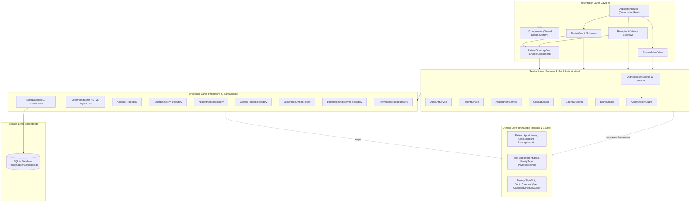
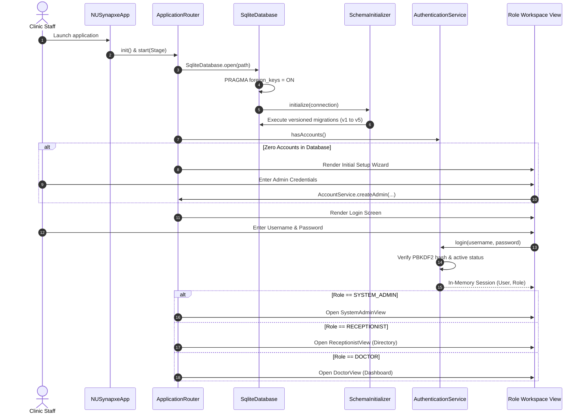
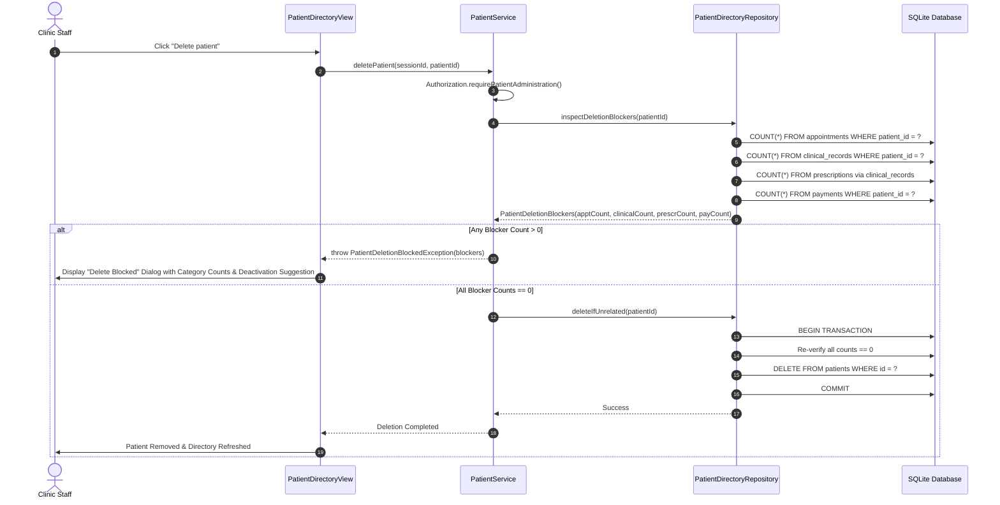
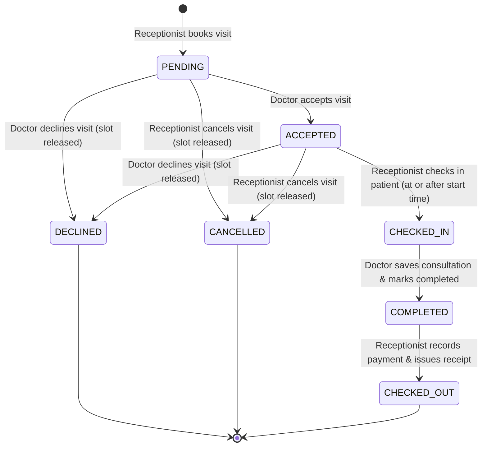
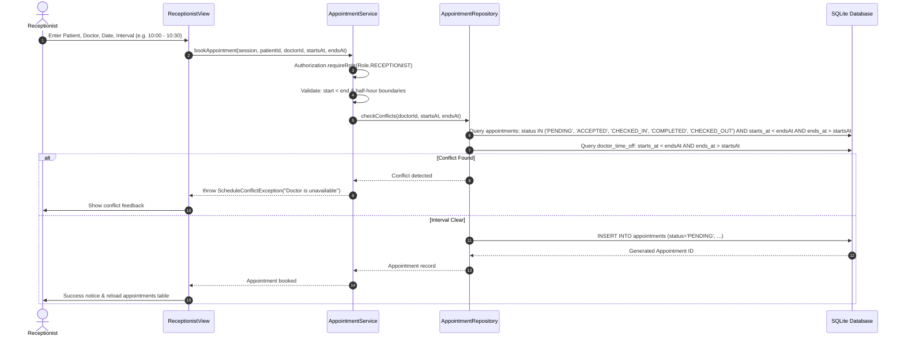
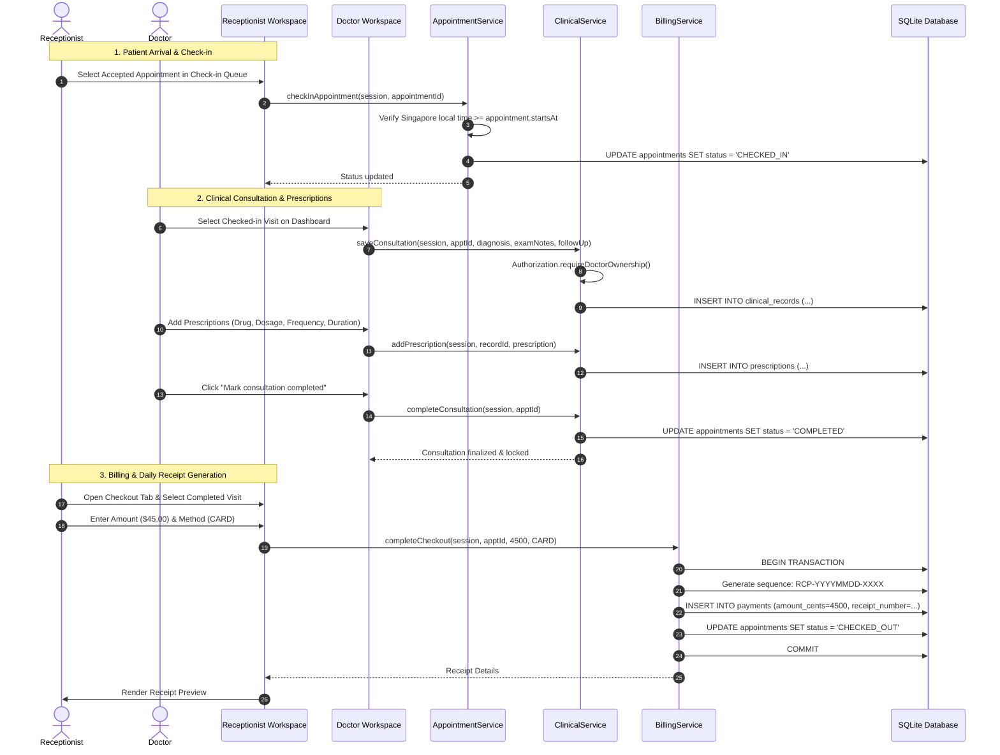

# Architecture & System Design

This document details the architectural principles, component structure, database schema, authorization mechanics, and workflow rules of NUSynapxe.

For product specifications and use case flows, see [Product Specifications & Use Cases](ProductSpecifications.md). For automated and manual testing strategies, see [Testing Strategy](TestingStrategy.md).

---

## 1. System Architecture

### 1.1 Component & Tier Architecture

NUSynapxe enforces a strict layered architecture with unidirectional dependencies from presentation down to persistence:



### 1.2 Package Layout and Responsibilities

```text
src/main/java/nusynapxe/             Application entry point, paths, and router
src/main/java/nusynapxe/domain/      Immutable records, value objects, and enums
src/main/java/nusynapxe/tools/       Database seeding and demo data utilities
src/main/java/nusynapxe/persistence/ SQLite connection, migrations, repositories
src/main/java/nusynapxe/service/     Authorization, business validation, use-cases
src/main/java/nusynapxe/ui/          JavaFX programmatic views and UI components
src/test/java/nusynapxe/             Unit, integration, persistence, and TestFX tests
config/checkstyle/                   Checkstyle ruleset
config/pmd/                          PMD ruleset
config/spotbugs/                     SpotBugs security and bug exclusions
website/                             Docusaurus documentation website
```

### 1.3 Enforced Dependency Rules

Architectural rules are codified and continuously verified via **ArchUnit 1.5.0** in `ArchitectureTest.java`:
1. **Domain Isolation**: Classes in `nusynapxe.domain` have zero dependencies on outer layers (persistence, service, UI, or tools).
2. **Persistence Boundary**: `nusynapxe.persistence` cannot depend on `service`, `ui`, or `tools`.
3. **Service Layer Boundary**: `nusynapxe.service` cannot depend on `ui` or `tools`.
4. **UI Isolation**: `nusynapxe.ui` cannot directly access `persistence` or `tools`. The sole exception is `ApplicationRouter`, which acts as the composition root by opening the database and wiring dependencies.
5. **No Package Cycles**: Slice assertions verify zero cyclical dependencies between `domain`, `persistence`, `service`, `ui`, and `tools`.

Run the automated architecture check:

```powershell
.\gradlew.bat test --tests nusynapxe.architecture.ArchitectureTest --no-daemon --console=plain
```

### 1.4 Application Startup & Session Routing Sequence



---

## 2. Persistence & Schema Design

### 2.1 SQLite Connection Lifecycle and Settings

`SqliteDatabase.java` manages SQLite JDBC connections. On initialization:
1. Creates parent directory if missing (`%USERPROFILE%\.nusynapxe` or `~/.nusynapxe`).
2. Opens connection with `PRAGMA foreign_keys = ON;` to enforce relational integrity.
3. Configures WAL (Write-Ahead Logging) mode for concurrent read performance and crash resilience.
4. Executes `SchemaInitializer.java` to inspect `app_metadata.schema_version` and apply pending schema migrations.

### 2.2 Entity-Relationship Diagram


### 2.3 Schema Version Evolution & Migrations

Migrations execute within an explicit SQLite transaction; failure rolls back all statement changes and leaves `schema_version` unchanged:
- **Version 1**: Initial baseline tables (`users`, `patients`, `appointments`, `clinical_records`, `prescriptions`, `payments`, `app_metadata`).
- **Version 2**: Adds nullable identity columns (`identity_type`, `issuing_country`, `identity_number`), `sex`, `height_cm`, `weight_kg`, and `active` flag to `patients` for backward compatibility.
- **Version 3**: Drops legacy `billing_information` column from `patients` table (payment records are preserved in `payments`) and normalizes legacy sex values to `FEMALE` or `MALE`.
- **Version 4**: Renames legacy `phone` to `phone_number`, adds nullable `phone_country_code`, and requires country code validation on subsequent patient saves.
- **Version 5**: Introduces `doctor_calendar_settings` and `doctor_working_intervals` supporting custom daily shift intervals and lunch breaks (up to 1440 minutes). Default seed supplies Mon-Fri `08:00`-`18:00` display intervals.

### 2.4 Safe Patient Deletion Sequence with Preflight Blocker Check

To maintain relational integrity, NUSynapxe **never uses cascade deletions** (`ON DELETE CASCADE`). Deletion is strictly reserved for unused records. If any linked record exists, deletion is rejected with itemized blocker counts:



---

## 3. Account, Session, and Authorization Design

### 3.1 Cryptographic Password Storage

`AccountService.java` delegates password verification and salting to `PasswordHasher.java`:
- **Algorithm**: `PBKDF2WithHmacSHA256`
- **Salt**: 16 cryptographically secure random bytes generated per account via `SecureRandom`
- **Iterations**: 65,536 iterations
- **Key Length**: 256 bits
- **Zeroing Memory**: Password char arrays are scrubbed immediately after verification. Plaintext passwords and derived hashes are never recorded in application log files.

### 3.2 Volatile In-Memory Session

Authentication produces an immutable `Session` object containing the authenticated `User`, their assigned `Role`, and login timestamp. Sessions exist purely in JVM volatile heap memory and are **never serialized to SQLite or written to disk**. When the application closes or the user clicks **Log out**, the session reference is discarded.

### 3.3 Role Authorization Matrix

Every public service method enforces authorization guards through `Authorization.java`:

| Operation | System Admin | Receptionist | Attending Doctor | Other Doctors |
| --- | :---: | :---: | :---: | :---: |
| Create Staff Account | ✅ | ❌ | ❌ | ❌ |
| View Staff Account List | ✅ | ❌ | ❌ | ❌ |
| Register / Edit Patient Basic Data | ❌ | ✅ | ✅ | ✅ |
| Activate / Deactivate Patient | ❌ | ✅ | ✅ | ✅ |
| Safe Delete Unused Patient | ❌ | ✅ | ✅ | ✅ |
| Book / Reschedule / Cancel Appointment | ❌ | ✅ | ❌ | ❌ |
| Check-in Arriving Patient | ❌ | ✅ | ❌ | ❌ |
| Complete Billing Checkout & Receipt | ❌ | ✅ | ❌ | ❌ |
| View Financial Reports & Export CSV/JSON | ❌ | ✅ | ❌ | ❌ |
| Accept / Decline Assigned Visit | ❌ | ❌ | ✅ | ❌ |
| Record Diagnosis & Consultation Notes | ❌ | ❌ | ✅ | ❌ |
| Build & Issue Multi-Drug Prescriptions | ❌ | ❌ | ✅ | ❌ |
| Mark Consultation Completed | ❌ | ❌ | ✅ | ❌ |
| Inspect Completed Patient Clinical History | ❌ | ❌ | ✅ | ✅ |
| Inspect In-Progress Patient Consultations | ❌ | ❌ | ✅ | ❌ |
| Configure Personal Working Hours & Time-Off | ❌ | ❌ | ✅ (own only) | ❌ |

---

## 4. Workflow Rules & Implementation Design

### 4.1 Appointment Finite State Machine



### 4.2 Appointment Booking Sequence & Conflict Validation



### 4.3 Check-in to Consultation to Checkout End-to-End Workflow



### 4.4 Doctor Calendar vs Infinite Scrolling Agenda

Doctor scheduling provides two distinct view modes:
1. **Interactive Multi-Day Time Grid (`Calendar`)**:
   - Visual grid displaying assigned appointments, shaded working intervals, and purple blocked time-off.
   - Dynamic Singapore red time line showing current time.
   - 100-pixel half-hour rows in full view; 44-pixel rows in compact dashboard view.
2. **Infinite Scrolling Agenda (`Agenda`)**:
   - Bounded chronological appointment stream starting from a selected Singapore anchor date.
   - Keyspacing pagination implemented via `CalendarScheduleCursor` containing `(startsAt, appointmentId)`.
   - SQLite orders rows deterministically by `starts_at ASC, id ASC`, reading one look-ahead row (`LIMIT pageSize + 1`) to accurately set `hasMore` without off-by-one errors or duplicate cards on page boundaries.

### 4.5 Revenue Calculation & Export Sanitization

- **Minor Unit Storage**: Monetary amounts are stored strictly as 64-bit integer cents (`amount_cents INTEGER`), eliminating IEEE-754 floating-point inaccuracies.
- **Strict Boundary Checks**: UI parses amounts using `BigDecimal` and checks for non-negative values. Arithmetic operations in `RevenueReport.java` use `Math.addExact()` to prevent integer overflow.
- **CSV Sanitization**: CSV export properly escapes values containing commas, double quotes (`"` &rarr; `""`), and newline characters (`\r\n`).
- **JSON Sanitization**: JSON export properly escapes Unicode control characters, tabs, quotes, and backslashes according to RFC 8259.

---

## 5. UI and TestFX Conventions

### 5.1 Scene Routing & Sizing

`ApplicationRouter.java` manages primary Stage transitions:
- Window opens **maximized** by default to provide an expansive clinical workspace.
- Minimum stage dimensions are locked at `980 x 640` pixels; restored initial default is `1200 x 760` pixels.
- All routed scenes share the single stylesheet `src/main/resources/nusynapxe/ui.css`.

### 5.2 Design System Components

`UiComponents.java` provides reusable, presentation-only component factories:
- `card(Node... children)`: Styled white content card with subtle border and drop shadow.
- `statusBadge(AppointmentStatus status)`: Produces a `Label` with the base `status-badge` class and semantic status class (`status-pending`, `status-accepted`, `status-checked-in`, `status-completed`, `status-checked-out`, `status-declined`, `status-cancelled`).
- `compactDatePicker()`: Custom styled date picker maintaining standard compact field height with integrated calendar icon.
- `feedback(String message, FeedbackType type)`: Standardized banner appearing below the header, automatically fading after 6 seconds.
- `errorBanner(String message)`: Prominent centered red error alert for form validation failures.

### 5.3 Stable TestFX IDs

Views are constructed programmatically in Java rather than FXML, ensuring every actionable node has an immutable, deterministic `setId()` for headless UI testing:

| Component ID | UI Description |
| --- | --- |
| `login-submit` | Login submit button |
| `setup-submit` | First-run setup submit button |
| `admin-account-submit` | Staff account creation button |
| `reception-patient-open-register` | Open patient registration button |
| `reception-patient-search` | Patient directory search input |
| `reception-patient-table` | Patient directory TableView |
| `reception-patient-view-<id>` | View action button for specific patient ID |
| `reception-book` | Book appointment submit button |
| `reception-checkout` | Complete checkout submit button |
| `doctor-dashboard-day-calendar` | Doctor dashboard single-day time grid |
| `doctor-consultation-save` | Save clinical consultation notes button |
| `doctor-history-patient` | Patient selector in consultation history view |
| `doctor-calendar-block-time` | Open block time-off modal button |
| `doctor-calendar-view-mode` | Calendar vs Agenda toggle button |
| `logout-button` | Top header logout button |\n