# Architecture & System Design

This document provides a comprehensive technical breakdown of NUSynapxe's system architecture, package structure, module responsibilities, threading model, and operational execution flows.

For product requirements and use cases, see [Product Specifications](ProductSpecifications.md). For automated verification and test walkthroughs, see [Testing Strategy](TestingStrategy.md).

---

## 1. High-Level Architecture Overview

NUSynapxe enforces a strict layered desktop architecture with unidirectional dependencies. High-level modules communicate downward through explicit service interfaces; lower layers remain completely agnostic of presentation details.

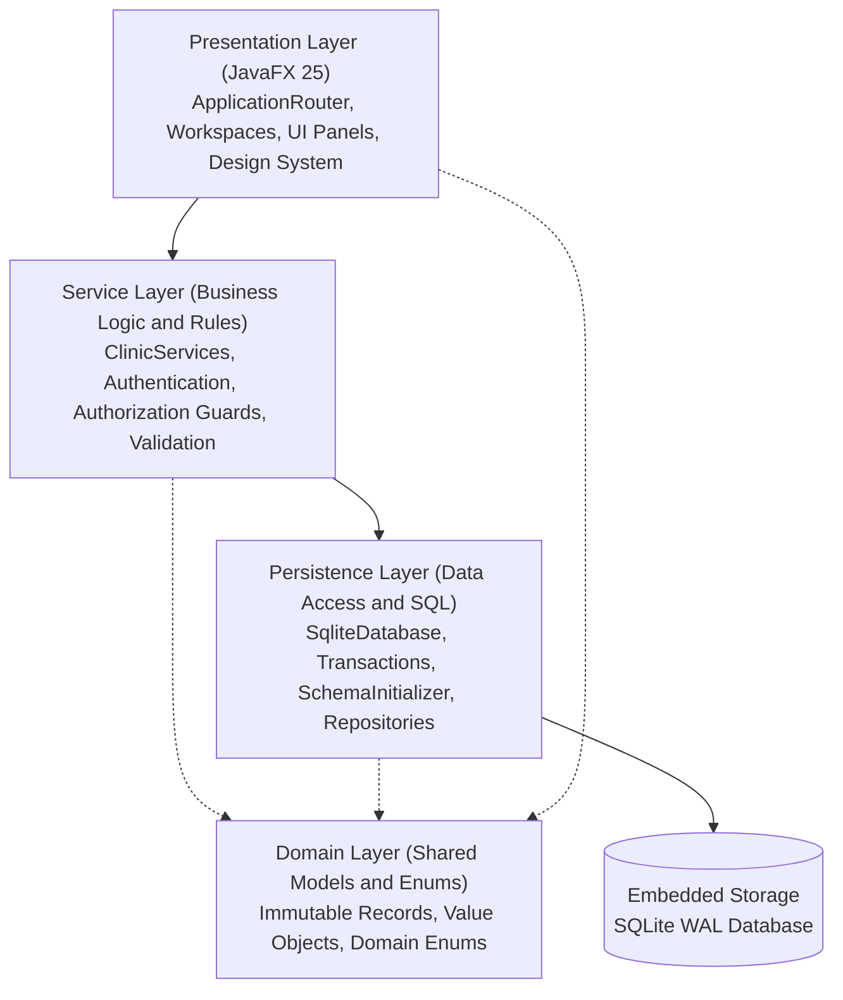

### 1.1 Architectural Principles & Layer Boundaries

The codebase follows five fundamental architectural invariants continuously verified by **ArchUnit 1.5.0** (`ArchitectureTest.java`):

1. **Domain Purity**: Classes in `nusynapxe.domain` are strictly decoupled from external dependencies. They contain no imports from `persistence`, `service`, `ui`, or `tools`, consisting purely of immutable records, value objects, and domain enums.
2. **Persistence Boundary**: `nusynapxe.persistence` depends only on `nusynapxe.domain` and the SQLite JDBC driver. It has zero knowledge of services, UI controllers, or tooling.
3. **Service Layer Isolation**: `nusynapxe.service` contains all application business rules, interval conflict math, authorization checks, and password hashing algorithms. It consumes persistence interfaces and domain models, but has no UI or JavaFX imports.
4. **Presentation Encapsulation**: `nusynapxe.ui` interacts exclusively through domain services. Direct persistence calls are forbidden. The sole composition root is `ApplicationRouter`, which opens the database and wires dependencies on startup.
5. **Acyclic Package Graph**: Slices across all top-level packages (`domain`, `persistence`, `service`, `ui`, `tools`) are strictly acyclic.

```powershell
# Run automated ArchUnit structural verification
.\gradlew.bat test --tests nusynapxe.architecture.ArchitectureTest --no-daemon --console=plain
```

### 1.2 Application Startup & Session Lifecycle

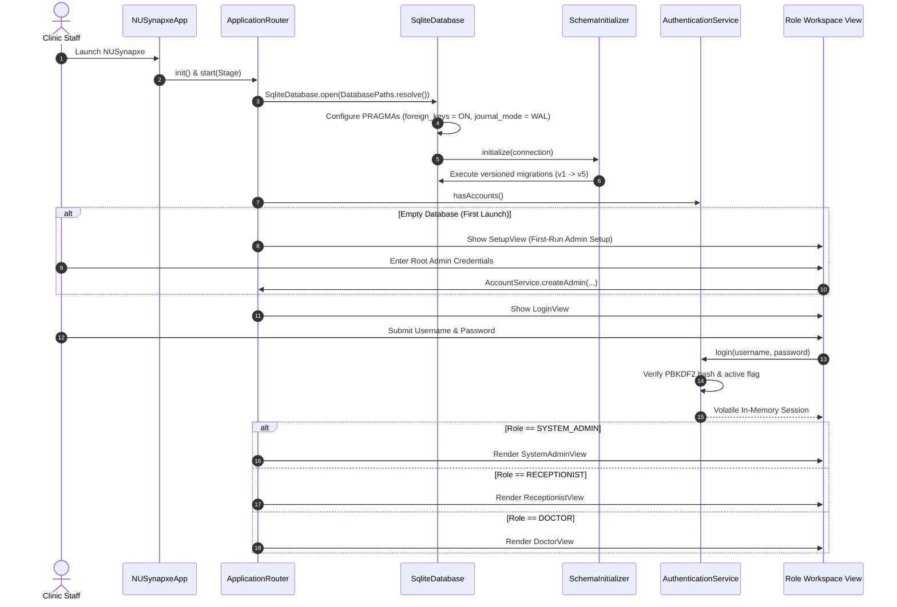

---

## 2. Presentation Layer (`nusynapxe.ui`)

The presentation layer is implemented in **pure programmatic JavaFX** without FXML templates. This guarantees type safety, fast component instantiation, clean dependency injection, and deterministic component IDs for headless UI automation.

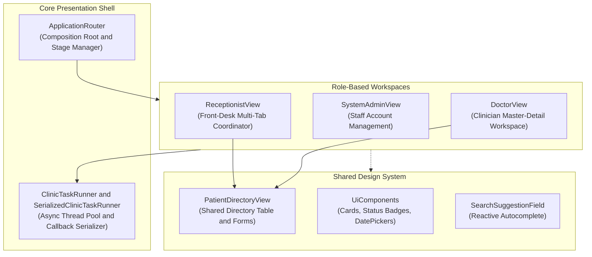

### 2.1 Key UI Files and Responsibilities

| Class / File | Primary Role & Responsibilities | Key Collaborators |
| --- | --- | --- |
| `ApplicationRouter` | Central stage manager, scene switcher, and dependency wiring root. Instantiates services, sets window constraints (`980x640` min), and coordinates logout flows. | `NUSynapxeApp`, `ClinicServices`, `Session` |
| `ClinicTaskRunner` / `SerializedClinicTaskRunner` | Concurrency coordinators executing database and service tasks on background threads while marshaling completions back to the JavaFX Application Thread. Prevents UI freezing and race conditions. | `Platform.runLater()`, Java `ExecutorService` |
| `UiComponents` | Shared visual component factory producing standard cards, colored status badges (`status-pending`, `status-checked-in`, etc.), compact date pickers, and fading feedback banners. | JavaFX controls, `ui.css` |
| `SystemAdminView` | Administrator dashboard for provisioning staff credentials, selecting user roles (`Doctor`, `Receptionist`), and auditing active accounts. | `AccountService`, `ClinicTaskRunner` |
| `ReceptionistView` & Workspace | Front-desk master view hosting navigation tabs: Patient Directory, Appointments Booking, Check-in Queue, Checkout Billing, and Revenue Reports. | `ReceptionistDataLoader`, `ReceptionistAppointmentPanel`, `ReceptionistCheckoutPanel` |
| `DoctorView` & Workspace | Clinician master view hosting the daily 24-hour schedule grid, live Singapore clock line, active consultation editor, prescription builder, and historical records. | `DoctorConsultationPanel`, `DoctorDashboardDayView`, `DoctorCalendarView` |
| `PatientDirectoryView` | Modular patient management interface embedded in both Receptionist and Doctor views. Handles live multi-field search, document registration, profile editing, and safe deletion. | `PatientService`, `PatientDirectoryTableView`, `PatientDirectoryFormView` |
| `ClinicalHistoryView` | Clinician-exclusive modal browsing completed cross-doctor medical consultations, diagnoses, and issued prescriptions across all attending physicians. | `ClinicalService`, `Patient` |
| `DoctorCalendarView` | Multi-day scheduling view supporting both 7-day interactive time grid and infinite-scrolling agenda, personal time-off blocking, and working hours settings. | `CalendarService`, `CalendarTimeGrid`, `DoctorCalendarSettingsView` |
| `ReportExporter` | File export coordinator formatting and saving revenue records to RFC 4180 CSV and RFC 8259 JSON files. | `BillingService`, `RevenueReport` |

### 2.2 Asynchronous Concurrency & UI Thread Safety

To guarantee a responsive UI, all database queries and service calls execute off the JavaFX Application Thread:

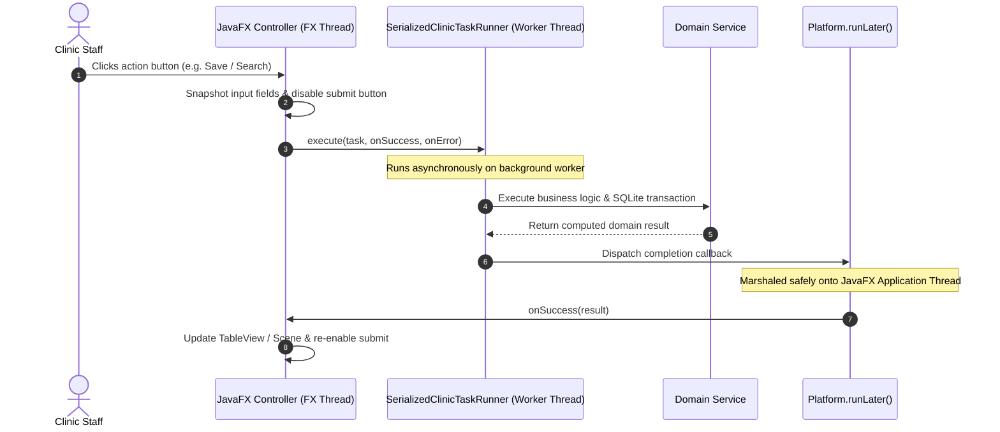

- **Input Snapshotting**: Form inputs (such as credentials, appointment slots, or patient details) are immediately captured as immutable local records before submitting tasks to the background runner, preventing input mutation during inflight operations.
- **Sequential Task Serialization**: `SerializedClinicTaskRunner` chains related operations sequentially, preventing race conditions (such as rapid consecutive appointment bookings or double payment submissions).
- **Callback Invalidation on Navigation**: When a user navigates away from a tab or closes a dialog, pending callback tokens are invalidated so stale background completions do not overwrite newer UI state.

---

## 3. Service Layer (`nusynapxe.service`)

The service layer implements all core business validation, role-based access control, appointment conflict mathematics, cryptographic password management, and use-case coordination.

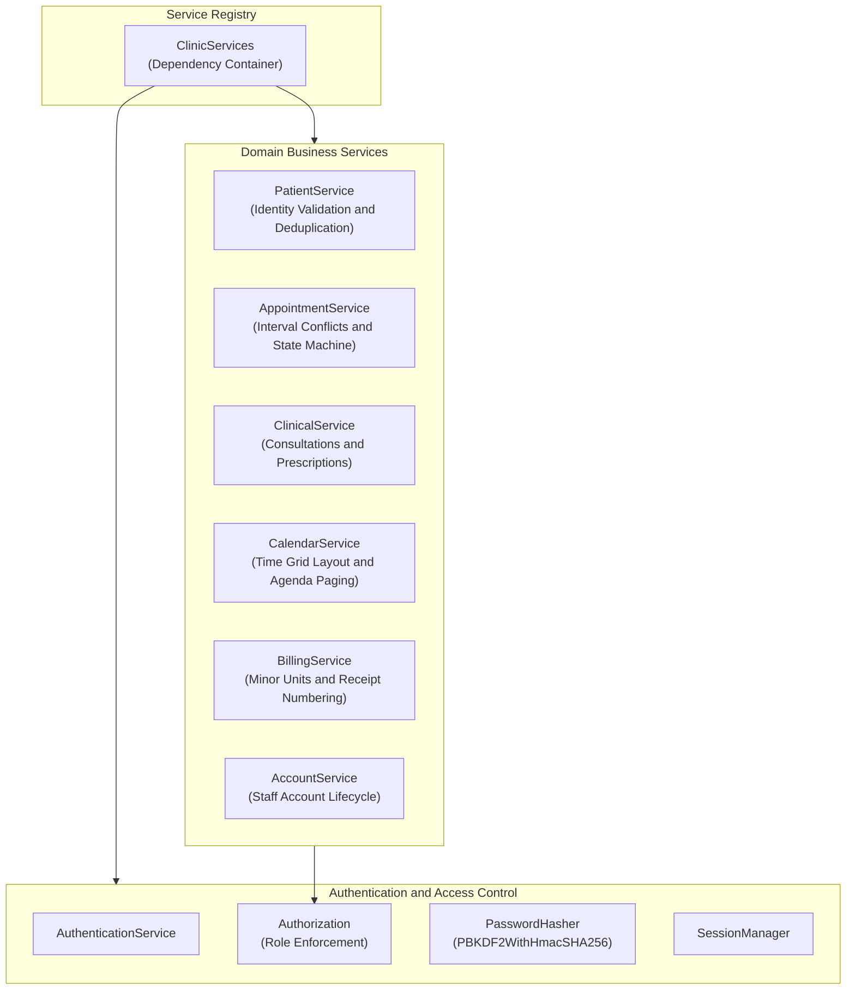

### 3.1 Key Service Files and Responsibilities

| Class / File | Primary Role & Responsibilities | Key Collaborators |
| --- | --- | --- |
| `ClinicServices` | Immutable service container providing centralized instantiation and access to all domain services. | All service interfaces |
| `AuthenticationService` | Handles user authentication, credential verification against PBKDF2 hashes, account active flag inspection, and session initialization. | `AccountRepository`, `PasswordHasher`, `Session` |
| `Authorization` | Static security guard enforcing role authorization matrices (e.g. `requireRole()`, `requireDoctorOwnership()`, `requirePatientAdministration()`). Throws `AuthorizationException`. | `Session`, `Role` |
| `PasswordHasher` | Cryptographic password management. Hashes passwords using `PBKDF2WithHmacSHA256` with 16-byte random salt and 65,536 iterations. Scrubs password byte buffers immediately after use. | `SecureRandom`, `SecretKeyFactory` |
| `PatientService` | Validates NRIC/FIN/Passport document syntax, locks Singapore issuing country, normalizes international calling codes, executes preflight deletion blocker checks, and toggles active state. | `PatientRepository`, `PatientDeletionBlockers` |
| `AppointmentService` | Enforces 30-minute interval boundaries, executes interval overlap conflict detection (`existing_start < new_end AND existing_end > new_start`), checks Singapore check-in time gate, and manages state transitions. | `AppointmentRepository`, `AppointmentTransitions` |
| `ClinicalService` | Enforces attending doctor consultation ownership, persists diagnostic notes, manages itemized multi-drug prescriptions, and joins completed cross-doctor medical histories. | `ClinicalRecordRepository`, `Prescription` |
| `CalendarService` | Computes 24-hour visual time slot layouts, discretizes doctor working intervals, filters personal time-off blocks, and handles keyspaced cursor-based agenda pagination. | `CalendarSettingsRepository`, `DoctorTimeOff` |
| `BillingService` | Converts dollar amounts to exact integer cents (`amount_cents INTEGER`), enforces positive payments, generates daily sequential receipt numbers (`RCP-YYYYMMDD-XXXX`), and aggregates revenue reports. | `PaymentRepository`, `ReceiptRepository`, `RevenueReport` |

### 3.2 Authorization & Role Access Matrix

Every public service method verifies the caller's volatile `Session` against the formal security matrix:

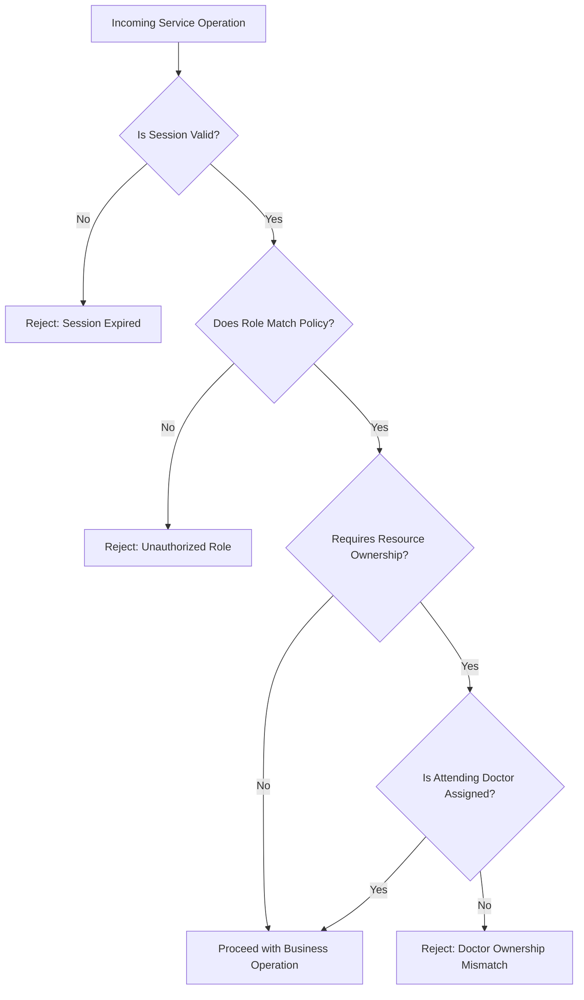

---

## 4. Persistence Layer (`nusynapxe.persistence`)

The persistence layer manages all embedded SQLite database interactions, connection pooling, transactional rollbacks, query projection sanitization, and automated schema migrations.

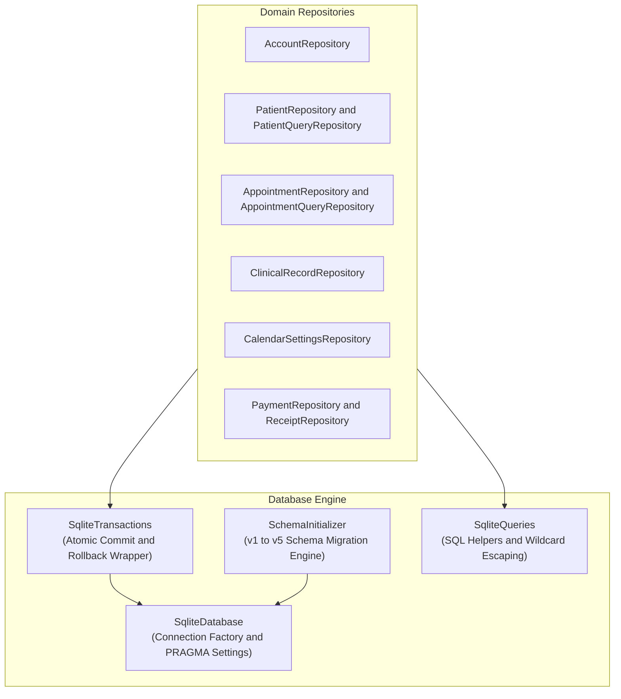

### 4.1 Key Persistence Files and Responsibilities

| Class / File | Primary Role & Responsibilities | Key Collaborators |
| --- | --- | --- |
| `SqliteDatabase` | Manages SQLite JDBC connection lifecycle. Sets `PRAGMA foreign_keys = ON;` and `PRAGMA journal_mode = WAL;`. Provides pooled and single-connection access. | `org.sqlite.JDBC`, `DatabasePaths` |
| `SqliteTransactions` | Functional transaction helper executing multi-statement operations within explicit `BEGIN TRANSACTION` and `COMMIT` blocks, automatically rolling back on `SQLException`. | `Connection` |
| `SchemaInitializer` | Incremental database migration runner. Inspects `app_metadata.schema_version` and executes migrations v1 through v5 sequentially within an atomic transaction. | `SqliteTransactions` |
| `SqliteQueries` | SQL utility class providing parameterized query construction and SQL `LIKE` wildcard escaping (safely escaping `%` and `_` characters to prevent query leakage). | `PreparedStatement` |
| `AccountRepository` | Persists user credentials, salts, PBKDF2 verifiers, display names, and active status flags. Enforces unique username constraints. | `Account`, `AccountCredential` |
| `PatientRepository` & `PatientQueryRepository` | Stores standardized patient profiles, executes multi-field search queries, enforces unique identity document tuples, and calculates preflight deletion blockers. | `Patient`, `PatientDeletionBlockers` |
| `AppointmentRepository` & `AppointmentQueryRepository` | Manages appointment booking, status updates, check-in queue queries, and transactional interval conflict checks. | `Appointment`, `TimeSlot` |
| `ClinicalRecordRepository` | Stores attending doctor consultation findings and coordinates atomic multi-drug prescription inserts. Executes batch queries for clinical histories. | `ClinicalRecord`, `Prescription` |
| `CalendarSettingsRepository` | Persists doctor daily shift intervals, lunch break splits, and personal time-off blocking ranges. | `DoctorCalendarSettings`, `DoctorTimeOff` |
| `PaymentRepository` & `ReceiptRepository` | Persists minor-unit payments, generates daily sequential receipt numbers, and executes revenue aggregation queries grouped by payment method and clinician. | `Payment`, `Receipt`, `RevenueReport` |

### 4.2 Relational Entity-Relationship Diagram

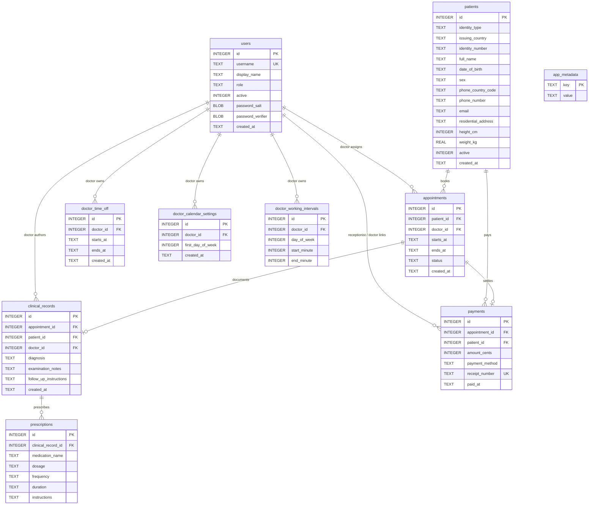

### 4.3 Database Schema Migration Ledger (v1 to v5)

All schema changes are versioned and executed through `SchemaInitializer.java`. When upgrading an existing clinic installation, migrations run incrementally in an explicit SQLite transaction:

- **Version 1 (Baseline)**: Initial operational tables: `users`, `patients`, `appointments`, `clinical_records`, `prescriptions`, `payments`, `app_metadata`.
- **Version 2 (Identity Document Enhancements)**: Adds nullable columns `identity_type`, `issuing_country`, `identity_number`, `sex`, `height_cm`, `weight_kg`, and `active` flag to `patients` to preserve backward compatibility with legacy demo data.
- **Version 3 (Data Hygiene & Normalization)**: Drops unused `billing_information` column from `patients` table (payment details are strictly stored in `payments`) and normalizes historical sex values to uppercase `MALE` or `FEMALE`.
- **Version 4 (International Telephony Normalization)**: Renames `phone` to `phone_number`, introduces `phone_country_code`, and requires standardized calling codes for subsequent patient profile updates.
- **Version 5 (Custom Working Hours & Shift Splits)**: Creates `doctor_calendar_settings` and `doctor_working_intervals`, enabling doctors to define split working shifts and lunch breaks (up to 1440 minutes per day). Defaults to Mon-Fri `08:00`–`18:00`.

---

## 5. Domain Layer (`nusynapxe.domain`)

The domain layer encapsulates immutable business records, value types, and domain state enumerations:

| Category | Domain Models & Types | Characteristics & Invariants |
| --- | --- | --- |
| **Identity & Patient** | `Patient`, `IdentityType`, `Sex`, `PatientDeletionBlockers` | Immutable Java record holding standardized patient demographic details, computed age, and foreign key blocker metrics across all related entity categories. |
| **Authentication & Access** | `Account`, `AccountCredential`, `Role`, `Session` | Encapsulates staff accounts, roles (`SYSTEM_ADMIN`, `RECEPTIONIST`, `DOCTOR`), and volatile heap sessions containing login timestamps. |
| **Appointments & Scheduling** | `Appointment`, `AppointmentStatus`, `AppointmentListRow`, `TimeSlot` | Enforces finite state transitions. Coordinates 30-minute interval slots and projection rows for front-desk list views. |
| **Calendar & Availability** | `CalendarAppointment`, `CalendarScheduleCursor`, `CalendarSchedulePage`, `DoctorTimeOff`, `DoctorCalendarSettings`, `WorkingInterval` | Virtualized keyspaced pagination cursors `(startsAt, appointmentId)`, recurring daily shift intervals, and personal time-off date ranges. |
| **Clinical Records** | `ClinicalRecord`, `ClinicalHistoryEntry`, `Prescription` | Attending doctor clinical findings, examination notes, and itemized multi-drug prescriptions (drug name, dosage, frequency, duration). |
| **Billing & Finance** | `Payment`, `PaymentMethod`, `PaymentStatus`, `Receipt`, `RevenueReport`, `RevenueSummary` | 64-bit integer minor unit representation (`amount_cents`), payment methods (`CASH`, `CARD`, `TRANSFER`, `OTHER`), and date-bounded revenue summaries. |

---

## 6. Core Application Utilities (`nusynapxe`)

The root package provides the platform bootstrap, path resolution, and injectable time foundations:

| Class / File | Primary Role & Responsibilities | Key Collaborators |
| --- | --- | --- |
| `NUSynapxeApp` | The JavaFX `Application` entrypoint. Initializes database connections, starts `SchemaInitializer`, verifies administrator provisioning, and loads the primary maximized window. | `ApplicationRouter`, `DatabasePaths` |
| `NUSynapxeLauncher` | A pure Java bootstrapping class that does not extend `javafx.application.Application`. Enables launching executable fat JARs (`java -jar NUSynapxe.jar`) on standard JVMs without needing `--module-path` runtime arguments. | `NUSynapxeApp` |
| `DatabasePaths` | Resolves the clinic database file path. Defaults to `%USERPROFILE%\.nusynapxe\nusynapxe.db` (Windows) or `~/.nusynapxe/nusynapxe.db` (macOS/Linux), while supporting runtime command-line overrides via `-Dnusynapxe.database=...`. | Java `System.getProperty` |
| `ClinicClock` | Centralized injectable clock wrapper defaulting to Singapore standard time (`ZoneId.of("Asia/Singapore")`). Allows automated test suites to inject fixed timestamps to verify time-sensitive arrival gates and calendar lines. | Java `Clock`, `ZonedDateTime` |

---

## 7. Developer Tooling & Seeding (`nusynapxe.tools`)

Developer tooling provides deterministic database initialization and demo data generation:

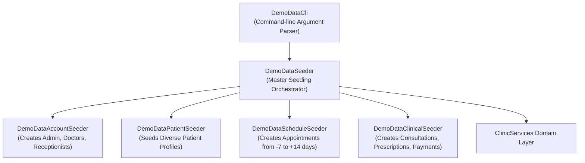

- **Reset Tooling (`reset-demo-database.ps1`)**: Safely purges existing SQLite database files (`.db`, `-wal`, `-shm`) and re-executes all migrations to return to a pristine zero-account state.
- **Seeding Tooling (`seed-demo-data.ps1`)**: Populates realistic clinical scenarios relative to the current calendar date (`Asia/Singapore`), enabling immediate testing of front-desk check-ins, active doctor dashboards, and multi-drug prescriptions.

---

## 8. Detailed Flow Diagrams

### 8.1 Safe Patient Deletion Preflight Check Flow

NUSynapxe strictly prevents orphan records without using cascade deletes (`ON DELETE CASCADE`). Deletion is permitted only if the patient has zero linked records across all categories:

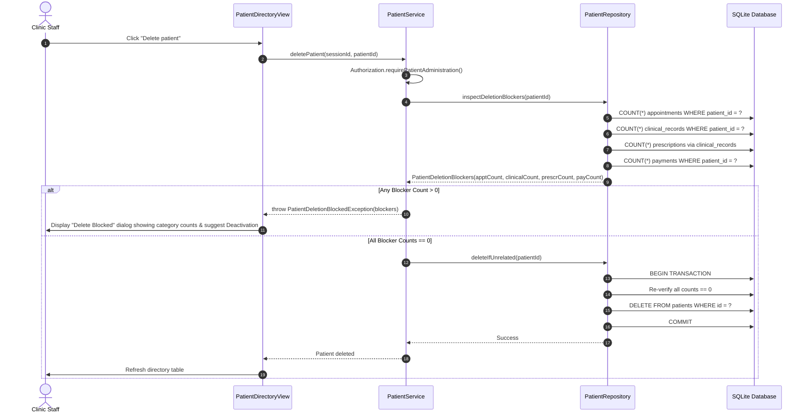

### 8.2 Appointment Booking & Conflict Detection Flow

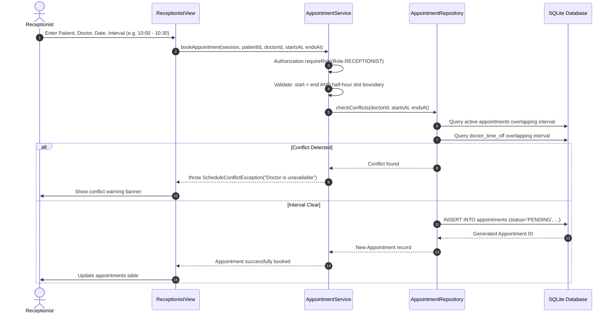

### 8.3 Check-in to Consultation to Checkout End-to-End Flow

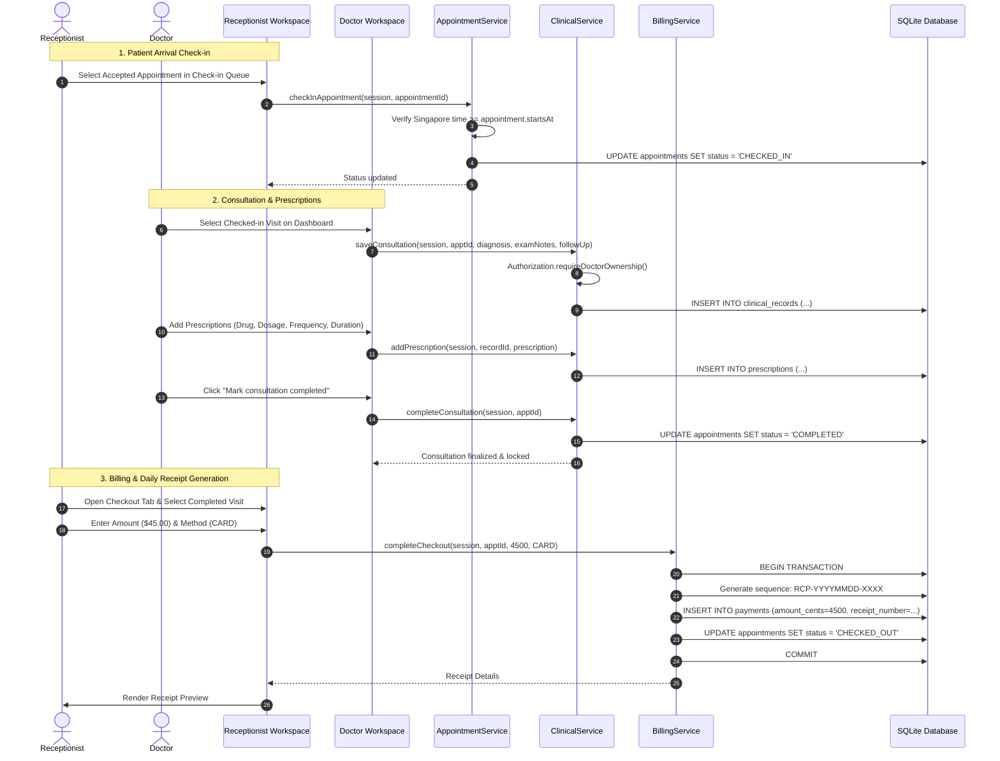

### 8.4 Virtualized Infinite Agenda Keyspaced Pagination Flow

When browsing the upcoming schedule in Agenda mode, appointments are paginated using a deterministic keyspacing cursor `(startsAt, appointmentId)`:

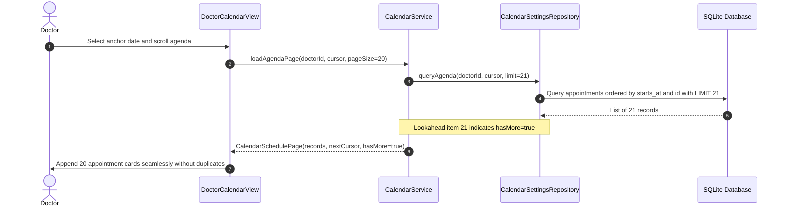
