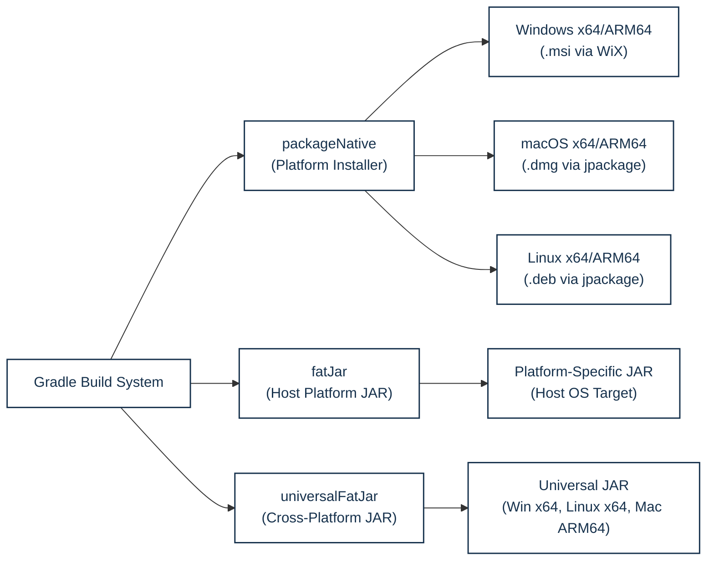

# Developer Guide

## 1. Development Prerequisites

NUSynapxe is built on modern Java and desktop UI standards. The project uses:
- **Java**: OpenJDK 25 (Java 25 toolchain)
- **Build System**: Gradle Wrapper 9.7.1
- **UI Toolkit**: JavaFX 25.0.4 (resolved via the `org.openjfx.javafxplugin` Gradle plugin; no external JavaFX SDK installation is needed)
- **Embedded Database**: SQLite JDBC 3.53.4.0 with Xerial SQLite driver
- **Documentation Platform**: Node.js 24 and Docusaurus 3.10.2
- **Testing & Verification**: JUnit 6.1.3 (via `junit-bom`), Mockito 5.23.0, TestFX 4.0.18, ArchUnit 1.5.0, Spotless 8.10.2 (Google Java Format 1.36.1), Checkstyle 14.1.0, PMD 7.26.0, SpotBugs 4.10.3 with FindSecBugs 1.14.0, and JaCoCo 0.8.14.

Use the checked-in Gradle Wrapper (`.\gradlew.bat` on Windows, `./gradlew` on macOS/Linux) rather than an externally installed Gradle binary. Native Windows packaging (`.msi`) additionally requires the [WiX Toolset v3](https://wixtoolset.org/) or newer on system `PATH`; WiX is not needed for routine development, compilation, or testing.

---

## 2. Getting Started

### 2.1 Running NUSynapxe from Source

Start the desktop application from the repository root:

```powershell
# Windows PowerShell
.\gradlew.bat run
```

```bash
# macOS / Linux
./gradlew run
```

The application creates or opens the local SQLite database described in the [User Guide](UserGuide.md) at `%USERPROFILE%\.nusynapxe\nusynapxe.db` (Windows) or `~/.nusynapxe/nusynapxe.db` (macOS/Linux). To isolate development data from your personal environment when running via Gradle, pass the `-PdemoDatabasePath` project property (which the `run` task in `build.gradle` forwards to the forked application JVM as the `nusynapxe.database` system property):

```powershell
# Windows PowerShell
.\gradlew.bat run -PdemoDatabasePath="build/dev-test.db"
```

```bash
# macOS / Linux
./gradlew run -PdemoDatabasePath="build/dev-test.db"
```

*(Note: When launching a standalone fat JAR directly via `java -jar`, pass `-Dnusynapxe.database="build/dev-test.db"` directly to the JVM).*

> [!NOTE]
> When launching against a fresh custom database path, `run` creates an unpopulated database that presents the initial administrator registration screen. To populate it with showcase accounts and sample clinical records beforehand, seed it first using `scripts/seed-demo-data.ps1` (or the `demoData` Gradle task):
> ```powershell
> # Windows PowerShell
> .\scripts\seed-demo-data.ps1 -DatabasePath "build/dev-test.db" -Reset
> .\gradlew.bat run -PdemoDatabasePath="build/dev-test.db"
> ```
> ```bash
> # macOS / Linux
> ./gradlew demoData -PdemoDataCommand=seed -PdemoDatabasePath="build/dev-test.db" -PdemoDataReset=true --no-daemon --console=plain
> ./gradlew run -PdemoDatabasePath="build/dev-test.db"
> ```

### 2.2 Useful Build and Quality Commands

Execute the complete local Java quality gate:

```powershell
.\gradlew.bat spotlessApply check javadoc --no-daemon --console=plain
```

Individual focused commands for targeted development:

```powershell
# Run the complete test suite
.\gradlew.bat test --no-daemon --console=plain

# Run specific unit/service tests
.\gradlew.bat test --tests nusynapxe.service.AppointmentServiceTest --no-daemon --console=plain
.\gradlew.bat test --tests nusynapxe.persistence.SchemaMigrationTest --tests nusynapxe.persistence.PatientDirectoryRepositoryTest --no-daemon --console=plain
.\gradlew.bat test --tests nusynapxe.service.PatientServiceValidationTest --tests nusynapxe.ui.ReceptionistBookingTest --no-daemon --console=plain
.\gradlew.bat test --tests nusynapxe.service.PatientServiceMaintenanceTest --tests nusynapxe.persistence.PatientDirectoryRepositoryTest --tests nusynapxe.ui.DoctorDashboardTest --no-daemon --console=plain

# Run static analysis and linting
.\gradlew.bat checkstyleMain checkstyleTest --no-daemon --console=plain
.\gradlew.bat pmdMain --no-daemon --console=plain
.\gradlew.bat spotbugsMain spotbugsTest --no-daemon --console=plain

# Generate coverage reports
.\gradlew.bat jacocoTestReport --no-daemon --console=plain
```

- `spotlessApply` formats Java sources according to Google Java Format. `spotlessCheck` is the read-only CI equivalent.
- `check` runs JUnit, Checkstyle, PMD, SpotBugs with FindSecBugs, file size limit verification, and JaCoCo. Quality gates fail the build on any violation.
- Both `pmdTest` (using a test-specific ruleset) and `spotbugsTest` are enabled and enforced as part of the `check` quality gate.

### 2.3 Demo Database Tooling

`scripts/reset-demo-database.ps1` and `scripts/seed-demo-data.ps1` are the supported Windows workflow for resetting and creating the local-development database used by `.\gradlew.bat run`. Both delegate to the `demoData` Gradle `JavaExec` task, which executes `nusynapxe.tools.DemoDataSeeder` through standard service and repository abstractions.

- **Default Target**: `%USERPROFILE%\.nusynapxe\nusynapxe.db`. A custom path can be supplied via `-DatabasePath`.
- **Reset Command**: Destructive operation requiring `-Force` for an existing database. It removes the SQLite database and its supporting files, then reinitializes the schema.
  ```powershell
  .\scripts\reset-demo-database.ps1 -Force
  ```
- **Seed Command**: Populates an empty database with realistic, time-relative clinical data centered on the current Singapore clinic date (`Asia/Singapore`):
  ```powershell
  .\scripts\seed-demo-data.ps1 -Reset
  ```
  - Creates realistic patient profiles across active and inactive states.
  - Provisions 2 non-overlapping appointments per doctor for every date from 7 days before today through 14 days after today.
  - Generates realistic clinical records, notes, and multi-drug prescriptions for completed and checked-out visits.
  - Outputs showcase credentials:
    - **Doctor 1**: `ada` / `ada1234!` (Dr. Ada Lovelace)
    - **Doctor 2**: `grace` / `grace123!` (Dr. Grace Hopper)
    - **Receptionist**: `reception` / `recept123!`
    - **System Admin**: `admin.demo` / `DemoAdmin123!`

### 2.4 Running the Documentation Site

The Docusaurus documentation website is located in `website/`:

```powershell
cd website
npm ci
npm run build
npm run start
```

---

## 3. Product Definition

### 3.1 Goal

NUSynapxe is an enterprise-grade, single-workstation desktop clinic management system designed for Singapore general practitioner clinics and specialized outpatient medical centres. It coordinates patient administration, doctor scheduling, appointment lifecycles, clinical consultation documentation, pharmacy prescriptions, billing checkout, and revenue accounting while maintaining rigid role and ownership boundaries between System Administrators, Receptionists, and Doctors.

### 3.2 Current Capabilities

- **Role-Based Access Control**: Strict segregation between System Admin (account provisioning), Receptionist (front-desk administrative & billing operations), and Doctor (clinical documentation & scheduling).
- **Patient Directory**: Standardized identity management supporting NRIC, FIN, and Passport documents with syntax validation, country locking, deduplication, soft deactivation, and safe blocker-verified deletion.
- **Multi-Day Clinic Scheduling**: Multi-doctor 30-minute interval scheduler, conflict detection, appointment rescheduling, and appointment cancellation.
- **Real-Time Check-in Queue**: Arrival processing gated by Singapore local time (`Asia/Singapore`).
- **Clinical Documentation & Pharmacy**: Assigned-doctor consultation recording, clinical examination findings, and itemized multi-drug prescription management.
- **Continuity of Care**: Cross-doctor historical consultation browser allowing attending physicians to inspect completed medical records across all clinic colleagues.
- **Physician Calendar & Agenda**: Dual-mode calendar with interactive multi-day time-grid and virtualized infinite-scrolling agenda stream, personal time-off blocking, and recurring working hours configuration with split lunch breaks.
- **Atomic Checkout & Daily Receipts**: Minor-currency unit financial tracking, diverse payment method support, and sequential daily receipt numbering.
- **Financial Auditing & Data Exports**: Date-bounded revenue auditing with multi-dimensional breakdowns and RFC 4180 compliant CSV and structured JSON data export.
- **Versioned SQLite Storage**: Zero-configuration embedded relational persistence with atomic schema migrations (v1 through v7).

### 3.3 Non-Goals

The current version of NUSynapxe intentionally omits:
- Multi-tenant cloud synchronization or remote server backends (architecture is strictly local-first to ensure patient privacy and offline reliability).
- Online patient self-booking or web-facing patient portals.
- Government health insurance (Medisave/CHAS) or third-party corporate claims API integration.
- Automated pharmaceutical inventory stock decrementing or barcode dispensing.
- In-application automated cloud backup/restore services (backup is handled via file-level database archiving).

---

## 4. Product Specifications Overview

Detailed user personas, prioritized user stories, formal use cases, and illustrative behavioral specifications (Gherkin feature scenarios) are organized in the standalone specifications document:

👉 **[Read the Full Product Specifications Guide](ProductSpecifications.md)**

The standalone specifications document covers:
- **Target User Personas**: Clinic Receptionist, Attending Physician / Doctor, and System Administrator.
- **Prioritized User Stories**: Comprehensive user stories organized across administrative, patient identity, appointment scheduling, clinical documentation, doctor availability, and billing checkout workflows.
- **Formal Use Cases**: Detailed end-to-end operational use cases specifying actors, preconditions, triggers, main success scenarios, and alternative extensions.
- **Behavioral Specifications (Gherkin)**: Illustrative Given-When-Then behavioral specifications with syntax highlighting covering account security, document deduplication, conflict prevention, queue management, consultations, and revenue auditing.

---

## 5. Architecture & System Design Overview

Technical design specifications, class layouts, database schemas, and sequence diagrams are detailed in the dedicated architectural guide:

👉 **[Read the Full Architecture & System Design Guide](ArchitectureAndDesign.md)**

The standalone design guide details:
- **Component & Tier Architecture**: Strict unidirectional dependencies between JavaFX UI, Business Services, Persistence Projections, and SQLite storage.
- **Package Layout & ArchUnit Rules**: Codified layer boundaries preventing architectural erosion.
- **Persistence & Entity-Relationship Schema**: Relational database schema, foreign key constraints, and transactional schema migrations (v1 through v7).
- **Safe Patient Deletion**: Multi-category preflight blocker inspection algorithm preventing orphan records.
- **Cryptographic Security & Session Flow**: PBKDF2WithHmacSHA256 password hashing with per-account salt (210,000 iterations) and volatile in-memory sessions.
- **Appointment Finite State Machine**: State transitions (`PENDING` through `CHECKED_OUT`) and conflict validation.
- **Dual Doctor Scheduling**: Interactive 24-hour time-grid vs. infinite-scrolling cursor-paginated agenda stream.
- **UI Design System & TestFX Conventions**: Programmatic JavaFX view construction and semantic element IDs.

---

## 6. Software Engineering Process

### 6.1 OpenSpec Artifact Lifecycle

All architectural, functional, and schema modifications follow the **OpenSpec** engineering process:

```mermaid
flowchart LR
    Explore["1. Explore<br/>(Problem analysis)"] --> Propose["2. Propose<br/>(Change proposal)"]
    Propose --> Design["3. Design<br/>(Architecture & schema)"]
    Design --> Spec["4. Spec<br/>(Delta requirements)"]
    Spec --> Tasks["5. Tasks<br/>(Work breakdown)"]
    Tasks --> Apply["6. Apply<br/>(Implementation & tests)"]
    Apply --> Verify["7. Verify<br/>(Quality gates & DoD)"]
    Verify --> Archive["8. Archive<br/>(Sync to main specs)"]

    classDef default fill:#ffffff,stroke:#17324d,stroke-width:1.5px,color:#17324d;
```



1. **Explore**: Clarify functional requirements, review risk boundaries, and determine schema impact.
2. **Propose & Design**: Author `proposal.md` and `design.md` detailing architectural implications, data migrations, and UI mockups.
3. **Spec**: Define exact delta specifications using strict RFC 2119 requirement keywords (`SHALL`, `MUST`, `SHOULD`).
4. **Tasks**: Break implementation into small, atomic, independently testable tasks.
5. **Apply & Verify**: Implement code, author unit/integration/UI tests, and verify against quality gates.
6. **Archive**: Sync delta specs to the canonical system specifications and archive the completed change artifact.

### 6.2 Conventional Commits & Branching Strategy

Git commits adhere strictly to the Conventional Commits specification:
- `feat(...)`: New user-facing feature or enhancement.
- `fix(...)`: Bug fix or error resolution.
- `test(...)`: Adding or modifying automated test suites.
- `refactor(...)`: Code refactoring without changing observable behavior.
- `docs(...)`: Documentation updates, guides, or markdown revisions.
- `chore(...)`: Dependency bumps, Gradle build script maintenance, or tool configuration.

Pull requests require linear git history, zero merge commits on release branches, and complete green CI check status before merging.

### 6.3 Definition of Done (DoD)

A task or pull request is considered **Done** only when:
- [x] Code passes `.\gradlew.bat spotlessCheck` with zero formatting differences.
- [x] Code passes `.\gradlew.bat check` (Checkstyle, PMD, SpotBugs with FindSecBugs, file size limits, JaCoCo thresholds) with zero violations.
- [x] All automated tests in `.\gradlew.bat test` pass cleanly.
- [x] `.\gradlew.bat javadoc` generates complete API documentation without compilation warnings.
- [x] `npm run build` in `website/` completes with exit code 0 and zero broken links.
- [x] Git patch passes `git diff --check` with zero trailing whitespace or carriage-return warnings.
- [x] User Guide and Developer Guide are updated to reflect the new functionality.

---

## 7. Testing Strategy Overview

Automated test structures, quality tasks, coverage risk matrices, and manual peer-testing scripts are detailed in the testing guide:

👉 **[Read the Full Testing Strategy & Peer Testing Guide](TestingStrategy.md)**

The standalone testing guide covers:
- **Test Levels Pyramid**: Domain records, temporary SQLite persistence, transactional services, integration workflows, and headless TestFX UI tests.
- **Automated Test Inventory**: Full inventory of automated test classes spanning domain, persistence, service, and UI layers.
- **Risk-Based Coverage Matrix**: Specific test suites mitigating data privacy leaks, transaction splits, schedule conflicts, and numeric overflow.
- **Quality Gates**: Repo-wide enforcement of Spotless formatting, Checkstyle rules, PMD static analysis, SpotBugs bytecode inspection, 500-line source file limits, and JaCoCo coverage (85% instruction, 70% branch, 85% line).
- **Manual Peer Testing Walkthrough Scenarios**: End-to-end walkthrough scenarios covering setup, patient deduplication, booking conflicts, consultations, cross-doctor history, and revenue exports.

---

## 8. Documentation Site and CI

### 8.1 Docusaurus Production Build

The project documentation website is built with Docusaurus 3.10.2:
- Configuration is declared in `website/docusaurus.config.js`.
- Documents are organized in `docs/` and structured via `website/sidebars.js`.
- Custom styling is declared in `website/src/css/custom.css`, mirroring NUSynapxe's clinical desktop palette (teal `#0f8f83`, dark navy `#17324d`, slate `#52677b`).

### 8.2 Continuous Integration Pipeline

The GitHub Actions workflow (`.github/workflows/ci.yml`) executes on every push to `master`, pull request, and manual workflow dispatch:
1. Sets up JDK 25 and Node.js 24.
2. Executes `./gradlew spotlessCheck` to enforce formatting.
3. Executes `./gradlew check javadoc` under `xvfb-run` to run the complete test suite and static analysis.
4. Executes `npm ci && npm run build` in `website/` to ensure documentation site integrity.
5. Archives JaCoCo, Checkstyle, PMD, and SpotBugs reports as build artifacts.

---

## 9. Distribution Packaging and Native Releases

### 9.1 Packaging Architecture



### 9.2 Gradle Packaging Tasks

- **`packageNative`**: Builds platform-native installer with bundled JDK using `jpackage` (requires `-PreleaseVersion=<major>.<minor>.<patch>`):
  ```powershell
  .\gradlew.bat packageNative -PreleaseVersion=1.0.0 --no-daemon --console=plain
  ```
  Generates `.msi` (Windows, requires WiX v3+), `.dmg` (macOS), or `.deb` (Linux, requires `fakeroot`).
- **`fatJar`**: Assembles host-specific executable fat JAR:
  ```powershell
  .\gradlew.bat fatJar --no-daemon --console=plain
  ```
  Writes `build/libs/NUSynapxe-<version>-fat.jar` bundling host JavaFX binaries.
- **`universalFatJar`**: Assembles universal executable fat JAR embedding JavaFX for the three primary targets:
  ```powershell
  .\gradlew.bat universalFatJar --no-daemon --console=plain
  ```
  Writes `build/libs/NUSynapxe-<version>.jar` embedding native libraries for **Windows x64**, **Linux x64**, and **macOS ARM64**.

### 9.3 Official Release Asset Matrix

On every tag push matching `v*.*.*`, `.github/workflows/release.yml` executes packaging across a matrix of 6 platform runners and attaches verified assets to the GitHub Release:

| Operating System & Architecture | Native Installer Asset | Dedicated Platform Executable JAR Asset | Universal JAR (`NUSynapxe-<version>.jar`) Supported? |
| --- | --- | --- | :---: |
| **Windows x64** (Intel / AMD) | `NUSynapxe-<version>-windows-x64.msi` | `NUSynapxe-<version>-windows-x64.jar` | **Yes** |
| **Windows ARM64** (Surface Pro, Snapdragon) | `NUSynapxe-<version>-windows-arm64-compat.msi` | `NUSynapxe-<version>-windows-arm64-compat.jar` | **No** (Requires Platform JAR) |
| **macOS Apple Silicon** (M1 / M2 / M3 / M4) | `NUSynapxe-<version>-macos-arm64.dmg` | `NUSynapxe-<version>-macos-arm64.jar` | **Yes** |
| **macOS Intel (x64)** (Pre-2020 Macs) | `NUSynapxe-<version>-macos-x64.dmg` | `NUSynapxe-<version>-macos-x64.jar` | **No** (Requires Platform JAR) |
| **Linux x64** (Ubuntu, Debian, Mint) | `NUSynapxe-<version>-linux-x64.deb` | `NUSynapxe-<version>-linux-x64.jar` | **Yes** |
| **Linux ARM64** (Raspberry Pi, ARM Linux) | `NUSynapxe-<version>-linux-arm64.deb` | `NUSynapxe-<version>-linux-arm64.jar` | **No** (Requires Platform JAR) |

---

## 10. Requirements-to-Implementation Mapping

| Functional Requirement | Implementation Classes | Automated Test Verification |
| --- | --- | --- |
| **Role-Based Authentication & Session Isolation** | `AuthenticationService`, `PasswordHasher`, `Session` | `AuthenticationServiceTest`, `AuthorizationTest` |
| **Patient Directory & Document Syntax Rules** | `PatientService`, `PatientDirectoryRepository` | `PatientServiceValidationTest`, `PatientDirectoryRepositoryTest` |
| **Safe Patient Deletion with Blocker Preflight** | `PatientService`, `PatientDeletionBlockers` | `PatientServiceMaintenanceTest`, `PatientDirectoryRepositoryTest` |
| **Appointment Lifecycle & Conflict Checking** | `AppointmentService`, `AppointmentTransitions` | `AppointmentServiceTest`, `AppointmentRepositoryTest` |
| **Arrival Check-in Gate with Singapore Time** | `AppointmentService`, `ReceptionistCheckoutPanel` | `AppointmentServiceTest`, `ReceptionistBookingTest` |
| **Assigned Doctor Consultation & Prescriptions** | `ClinicalService`, `ClinicalRecordRepository` | `ClinicalServiceTest`, `DoctorDashboardTest` |
| **Cross-Doctor Consultation History** | `ClinicalService`, `ClinicalHistoryView` | `ClinicalServiceTest`, `DoctorDashboardTest` |
| **Doctor Calendar, Agenda & Working Intervals** | `CalendarService`, `CalendarSettingsRepository` | `CalendarServiceTest`, `CalendarSettingsRepositoryTest` |
| **Atomic Billing Checkout & Receipts** | `BillingService`, `PaymentRepository`, `ReceiptRepository` | `BillingServiceTest`, `ReceiptRepositoryTest` |
| **Revenue Reports & CSV/JSON Exporting** | `RevenueReport`, `BillingService`, `ReportExporter` | `RevenueReportTest`, `ReceptionistRevenueTest` |
| **Versioned Relational SQLite Storage** | `SqliteDatabase`, `SchemaInitializer` | `SqliteDatabaseTest`, `SchemaMigrationTest` |
| **Layered Architecture & Package Direction** | Architecture and layer boundaries | `ArchitectureTest` |
| **Cross-Platform Delivery & Packaging** | `build.gradle`, `.github/workflows/release.yml` | GitHub Actions multi-platform release matrix |

---

## 11. Known Limitations & Future Work

1. **Single-Workstation Concurrency**: The application is optimized for single-workstation local desktop use with a dedicated SQLite database connection. Future iterations could incorporate an optional remote PostgreSQL sync connector for multi-counter clinic networks.
2. **External Identity Verification**: Identity document syntax (NRIC/FIN/Passport) is strictly verified via pattern matching and issuing country checks, but does not query government identity registries (e.g. Singpass API).
3. **Calendar Shading vs Booking Policy**: Doctor working intervals and lunch breaks provide visual calendar shading to assist front-desk scheduling without strictly blocking emergency walk-in bookings.
4. **Code Signing**: Open-source binaries are unsigned. Operating systems may present a one-time trust prompt on first run. Future releases could integrate Apple Developer ID and Microsoft Authenticode code-signing certificates.
5. **Universal JAR Scope**: The universal JAR embeds native libraries for Windows x64, Linux x64, and macOS Apple Silicon. Other architectures (Windows ARM64, macOS Intel, Linux ARM64) require their respective dedicated platform JARs or native installers.

---

## 12. Acknowledgements

We gratefully acknowledge the following open-source projects, frameworks, specifications, and reference documentation that made the development of NUSynapxe possible:

| Source / Project | Role and Utilization in NUSynapxe |
| --- | --- |
| [OpenJFX](https://openjfx.io/) | High-performance desktop UI controls, scene graph, layouts, and JavaFX application lifecycle. |
| [SQLite](https://www.sqlite.org/docs.html) & [Xerial SQLite JDBC](https://github.com/xerial/sqlite-jdbc) | Zero-configuration embedded relational persistence, transactional schema initialization, and foreign key enforcement. |
| [Google libphonenumber](https://github.com/google/libphonenumber) | International telephone country calling-code mapping and metadata resolution. |
| [JUnit 5](https://junit.org/junit5/) & [Mockito](https://site.mockito.org/) | Comprehensive unit, parameterized, and service layer mock testing. |
| [TestFX](https://github.com/TestFX/TestFX) | Automated headless JavaFX user interface interaction, form automation, and scene assertion. |
| [ArchUnit](https://www.archunit.org/) | Automated structural linting and architectural dependency direction enforcement. |
| [Spotless](https://github.com/diffplug/spotless) & [Google Java Format](https://github.com/google/google-java-format) | Deterministic code formatting and automated style checking. |
| [Checkstyle](https://checkstyle.org/) & [PMD](https://pmd.github.io/) | Static source analysis, maintainability rules, and coding standards enforcement. |
| [SpotBugs](https://spotbugs.github.io/) & [FindSecBugs](https://find-sec-bugs.github.io/) | Bytecode security vulnerability detection and static bug pattern analysis. |
| [JaCoCo](https://www.jacoco.org/jacoco/) | Branch and instruction code coverage analysis and report generation. |
| [Docusaurus](https://docusaurus.io/) & [Mermaid](https://mermaid.js.org/) | Production documentation website generation, MDX rendering, and source-controlled architectural diagrams. |
| [WiX Toolset](https://wixtoolset.org/) & `jpackage` | Native Windows (`.msi`), macOS (`.dmg`), and Linux (`.deb`) installer compilation. |
