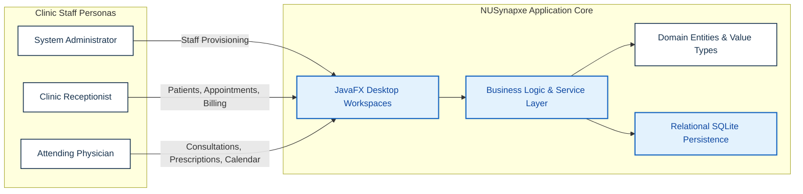
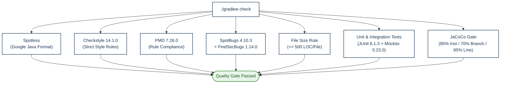

# NUSynapxe Developer Guide

## 1. Introduction

NUSynapxe is a modern, responsive, offline-first desktop clinic management system engineered in Java 25 and JavaFX 25-ea+18. It provides a cohesive, role-tailored workstation experience for clinic staff across administrative, front-desk, and clinical domains.

### 1.1 Purpose and Scope

This Developer Guide describes the software architecture, design principles, persistence data model, testing philosophy, and engineering processes governing NUSynapxe. It serves as the primary technical onboarding reference for new contributors, maintainers, and system evaluators.

### 1.2 System Overview

NUSynapxe coordinates four operational core domains:
- **Administrative Bootstrap & Provisioning**: System initialization, root administrator setup, role-based staff account lifecycle (`SYSTEM_ADMIN`, `RECEPTIONIST`, `DOCTOR`), and directory listing.
- **Patient Registration & Demographics**: Deduplicated patient indexing supporting Singapore NRIC, FIN, and International Passports, complete with phone normalization and cascade-safe deletion blocker preflight audits.
- **Appointment Scheduling & Multi-Doctor Agenda**: Temporal conflict detection, stateful lifecycle tracking (`PENDING` &rarr; `ACCEPTED` &rarr; `CHECKED_IN` &rarr; `COMPLETED` &rarr; `CHECKED_OUT`), arrival time gating in Asia/Singapore local time, recurring doctor working hours, and personal time-off blocking.
- **Clinical Documentation & Financial Auditing**: Confidential doctor consultation workspace, multi-medication itemized prescription builder, cross-doctor historical clinical record browser, transactional payment settlement, sequenced daily receipt issuance, and multi-format (`CSV` / `JSON`) revenue report aggregation.



---

## 2. Technical Prerequisites & Stack

NUSynapxe requires a modern Java toolchain and Node.js environment for building documentation:

| Component | Required Version | Pinned Build Specification | Role in Architecture |
| --- | --- | --- | --- |
| **Java Development Kit (JDK)** | 25 | Eclipse Temurin 25 | Application runtime, virtual thread scheduling, pattern matching, records |
| **JavaFX SDK** | 25-ea+18 | `openjfx:javafx-controls:25-ea+18` | Cross-platform desktop user interface controls and scene graph rendering |
| **Relational Database** | 3.51.0.0 | `org.xerial:sqlite-jdbc:3.51.0.0` | Embedded local relational SQL database |
| **Build Automation** | 9.2.1 | Gradle Wrapper (`gradlew`) | Dependency resolution, multi-task orchestration, packaging |
| **Documentation Engine** | 3.10.2 | Docusaurus (`@docusaurus/core: 3.10.2`) | Documentation static site generator and live portal |
| **Automated Testing** | 6.1.3 | JUnit 6.1.3 (`junit-jupiter`) | Unit, parameterized, and integration test execution |
| **Mocking Framework** | 5.23.0 | Mockito 5.23.0 (`mockito-core`, `mockito-junit-jupiter`) | Isolated boundary mocking |
| **Code Formatting** | 7.3.1 | Spotless 7.3.1 (`google-java-format: 1.25.2`) | Deterministic source code formatting |
| **Static Code Analysis** | 14.1.0 / 7.26.0 | Checkstyle 14.1.0 & PMD 7.26.0 | Enforce coding standards and detect antipatterns |
| **Bytecode Analysis** | 4.10.3 / 1.14.0 | SpotBugs 4.10.3 + FindSecBugs 1.14.0 | Detect concurrency, nullability, and security vulnerabilities |
| **Code Coverage** | 0.8.14 | JaCoCo 0.8.14 | Bytecode test coverage verification gates |

---

## 3. Product Specifications

The system functional requirements, target user personas, priority-rated user stories, structured use cases (UC01–UC16), non-functional specifications, and Gherkin behavioral specifications are maintained in the standalone [**Product Specifications**](ProductSpecifications.md) reference.

Key specifications include:
- **Target User Personas**: System Administrator (system bootstrap & staff provisioning), Clinic Receptionist (front-desk coordination & billing), and Attending Physician / Doctor (clinical workflow & scheduling).
- **User Stories**: Prioritized stories covering administrative, identity, appointment, consultation, time-off, and financial domains.
- **Use Cases (UC01–UC16)**: Formal definitions with preconditions, main success scenarios, and failure extensions covering authentication, patient registration, conflict-aware scheduling, check-in, clinical notes, prescriptions, checkout billing, and reporting.
- **Gherkin Specifications**: Illustrative Given-When-Then behavioral specifications specifying end-to-end user journeys and system invariants.

---

## 4. Architecture and Design

The architectural structure, package modularization, persistence schema, data flow models, and runtime sequence interactions are documented in the standalone [**Architecture and Design**](ArchitectureAndDesign.md) reference.

Key architectural concepts include:
- **Three-Tier Modular Architecture**: Separation into UI / Presentation Layer (`nusynapxe.ui`), Service / Business Logic Layer (`nusynapxe.service`), Domain Model Layer (`nusynapxe.domain`), and Relational Persistence Layer (`nusynapxe.persistence`).
- **Database Schema & Relational Model**: Relational database schema, foreign key constraints, and transactional schema migrations.
- **Key System Sequence Diagrams**:
  1. *Asynchronous Background Task Flow*: Thread-safe UI dispatching via `ClinicTaskRunner` and `Platform.runLater`.
  2. *Preflight Blocker Cascade Check*: Atomic verification of dependent records preventing invalid patient deletions.
  3. *Conflict-Aware Appointment Scheduling*: Temporal collision detection (`starts_at < other_ends && ends_at > other_starts`) against active visits and doctor time-off.
  4. *Infinite-Scrolling Keyspaced Agenda*: Chronological chunked loading with cursor anchoring in Singapore local time.
  5. *Atomic Billing & Sequenced Receipt Issuance*: Transactional payment recording and synchronized daily receipt numbering.

---

## 5. Testing Strategy

The complete testing methodology, test pyramid distribution, quality gates, automated test inventory, and manual verification walkthroughs are documented in the standalone [**Testing Strategy**](TestingStrategy.md) reference.

Key testing policies include:
- **Comprehensive Test Pyramid**: Layered automated verification spanning unit, parameterized, ArchUnit structural, and TestFX UI headless tests.
- **Quality Verification Gates**: Strict enforcement of Spotless code formatting, Checkstyle syntax linting, PMD static analysis, SpotBugs + FindSecBugs security rules, maximum 500-line source file limits, and repo-wide JaCoCo coverage thresholds (85% instruction, 70% branch, 85% line).
- **Manual Verification Walkthroughs**: Deterministic test scenarios with step-by-step test vectors for peer testing.

---

## 6. Development Workflow and Showcase Data

### 6.1 Running Demonstration Seed Data

To launch NUSynapxe with isolated demonstration showcase data without mutating your local user environment database:

```powershell
# Windows PowerShell
.\gradlew.bat run -PdemoDatabasePath="build/demo/showcase.db" --no-daemon --console=plain
```

```bash
# macOS / Linux Bash
./gradlew run -PdemoDatabasePath="build/demo/showcase.db" --no-daemon --console=plain
```

The database seeder automatically initializes the schema and creates demo accounts:
- **System Administrator**: `admin` / `admin123`
- **Clinic Receptionist**: `mary` / `reception123`
- **Attending Physician**: `dr.john` / `doctor123`

### 6.2 Focused Automated Test Execution

Execute specific test classes or packages without running the full test suite:

```powershell
# Run a specific service test suite
.\gradlew.bat test --tests "nusynapxe.service.PatientServiceValidationTest" --info

# Run persistence migration tests
.\gradlew.bat test --tests "nusynapxe.persistence.SchemaMigrationTest" --info

# Run front-desk booking tests
.\gradlew.bat test --tests "nusynapxe.service.ReceptionistBookingTest" --info
```

---

## 7. Build Automation and Verification Gates

All code pushed to repository branches is evaluated against strict automated quality gates configured in `build.gradle`:



---

## 8. Distribution Packaging and Release Management

NUSynapxe produces native desktop installers and fat JARs for cross-platform distribution.

### 8.1 Building Executable JARs

```powershell
# Universal Fat JAR (Windows x64, Linux x64, macOS ARM64)
.\gradlew.bat universalFatJar --no-daemon --console=plain

# Platform-Specific Fat JAR for current host
.\gradlew.bat fatJar --no-daemon --console=plain
```

Output JARs are located in `build/libs/`.

### 8.2 Building Native Platform Installers

The project uses `jpackage` through the unified `packageNative` Gradle task (which requires `-PreleaseVersion=<major>.<minor>.<patch>`) to compile a self-contained native installer bundling a dedicated Java 25 runtime for the host operating system:

```powershell
# Build native installer for the current host OS (e.g. .msi on Windows, .dmg on macOS, .deb on Linux)
.\gradlew.bat packageNative -PreleaseVersion=1.0.0 --no-daemon --console=plain
```

- **Windows (`.msi`)**: Run `packageNative` on Windows (requires WiX Toolset v3+ on `PATH`).
- **macOS (`.dmg`)**: Run `packageNative` on macOS.
- **Linux (`.deb`)**: Run `packageNative` on Linux (requires `fakeroot`).

---

## 9. Platform Compatibility Matrix

| Target Platform & Architecture | Native Installer Package | Portable Executable JAR | Universal JAR Compatible? |
| --- | --- | --- | :---: |
| **Windows x64** (Intel / AMD) | `NUSynapxe-<version>-windows-x64.msi` | `NUSynapxe-<version>-windows-x64.jar` | **Yes** |
| **Windows ARM64** (Surface Pro, Snapdragon) | `NUSynapxe-<version>-windows-arm64-compat.msi` | `NUSynapxe-<version>-windows-arm64-compat.jar` | **No** (Requires Platform JAR) |
| **macOS Apple Silicon** (M1 / M2 / M3 / M4) | `NUSynapxe-<version>-macos-arm64.dmg` | `NUSynapxe-<version>-macos-arm64.jar` | **Yes** |
| **macOS Intel (x64)** (Pre-2020 Macs) | `NUSynapxe-<version>-macos-x64.dmg` | `NUSynapxe-<version>-macos-x64.jar` | **No** (Requires Platform JAR) |
| **Linux x64** (Ubuntu, Debian, Mint) | `NUSynapxe-<version>-linux-x64.deb` | `NUSynapxe-<version>-linux-x64.jar` | **Yes** |
| **Linux ARM64** (Raspberry Pi, ARM Linux) | `NUSynapxe-<version>-linux-arm64.deb` | `NUSynapxe-<version>-linux-arm64.jar` | **No** (Requires Platform JAR) |

---

## 10. Requirements-to-Implementation Mapping

| Functional Requirement | Implementation Classes | Automated Test Verification |
| --- | --- | --- |
| **Role-Based Authentication & Session Isolation** | `AuthenticationService`, `PasswordHasher`, `Session` | `AuthenticationServiceTest`, `AuthorizationTest` |
| **Patient Directory & Document Syntax Rules** | `PatientService`, `PatientDirectoryRepository` | `PatientServiceValidationTest`, `PatientDirectoryRepositoryTest` |
| **Safe Patient Deletion with Blocker Preflight** | `PatientService`, `PatientDeletionBlockers` | `PatientServiceMaintenanceTest`, `PatientDirectoryRepositoryTest` |
| **Appointment Lifecycle & Conflict Checking** | `AppointmentService`, `AppointmentTransitions` | `AppointmentServiceTest`, `AppointmentRepositoryScheduleTest` |
| **Arrival Check-in Gate with Singapore Time** | `AppointmentService`, `ReceptionistCheckInQueuePanel` | `AppointmentServiceTest`, `ReceptionistBookingTest` |
| **Assigned Doctor Consultation & Prescriptions** | `ClinicalService`, `ClinicalRecordRepository` | `ClinicalServiceTest`, `DoctorConsultationPanelTest` |
| **Cross-Doctor Consultation History** | `ClinicalService`, `DoctorClinicalHistoryPanel` | `ClinicalServiceTest`, `DoctorClinicalHistoryTest` |
| **Doctor Calendar, Agenda & Working Intervals** | `CalendarService`, `DoctorCalendarNavigationPane` | `CalendarServiceTest`, `DoctorCalendarNavigationTest`, `DoctorCalendarAppointmentTest`, `DoctorCalendarTimeOffTest` |
| **Atomic Billing Checkout & Receipts** | `BillingService`, `ReceiptRepository`, `PaymentRepository` | `BillingServiceTest`, `ReceiptRepositoryTest` |
| **Revenue Reports & CSV/JSON Exporting** | `RevenueReport`, `BillingService` | `RevenueReportTest`, `ReceptionistBookingTest` |
| **Versioned Relational SQLite Storage** | `SqliteDatabase`, `SchemaInitializer` | `SqliteDatabaseTest`, `SchemaMigrationTest` |
| **Layered Architecture & Package Direction** | `ArchitectureTest`, Gradle config | `ArchitectureTest`, `check` task |
| **Cross-Platform Delivery & Packaging** | `build.gradle`, `.github/workflows/release.yml` | GitHub Actions multi-platform release matrix |

---

## 11. Known Limitations & Future Work

1. **Single-Workstation Concurrency**: The application is optimized for single-workstation local desktop use with a dedicated SQLite database connection. Future iterations could incorporate an optional remote PostgreSQL sync connector for multi-counter clinic networks.
2. **External Identity Verification**: Identity document syntax (NRIC/FIN/Passport) is strictly verified via pattern matching and issuing country checks, but does not query government identity registries (e.g. Singpass API).
3. **Calendar Shading vs Booking Policy**: Doctor working intervals and lunch breaks provide visual calendar shading to assist front-desk scheduling without strictly blocking emergency walk-in bookings.
4. **Code Signing**: Open-source binaries are unsigned. Operating systems may present a one-time trust prompt on first run. Future releases could integrate Apple Developer ID and Microsoft Authenticode code-signing certificates.
5. **Universal JAR Scope**: The universal JAR embeds native libraries for Windows x64, Linux x64, and macOS Apple Silicon. Other architectures (Windows ARM64, macOS Intel, Linux ARM64) require their respective dedicated platform JARs or native installers.

---

## 12. Acknowledgements

We gratefully acknowledge the following open-source projects, frameworks, specifications, and reference documentation that made the development of NUSynapxe possible:

| Source / Project | Role and Utilization in NUSynapxe |
| --- | --- |
| [OpenJFX](https://openjfx.io/) | High-performance desktop UI controls, scene graph, layouts, and JavaFX application lifecycle. |
| [SQLite](https://www.sqlite.org/docs.html) & [Xerial SQLite JDBC](https://github.com/xerial/sqlite-jdbc) | Zero-configuration embedded relational persistence, transactional schema initialization, and foreign key enforcement. |
| [Google libphonenumber](https://github.com/google/libphonenumber) | International telephone country calling-code mapping and metadata resolution. |
| [JUnit 5](https://junit.org/junit5/) & [Mockito](https://site.mockito.org/) | Comprehensive unit, parameterized, and service layer mock testing. |
| [TestFX](https://github.com/TestFX/TestFX) | Automated headless JavaFX user interface interaction, form automation, and scene assertion. |
| [ArchUnit](https://www.archunit.org/) | Automated structural linting and architectural dependency direction enforcement. |
| [Spotless](https://github.com/diffplug/spotless) & [Google Java Format](https://github.com/google/google-java-format) | Deterministic code formatting and automated style checking. |
| [Checkstyle](https://checkstyle.org/) & [PMD](https://pmd.github.io/) | Static source analysis, maintainability rules, and coding standards enforcement. |
| [SpotBugs](https://spotbugs.github.io/) & [FindSecBugs](https://find-sec-bugs.github.io/) | Bytecode security vulnerability detection and static bug pattern analysis. |
| [JaCoCo](https://www.jacoco.org/jacoco/) | Branch and instruction code coverage analysis and report generation. |
| [Docusaurus](https://docusaurus.io/) & [Mermaid](https://mermaid.js.org/) | Production documentation website generation, MDX rendering, and source-controlled architectural diagrams. |
| [WiX Toolset](https://wixtoolset.org/) & `jpackage` | Native Windows (`.msi`), macOS (`.dmg`), and Linux (`.deb`) installer compilation. |
