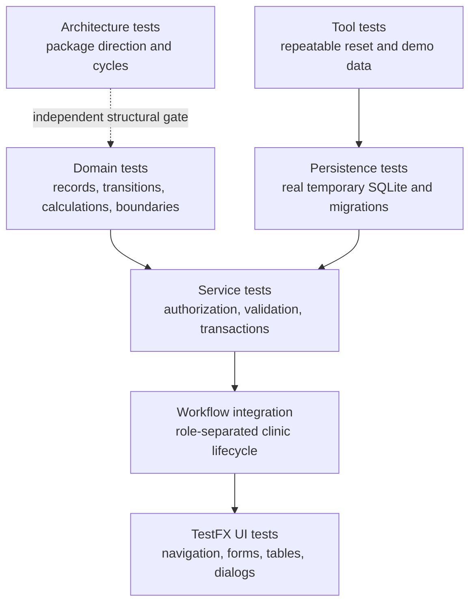

# Developer Guide

## Development prerequisites

The project uses Java 25, Gradle Wrapper 9.7.1, JavaFX 25.0.4, SQLite JDBC
3.53.4.0, and Node.js 24 for the Docusaurus site. JavaFX is resolved by the
Gradle plugin; a separate JavaFX SDK is not required.

Use the checked-in Gradle Wrapper rather than a separately installed Gradle
version. Native Windows packaging additionally requires WiX Toolset v3 or
newer, but WiX is not needed for normal development or testing.

## Getting started

### Running NUSynapxe from source

Run the desktop application from the repository root:

```powershell
.\gradlew.bat run
```

On macOS or Linux, use `./gradlew run`. The application creates or opens the
local database described in the User Guide unless the
`nusynapxe.database` Java system property supplies an isolated path.

### Useful build and quality commands

Run the complete local Java quality gate with:

```powershell
.\gradlew.bat spotlessApply check javadoc --no-daemon --console=plain
```

Useful focused commands are:

```powershell
.\gradlew.bat test --no-daemon --console=plain
.\gradlew.bat test --tests nusynapxe.service.AppointmentServiceTest --no-daemon --console=plain
.\gradlew.bat test --tests nusynapxe.persistence.SchemaMigrationTest --tests nusynapxe.persistence.PatientDirectoryRepositoryTest --no-daemon --console=plain
.\gradlew.bat test --tests nusynapxe.service.PatientServiceTest --tests nusynapxe.ui.ReceptionistViewTest --no-daemon --console=plain
.\gradlew.bat test --tests nusynapxe.service.PatientServiceTest --tests nusynapxe.persistence.PatientDirectoryRepositoryTest --tests nusynapxe.ui.DoctorViewTest --no-daemon --console=plain
.\gradlew.bat checkstyleMain checkstyleTest --no-daemon --console=plain
.\gradlew.bat pmdMain --no-daemon --console=plain
.\gradlew.bat spotbugsMain --no-daemon --console=plain
.\gradlew.bat jacocoTestReport --no-daemon --console=plain
```

`spotlessApply` formats Java source. `spotlessCheck` is the read-only CI
equivalent. `check` runs JUnit, Checkstyle, PMD, SpotBugs with FindSecBugs, and
JaCoCo. Production quality gates fail the build on violations. `pmdTest` is
enabled with its test-specific ruleset; `spotbugsTest` is disabled because
bytecode analysis of the TestFX harness is not part of the production contract.

### Demo database tooling

`scripts/reset-demo-database.ps1` and `scripts/seed-demo-data.ps1` are the
supported Windows workflow for resetting and creating the local-development
database used by `.\gradlew.bat run`. Both use
the `demoData` Gradle `JavaExec` task, which delegates to
`nusynapxe.tools.DemoDataSeeder` and the normal repositories and password
hashing service. The default target is `%USERPROFILE%\.nusynapxe\nusynapxe.db`,
which is also the application's default when no `nusynapxe.database` property
is supplied. A different target can be supplied with `-DatabasePath`.

Reset is destructive; the standalone reset script requires `-Force` for an
existing database. Seeding only accepts an empty database, while
`seed-demo-data.ps1 -Reset` explicitly replaces the target before seeding. The
reset operation removes only the SQLite file and its adjacent `-wal`, `-shm`,
and `-journal` files, then reinitializes the current schema. The generated data
is time-relative to the Singapore clinic date: it creates 18 patients and two
non-overlapping appointments for each Doctor on every date from seven days
before today through fourteen days after today. Historical checked-in,
completed, and checked-out appointments are persisted with deterministic
clinical records, and completed or checked-out records receive a prescription.
The wrapper prints the short showcase credentials `ada` / `ada1234!`, `grace` /
`grace123!`, and `reception` / `recept123!`; the System Admin remains
`admin.demo` / `DemoAdmin123!`. Keep these credentials and generated records
limited to local demonstrations.

## Product definition

### Goal

NUSynapxe is a local desktop clinic application that coordinates patient
administration, Doctor schedules, appointment lifecycle, consultation records,
checkout, receipts, and revenue reporting while enforcing role and ownership
boundaries between System Admin, Receptionist, and Doctor users.

### Current capabilities

- System Admin creates and views Doctor and Receptionist accounts.
- Receptionists maintain administrative patient data, schedule and check in
  visits, complete checkout, view receipts, and generate revenue reports.
- Doctors maintain administrative patient data, manage their own schedule and
  time off, decide assigned appointments, and record assigned consultations and
  prescriptions.
- SQLite stores versioned local data, and native installers package the Java
  runtime for Windows, macOS, and Linux.

### Non-goals

The current product does not provide cloud synchronization, online booking,
government identity verification, insurance claims, inventory management,
multi-clinic tenancy, or an in-application backup/restore workflow. Calendar
working hours shade the display but do not impose booking policy.

## Architecture

### Package layout and boundaries

```text
src/main/java/nusynapxe/             Application entry point and database paths
src/main/java/nusynapxe/domain/      Immutable records and workflow enums
src/main/java/nusynapxe/tools/       Database reset and demo-data utilities
src/main/java/nusynapxe/persistence/SQLite connection, schema, repositories
src/main/java/nusynapxe/service/     Authorization and business-use-case rules
src/main/java/nusynapxe/ui/          Programmatic JavaFX views and scene router
src/test/java/nusynapxe/             JUnit, Mockito, persistence, service, TestFX tests
config/checkstyle/                   Checkstyle configuration
config/pmd/                          PMD ruleset
config/spotbugs/                     SpotBugs exclusions
website/                             Docusaurus configuration and lockfile
```

The UI calls `ClinicServices`; it does not write SQL. Services validate the
actor, role, ownership, state, and input before calling repositories.
Repositories contain explicit projections and transaction boundaries. This
keeps the confidentiality boundary testable even if a future UI accidentally
renders an unauthorized control.

### Enforced dependency rules

`nusynapxe.architecture.ArchitectureTest` uses ArchUnit 1.5.0 to import only
production classes and enforce the package direction documented above. Domain
classes remain independent from outer layers; persistence cannot reach UI,
services, or tools; services cannot reach UI or tools; and UI classes cannot
reach tools or persistence except for `ApplicationRouter`, the database-opening
composition root. The `domain`, `persistence`, `service`, `ui`, and `tools`
slices must also remain free of cycles.

The architecture rules run as part of `.\gradlew.bat check`; run the focused
test with:

```powershell
.\gradlew.bat test --tests nusynapxe.architecture.ArchitectureTest --no-daemon --console=plain
```

## Persistence and schema

`SqliteDatabase.open()` creates the parent directory, enables SQLite foreign
keys, and delegates to the idempotent `SchemaInitializer`. The initializer
stores the schema version in `app_metadata` and creates:

```text
users                 account identity, role, enabled flag, salt/verifier
patients              Patient ID, documented identity, basic data, active flag
appointments          patient/Doctor interval and lifecycle status
doctor_time_off       blocked Doctor availability intervals
doctor_calendar_settings
                      Doctor-owned Calendar settings, including the retained
                      first-day value used for compatibility
doctor_working_intervals
                      Doctor-owned daily display intervals and breaks
clinical_records      diagnosis and consultation/follow-up notes
prescriptions         medication and usage instructions
payments              checkout amount in integer minor units and method
```

Schema version 2 adds nullable identity type/number/country, sex, height,
weight, and active columns for backward compatibility. Schema version 3
removes `patients.billing_information` and clears legacy sex values other than
`FEMALE` and `MALE`; it does not alter the separate `payments` table. Schema
version 4 renames legacy `phone` to `phone_number` and adds nullable
`phone_country_code`. Existing telephone text is retained verbatim and a
migrated row requires a country code on its next save. Version-1
databases apply all migrations in order within one transaction. Existing rows keep their generated numeric
Patient IDs and related records; no identity or measurement values are
invented. New registrations require complete identity and sex values, and a
legacy row requires complete identity fields on its next basic-data save.
Migration advances `app_metadata.schema_version` only after every statement
succeeds, so failure rolls back both schema changes and the version marker.
Schema version 5 adds `doctor_calendar_settings` and
`doctor_working_intervals`. Existing Doctors receive a Sunday-first default
with Monday-Friday `08:00`-`18:00` intervals; a missing interval list means a
disabled day. Intervals are stored as integer minutes through an explicit
`1440` midnight end and are validated as non-overlapping before an atomic
whole-profile replacement. Calendar working intervals are display preferences
only: they do not participate in appointment availability or conflict checks.

`patients.id INTEGER PRIMARY KEY AUTOINCREMENT` is the immutable relational
Patient ID. The UI formats value `42` as `P000042` without storing another
identifier. NRIC, FIN, passport, and other documents are business identifiers,
not primary keys. SQLite enforces uniqueness over the normalized
`(identity_type, issuing_country, identity_number)` tuple. Repository binding
trims and uppercases document values, while the service performs a friendly
pre-check and maps uniqueness races to a non-sensitive duplicate message.

NRIC syntax is `[ST][0-9]{7}[A-Z]`, FIN syntax is
`[FGM][0-9]{7}[A-Z]`, and both require normalized issuing country `SG` at the
service boundary. Passport syntax is `[A-Z0-9]{5,20}`; these rules do
not perform government checksum validation. `phone_country_code` follows
`^[1-9][0-9]{0,2}$` and `phone_number` contains digits only. The plus sign is
added only when formatting the combined telephone number. Calling-code
suggestions use Google libphonenumber metadata and remain editable. Email has
non-empty text around `@`. Height is an optional positive whole number of
centimetres; weight is optional, positive, and limited to one decimal place.
Patient sex is limited to `FEMALE` or `MALE`. Patient-level billing information
is not stored; appointment payments remain in `payments`.
Patient deactivation sets `active = 0`, and reactivation restores `active = 1`;
neither transition reuses the Patient ID or deletes appointment, payment, or
clinical history.

Directory search accepts an exact numeric or `P`-formatted Patient ID and
case-insensitive partial document, country, name, phone, or email text. SQL
wildcards supplied by a user are escaped and treated literally. Blank search
lists the directory, and results use deterministic name-then-ID ordering.

Patient deletion uses `PatientDeletionBlockers` as a non-sensitive relationship
projection. The repository counts appointments, clinical records,
prescriptions reached through clinical records, payments, receipts, and any
other table with a direct foreign key to `patients`. `deleteIfUnrelated` repeats
the counts and the patient-row delete in one transaction. It deletes only the
patient row when every count is zero; it never deletes child rows or uses
`ON DELETE CASCADE`. A final SQLite foreign-key failure is rolled back and
returned as an additional safe blocker category for a stale or newly added
relationship. `PatientDeletionBlockedException` carries only the patient ID
and category counts to the UI.

New schema changes should remain ordered, versioned, and transactional. Keep
basic administrative and clinical columns in separate repository projections. All
appointment and time-off interval writes use transactions and reject overlap;
the overlap rule is `existing_start < new_end` and `existing_end > new_start`,
so adjacent intervals are valid.

## Account, session, and authorization design

The first account must be a System Admin. `AccountService` uses the
`PasswordHasher` PBKDF2WithHmacSHA256 implementation with a random per-account
salt and stores only the salt/verifier byte arrays. `AuthenticationService`
creates an in-memory `Session` after verifying an enabled account and clears
the submitted password array. Sessions are never serialized to SQLite.

`Authorization.requireRole` and `requireDoctorOwnership` are called by every
protected service operation. `Authorization.requirePatientAdministration`
accepts only authenticated `Role.DOCTOR` or `Role.RECEPTIONIST` sessions for
patient registration, search, retrieval, update, activation, deactivation,
deletion preflight, and deletion. `PatientRepository` selects an explicit
basic-data projection and never joins clinical tables;
the `Patient` record cannot contain diagnoses, notes, or prescriptions.
`ClinicalService` requires the assigned Doctor and a checked-in or later
appointment. System Admin is limited to account administration.

Treat document numbers as private data: do not include complete values in
exceptions, logs, screenshots, fixtures, or generated reports. Duplicate
failures use one fixed message and never echo the submitted identity tuple.

## Workflow rules

The Receptionist scheduling dashboard uses `AppointmentRepository.search` and
`AppointmentService.searchAppointments` for optional date, Doctor, patient, and
status filters. It derives summary counts from the same filtered result set.
The repository joins only the administrative patient projection, and the UI
formats table rows with patient name, Doctor name, interval, and status without
generated identifier columns. Booking
rejects inactive patients at the service boundary. Reactivation restores booking
eligibility subject to the normal schedule-conflict rules. Existing appointments
and all history remain available after deactivation. Booking and rescheduling use
a calendar date plus separate hour (`00`–`23`) and minute (`00`/`30`) selectors, and
all conflict and lifecycle checks remain transactional service/repository
rules.
Patient and Doctor appointment selectors use `SearchSuggestionField`, with
filtered keyboard- and mouse-selectable results below their text editors.
Appointment times are generated in 30-minute increments from `00:00` through
`23:30`. Rescheduling is handled in an owned modal Stage that displays the
selected patient's administrative projection and exposes reschedule/cancel
actions; successful completion refreshes the dashboard.
The Check-in Queue reuses the administrative appointment search, defaults to
Singapore's current date, combines accepted and checked-in appointments, and
opens an administrative details popup with an eligibility-aware check-in action.
Checkout uses a completed-appointment search and a separate receipt-history
projection. Successful payments create one receipt with a unique daily sequence;
history viewing is read-only and contains administrative fields only.

The lifecycle policy is:

```text
PENDING -> ACCEPTED -> CHECKED_IN -> COMPLETED -> CHECKED_OUT
    \          /
     \-> CANCELLED
```

Receptionists book for any Doctor, check in at or after the start time, and
check out a completed appointment. Doctors accept assigned appointments,
reschedule their own pending/accepted appointments, manage time off from Calendar, save one
clinical record per consultation, add prescriptions, and complete checked-in
appointments. Invalid transitions leave persistence unchanged. Billing
stores integer minor units and aggregates successful payments by local date.

The shared availability query treats `PENDING`, `ACCEPTED`, `CHECKED_IN`,
`COMPLETED`, and `CHECKED_OUT` as blocking states. `DECLINED` and `CANCELLED`
appointments remain persisted and searchable but do not block booking,
rescheduling, or time-off creation. Time-off removal derives the owner from the
authenticated Doctor session and deletes with both `id` and `doctor_id`; a
missing or differently owned row produces the same safe validation result.

Revenue Reports are built from persisted successful-payment receipts. The
Receptionist-only service accepts an inclusive Singapore-local date range and
optional patient, Doctor, and payment-method filters, then returns receipt
detail rows plus total and breakdown projections. The UI renders an explicit
empty state and exports the current projection as CSV or JSON; exporting never
creates or mutates a payment or receipt.

The Doctor Calendar uses a separate authorized read path. Its range query
matches appointments and time off with `starts_at < range_end` and
`ends_at > range_start`. The immutable `DoctorCalendarWeek` projection contains
Calendar settings, administrative `CalendarAppointment` values, and ranged
`DoctorTimeOff` values with stable IDs; it does not load clinical records or
prescriptions. Doctor-owned and Receptionist-selected reads populate the same
non-clinical time-off projection after their role and ownership checks.
Calendar working-hours settings are owned by the authenticated Doctor and are
persisted transactionally. The fixed clinic zone is `Asia/Singapore`; it is
shown as informational text and is not configurable or stored as a preference.
The persisted first-day value remains part of the settings snapshot for
compatibility, but the settings page no longer presents it because Calendar
ranges and Agenda anchors are selected explicitly. Agenda mode uses the same
administrative projection through `CalendarService.getSchedulePage`: it takes
an inclusive Singapore-local start date, a bounded page size, and an optional
`CalendarScheduleCursor` containing `(startsAt, appointmentId)`. The repository
orders by `starts_at, id` and reads one look-ahead row to derive `hasMore`, so
equal timestamps cannot cause skips or duplicates. `CalendarScheduleList` is a
virtualized, append-only JavaFX list; it groups each page by start date and
does not add a duplicate date header when a page boundary splits a group.
Agenda navigation clears the cursor and list, while a failed later page
keeps prior rows and exposes Retry. Agenda working-hour and break shading is
intentionally confined to the weekly grid; it never blocks appointment writes.

`CalendarTimeGrid` shares day clipping, working-hour shading, current-time
presentation, appointment selection, time-off rendering, and proportional
minute geometry. Its full profile retains 100-pixel half-hour rows and inline
Doctor decisions. Its compact profile uses 44-pixel rows, combines time and
written status on one line, and makes the whole appointment block selectable.
A 60-minute event therefore occupies twice the time span of a 30-minute event,
less the same inset at both edges. `DoctorDashboardDayView` owns the Dashboard
date, Singapore clock, Today and previous/next navigation, date picker, refresh,
useful initial scrolling, minute ticker, and selection reconciliation.
`DoctorView` resolves an authorized Calendar selection through
`AppointmentService` before loading clinical data in the detail pane.

## UI and TestFX conventions

`ApplicationRouter` opens Login or first-run Setup and routes an authenticated
session to one of the role workspaces. Every routed scene loads
`src/main/resources/nusynapxe/ui.css`; the application opens the stage
maximized, while the router uses a restored initial size of `1200 x 760`, a
minimum size of `980 x 640`, and keeps the stage resizable.
`UiComponents` contains presentation-only factories for cards, headings,
field groups, action bars, feedback, empty states, buttons, status badges, and
the authenticated header. It has no service or persistence dependency.
`UiComponents.statusBadge` renders a `Label` with a `status-badge` style class
plus a semantic `status-<value>` class defined in `ui.css`; it is the single
source of status colour across the app (Doctor Calendar blocks and schedule
list, `SystemAdminView` account status, `PatientDirectoryView` patient status,
and the Receptionist appointment/queue/checkout `TableView`s), so a status
`TableColumn` uses a `TableCell` `cellFactory` that calls it via `setGraphic`
rather than rendering plain text.

Views are built programmatically so semantic ids remain easy to assert. The
patient area has one default directory view with search controls, a `TableView`
with `Name`, `Date of birth`, `Phone`, `Email`, `Status`, and rightmost
`Actions` columns, and a bottom `Register new patient` action. Each populated
Actions cell has a stable `*-patient-view-<id>` button. Registration, read-only
viewing, and editing are separate managed page states. Successful registration
clears the draft and search, while successful editing returns to the read-only
patient view. Both refresh the directory and dependent selectors. Validation
or persistence failure keeps the active form page open with feedback. Country
options come from `Locale.getISOCountries()`, use English display names, persist
ISO two-letter codes, and order Singapore first. NRIC and FIN selection chooses
and locks Singapore automatically; service validation independently enforces
the same rule. All identity, country, date, and sex `ComboBox` controls use the
shared `.compact-selector` style; impossible day/month combinations clamp to
the month's final day. Age is derived with the `Asia/Singapore` date, has no
placeholder, and is never persisted. Male precedes Female in the sex selector.
The telephone `+` is a fixed label outside the editable, digits-only country-code
field. Clicking a table row does not open a window; its explicit View action
shows all permitted administrative details with Edit, status, delete, and back
actions. Edit then opens a form with Save and Discard changes.

All date-picker fields use `UiComponents.compactDatePicker()` and the shared
`compact-date-picker` marker. The stylesheet keeps the control at the compact
selector height, gives the embedded text field transparent treatment, and uses
an understated calendar button while preserving the native popup, keyboard,
focus, accessible-label, and validation behavior. New date-picker fields should
use this factory rather than constructing `DatePicker` directly.
The top-level `reception-workspace-tabs` is an internal page stack with hidden
headers. The visible `reception-navigation` rail uses ordinary horizontal-text
buttons for directory, appointments, Calendar, check-in, checkout, and revenue.
`ReceptionistCalendarView` reads one selected Doctor's administrative projection
through `CalendarService.getReceptionistWeek`; empty slots open a Receptionist
creation dialog and appointment blocks open the Receptionist edit dialog without
exposing clinical data. Successful dialog actions refresh the grid. Actions and page
selection refresh affected data, so Receptionist view has no manual refresh
control. Important ids include `login-submit`, `setup-submit`,
`admin-account-submit`, `reception-patient-directory-view`,
`reception-patient-open-register`, `reception-patient-register-view`,
`reception-patient-register-cancel`,
`reception-register-identity-type`, `reception-register-issuing-country`,
`reception-register-phone-country-code`, `reception-register-phone-number`,
`reception-register-phone-plus`, `reception-register-date-of-birth`,
`reception-register-date-of-birth-month`, `reception-register-date-of-birth-year`,
`reception-register-age`, `reception-patient-view`, `reception-patient-edit-view`,
`reception-patient-identity-type`, `reception-patient-identity-number`,
`reception-patient-issuing-country`, `reception-patient-search`,
`reception-patient-search-submit`, `reception-patient-search-clear`,
`reception-patient-table`, `reception-patient-view-<id>`,
`reception-patient-update`, `reception-patient-edit-cancel`,
`reception-patient-deactivate`, `reception-book`, `reception-checkout`,
`doctor-consultation-save`, and `logout-button`.

Doctor navigation adds `doctor-nav-calendar`. The Calendar page uses
`doctor-calendar-today`, `doctor-calendar-previous`, `doctor-calendar-next`,
`doctor-calendar-schedule-date`, `doctor-calendar-view-mode`, and
`doctor-calendar-settings`. The view mode values are `Calendar` and `Agenda`;
Agenda's date picker is a shared compact `DatePicker` and has no custom popup
identifier. The responsive toolbar exposes
`doctor-calendar-toolbar-main`, `doctor-calendar-toolbar-actions`, and
`doctor-calendar-action-group`. Agenda mode uses
`doctor-calendar-schedule-list`, `doctor-calendar-schedule-date-<date>`,
`doctor-calendar-schedule-appointment-<id>`, and explicit
`doctor-calendar-schedule-loading`, `doctor-calendar-schedule-empty`,
`doctor-calendar-schedule-end`, `doctor-calendar-schedule-error`, and
`doctor-calendar-schedule-retry` state markers. The settings page uses
`doctor-calendar-settings-page`, `doctor-calendar-settings-timezone`,
`doctor-calendar-settings-working-hours`, and `doctor-calendar-settings-save`;
there is no first-day selector or Calendar Preferences card. Working-interval
rows are visual-only and support multiple intervals so a break can be
represented without changing appointment scheduling.

`PatientDirectoryView` is the shared administrative directory embedded by the
Receptionist and Doctor workspaces. It receives the authenticated session,
services, an ID prefix, a feedback label, and a callback for refreshing
dependent selectors. Receptionist IDs retain the `reception-*` prefix; Doctor
IDs use `doctor-*`. The table's explicit View action is backed by the row's
`Patient` cell value, so JavaFX cell reuse cannot detach an action after a
search refresh. It replaces the directory with a read-only administrative
page containing **Edit**, **Activate/Deactivate
patient**, **Delete patient**, and **Back to patients**. Edit opens a separate
form containing **Save** and **Discard changes**. Eligible
deletion opens an explicit confirmation window; a blocked deletion opens the
owned `*-patient-delete-blocked-window` modal with category/count labels and
deactivation guidance. No ordinary patient-details window is created, and
failed writes leave the edit page and its draft available for correction.

The shared authenticated header has `workspace-header`, `app-brand`,
`workspace-title`, `workspace-identity`, and `logout-button`. The Receptionist
top-level `reception-workspace-tabs` remains a hidden-header `TabPane`;
`reception-navigation` is the visible rail and its **Navigation** label is a
distinct non-interactive title. The appointment subflow uses compact secondary
tabs. Workspace feedback sits directly below the shared header and
`UiComponents.feedback` clears it after six seconds. Error feedback uses the
red `error-feedback` treatment and `notificationArea` centres banners at the
top. `passwordInput` overlays its faded visibility toggle within the password
field rather than placing a separate adjacent button. New layout markers include
`reception-patient-search-card`, `reception-patient-results-card`,
`reception-booking-card`, `reception-appointment-results-card`,
`reception-checkout-payment-card`, `reception-revenue-card`,
`doctor-master-detail`, `doctor-detail-scroll`, `doctor-no-selection`,
`doctor-dashboard-day-calendar`, `doctor-dashboard-date`,
`doctor-dashboard-previous`, `doctor-dashboard-next`, `doctor-dashboard-today`,
`doctor-dashboard-refresh`, `doctor-calendar-block-time`,
`doctor-calendar-refresh`, `doctor-calendar-time-off-dialog-content`,
`doctor-calendar-time-off-<id>-<date>`,
`doctor-calendar-time-off-remove-confirmation`,
`doctor-selected-appointment`, `doctor-selected-content`,
`doctor-patient-details-card`, `doctor-patient-details`, `doctor-decline`,
`doctor-status-message`, and `doctor-clinical-read-only`,
`admin-account-form-card`, and `admin-account-list-card`.

Operational results use dedicated JavaFX tables. Patient rows show name,
contact details, and active status without a generated-ID column. Receptionist
appointment rows show administrative patient context, Doctor name, date/time,
and a written lifecycle status without Patient or Doctor ID columns. Searchable
patient and Doctor fields use `SearchSuggestionField`, which filters options
beneath the editor and supports mouse plus Up/Down/Enter selection. Doctor
prescription cells show medication and usage fields. System Admin staff
accounts use a compact table with Username, Display Name, Role, and Status
columns. Empty results use stable `*-empty` markers and an explanatory
message. Color is supplementary to status text, and the stylesheet provides a
visible focus outline for keyboard navigation.

The Doctor workspace uses a compact, internally scrollable single-day Calendar
as the master pane and a separately scrollable, status-driven selected-
appointment detail pane. Its header contains the patient name, appointment
time, and written status with a matching semantic colour class; it deliberately
does not expose the generated Patient ID. The selected pane renders the shared
administrative patient details grid read-only. Pending and accepted visits get
only their permitted lifecycle actions, while checked-in visits get the
consultation, prescription, and completion cards. Completed and checked-out
clinical cards remain readable but have no editing actions; declined and
cancelled visits show a non-actionable status message. Rescheduling reuses
`AppointmentDialog.showDoctorEdit`, so date/time validation is shared with
Calendar. The old Dashboard appointment `ListView` and time-off form are
absent; time off is created and removed only from the full Calendar. The
existing services still own authorization and lifecycle validation, and a
successful action refreshes the Dashboard so the selected branch follows the
current status.
The Doctor shell keeps that content under the `Dashboard` destination and
places the shared administrative directory under `Patients`;
`doctor-nav-dashboard`, `doctor-nav-patients`, and `doctor-patients-page` are
the navigation markers. The navigation `VBox` uses zero spacing and its two
buttons are styled with infinite maximum width, flush edges, and full-panel
alignment while retaining active, hover, and keyboard-focus states. The
Patients destination has no clinical service or prescription controls.

TestFX tests require a display. The CI workflow runs the Java suite through
`xvfb-run --auto-servernum` on Ubuntu. For controls inside a scroll pane,
tests should wait for the view marker and use semantic JavaFX-thread actions
when a control is not physically visible. This avoids coupling tests to
layout coordinates while still exercising each control's event handler.

JaCoCo reports are generated at:

```text
build/reports/jacoco/test/html/index.html
build/reports/jacoco/test/jacocoTestReport.xml
```

## Testing strategy

### Test levels



Repository and service tests use isolated databases under JUnit `@TempDir`;
they never open the developer's default clinic database. Time-sensitive service
tests inject fixed `Clock` values. TestFX classes create their own temporary
database and wait for JavaFX events instead of depending on arbitrary sleeps.
This keeps the suite repeatable and prevents test patients, credentials, or
clinical records from leaking into local working data.

### Test inventory

The current source contains 168 `@Test` methods across 35 test classes. The
inventory is grouped by the package boundary it exercises so it can be checked
against the architecture rather than maintained as a long list of class names.

| Test area | Classes | Tests | Main evidence |
| --- | ---: | ---: | --- |
| Application root | 1 | 2 | Stable and normalized default database paths. |
| Architecture | 1 | 5 | Layer direction, exceptions, slice cycles, and UI/persistence separation. |
| Domain | 3 | 9 | Calendar invariants, schedule paging values, exact revenue boundaries and overflow rejection. |
| Persistence | 8 | 36 | Schema creation/migration, transactions, CRUD, conflicts, wildcard escaping, deletion blockers, and pagination. |
| Service | 14 | 51 | Authentication, authorization, patient validation, appointment lifecycle, billing, clinical ownership, and end-to-end workflow. |
| Tools | 1 | 2 | Protected reset and deterministic demo-data seeding. |
| UI | 7 | 63 | Login/routing, role workspaces, searchable selectors, responsive tables, dialogs, calendars, feedback, checkout, and exports. |
| **Total** | **35** | **168** | Source inventory; rerun the suite after any production or test change. |

### Risk-based coverage priorities

| Risk | Mitigation and automated evidence |
| --- | --- |
| Unauthorized clinical-data access | Service role/ownership checks, projection-specific repositories, `AuthorizationTest`, `ClinicalServiceTest`, and `ClinicWorkflowIntegrationTest`. |
| Partial appointment, checkout, or deletion writes | Explicit SQLite transactions and rollback tests in service and persistence suites. |
| Time conflicts and lifecycle mistakes | Boundary tests for adjacent/overlapping intervals, released declined/cancelled slots, check-in timing, and invalid transitions. |
| Monetary sign, precision, or overflow errors | Integer minor-unit storage; `BigDecimal.longValueExact()` at UI parsing; positive service validation; exact report aggregation; `BillingServiceTest` and `RevenueReportTest`, including `Long.MAX_VALUE` and overflow. |
| Migration data loss | `SchemaMigrationTest` covers every supported source version and rollback after partial failure. |
| Search mistakes or SQL wildcard leakage | Repository tests cover names, identity/contact fields, combined criteria, deterministic ordering, and literal `%`/`_` input. |
| Duplicate or skipped agenda rows | Stable `(startsAt, appointmentId)` cursors and sparse-page/concurrent-insert tests. |
| Invalid CSV or JSON exports | Receptionist export tests cover quotes, commas, backslashes, line breaks, tabs, and JSON control characters. |
| Layer erosion | ArchUnit rules reject forbidden dependencies and package cycles during `check`. |
| UI regressions | TestFX covers semantic control ids and workflows; manual review remains appropriate for visual balance, native file choosers, and installer behaviour. |

Extreme-value tests are required wherever input is converted to a narrower
representation or later aggregated. A boundary is not considered covered only
because rejected input was tested: the largest supported valid value and the
first overflowing combination must also have explicit expected behaviour. This
rule directly protects money, identifiers, date ranges, page sizes, and
calendar arithmetic from silent wraparound.

### Local verification commands

From the repository root:

```powershell
# Windows PowerShell
.\gradlew.bat spotlessApply
.\gradlew.bat test --no-daemon --console=plain
.\gradlew.bat check javadoc --no-daemon --console=plain
git diff --check
```

```bash
# macOS/Linux
./gradlew spotlessApply
./gradlew test --no-daemon --console=plain
xvfb-run --auto-servernum ./gradlew check javadoc --no-daemon --console=plain
git diff --check
```

Use `spotlessCheck` instead of `spotlessApply` when a read-only formatting
check is required. A passing `test` task is not the complete quality gate.

### Quality tasks and reports

| Task or tool | Purpose | Output or failure policy |
| --- | --- | --- |
| `spotlessApply` / `spotlessCheck` | Apply or verify Google Java Format. | Formatting differences fail `spotlessCheck`. |
| `checkstyleMain`, `checkstyleTest` | Enforce the configured Java style rules. | Reports are under `build/reports/checkstyle/`; violations fail. |
| `pmdMain`, `pmdTest` | Run production and test-specific PMD rulesets. | Reports are under `build/reports/pmd/`; violations fail. |
| `spotbugsMain` with FindSecBugs | Analyse production bytecode at maximum effort. | Reports are under `build/reports/spotbugs/`; medium-confidence findings fail. |
| `test` | Run JUnit, ArchUnit, repository/service tests, integration tests, and TestFX. | JUnit XML and HTML reports are generated under `build/`. |
| `jacocoTestReport` | Generate instruction and branch coverage evidence. | HTML/XML reports use the paths above and are published by CI. |
| `javadoc` | Verify and generate public API documentation. | Output is under `build/docs/javadoc/`; warnings promoted by compilation policy fail where configured. |
| `npm ci && npm run build` in `website/` | Reproduce and build the documentation site. | Broken Docusaurus links fail the production build. |
| `git diff --check` | Detect whitespace errors in the final patch. | Must produce no errors before commit. |

## Documentation site and CI

From the repository root, build or serve the Docusaurus site with:

```powershell
Set-Location website
npm ci
npm run build
npm run start
```

`website/docusaurus.config.js` includes `README.md` and `docs/**/*.md` in the
documentation build. The sidebar exposes the overview and the two guides;
reflection files remain unlisted but are still parsed by the production build.
Broken site links fail the production build. GitHub
Actions uses JDK 25, Node.js 24, `xvfb-run`, `./gradlew check javadoc`, and
`npm ci && npm run build`; it publishes the generated `build/reports/` files
as a quality-report artifact. `website/src/css/custom.css` mirrors the desktop
app's palette from `src/main/resources/nusynapxe/ui.css` (teal `#0f8f83`
primary, navy `#17324d` headings, slate `#52677b` body text) in both light and
dark Docusaurus themes.

## Native packaging and releases

The `packageNative` Gradle task (registered near the bottom of `build.gradle`)
builds a platform-native installer with `jpackage`, using the current
toolchain's bundled JDK:

```powershell
.\gradlew.bat installDist packageNative "-PreleaseVersion=0.1.0" --no-daemon
```

`-PreleaseVersion` is required and must be `<major>.<minor>.<patch>`; the task
fails fast without it. It packages whichever installer type matches the host
OS (`.msi` on Windows, `.dmg` on macOS, `.deb` on Linux), reading the app image
from `build/install/CS3227-2610-MP2/lib` (populated by `installDist`) and the
platform-specific JavaFX modules resolved on `runtimeClasspath` by the OpenJFX
Gradle plugin. The finished installer is copied to
`build/packages/NUSynapxe-<version>-<platform>.<extension>`. Building an
`.msi` on Windows requires the [WiX Toolset](https://wixtoolset.org) v3+ on
`PATH`.

The `fatJar` task builds the current host's platform-specific executable JAR:

```powershell
.\gradlew.bat fatJar "-PreleaseVersion=0.1.0" --no-daemon
```

It writes `build/libs/NUSynapxe-<version>-fat.jar`. The JAR contains the
application, its non-JavaFX runtime dependencies, and the JavaFX modules for
the host platform. It requires a matching Java 25 runtime when it is run
outside a native installer.

The `universalFatJar` task assembles one additional executable JAR for the
three explicitly supported targets Windows x64, Linux x64, and macOS ARM64:

```powershell
.\gradlew.bat universalFatJar "-PreleaseVersion=0.1.0" --no-daemon
```

It writes `build/libs/NUSynapxe-<version>.jar`. This task excludes the host's
JavaFX artifacts and embeds the JavaFX `win`, `linux`, and `mac-aarch64`
artifacts in a deterministic order, together with the application and its
other runtime dependencies. Because JavaFX contains native libraries, this is
not a platform-neutral Java-only JAR: it requires Java 25 and is limited to
those three OS/architecture combinations. Use a platform-specific fat JAR or
native installer for the other targets.

`.github/workflows/release.yml` runs the native packaging and platform-specific
fat JAR task on six explicit Windows/Linux/macOS x64 and ARM64 targets whenever
a tag matching `vX.Y.Z` is pushed. The Windows ARM64 job intentionally uses an
x64 Java/JavaFX build for Windows ARM emulation. A separate Windows x64 job
builds the universal JAR. Each target uploads one installer and one JAR; the
universal job uploads the additional `NUSynapxe-<version>.jar`. The final
`publish` job verifies and attaches 13 files to the GitHub Release: six native
installers, six platform-specific fat JARs, and the one universal JAR. macOS
jobs compile tests and run static checks but skip the TestFX runtime suite
because there is no `xvfb` equivalent there. To cut a release, push a tag from
`master`:

```bash
git tag v0.2.0
git push origin v0.2.0
```

## Requirements-to-implementation mapping

| Requirement | Implementation | Automated evidence |
| --- | --- | --- |
| Role-based authentication and confidentiality | `AuthenticationService`, `Authorization`, administrative projections, assigned-Doctor checks | `AuthenticationServiceTest`, `AuthorizationTest`, `ClinicalServiceTest`, workflow integration test |
| Patient administration without exposing clinical history | `PatientService`, `PatientRepository`, `PatientDirectoryView` | Patient service/repository suites and Doctor/Receptionist TestFX suites |
| Appointment lifecycle and conflict prevention | `AppointmentService`, `AppointmentTransitions`, `AppointmentRepository` | Service and repository schedule tests |
| Doctor Calendar, agenda, settings, and time off | `CalendarService`, calendar domain records, `DoctorCalendarView` | Calendar domain/service/calculation and TestFX suites |
| Atomic checkout, receipts, and revenue | `BillingService`, payment/receipt repositories, `RevenueReport` | Billing, persistence, integration, revenue-boundary, and export tests |
| Versioned local persistence | `SqliteDatabase`, `SchemaInitializer`, `SqliteTransactions` | Database, transaction, and migration suites |
| Enforced package boundaries and quality gates | Gradle configuration, ArchUnit, Checkstyle, PMD, SpotBugs, JaCoCo | `ArchitectureTest`, `check`, CI reports |
| Reproducible documentation and delivery | Docusaurus configuration, `packageNative`, CI/Pages/release workflows | Documentation build and platform release jobs |

Behavioural or architectural changes should update the relevant OpenSpec
artifact first, implement and test the change, synchronize the main specs, pass
strict OpenSpec validation, and archive the completed change. Documentation
examples must be checked against the final method signatures, visible labels,
and build configuration rather than an earlier design draft.

## Known limitations and future work

- The application and database are local to one computer; there is no cloud
  synchronization or built-in backup/restore workflow.
- Identity-document validation checks documented syntax but not government
  checksums or external registries.
- Calendar working intervals control shading only; appointment conflicts and
  explicit Doctor time off enforce availability.
- Native installers are not code-signed or notarized, so operating systems may
  display a publisher or trust warning.
- The universal JAR requires Java 25 and embeds native JavaFX files for Windows
  x64, Linux x64, and macOS ARM64 only; it is not a replacement for the
  platform-specific JARs or native installers on other targets.
- Hosted macOS release jobs compile tests and run static checks but do not run
  the TestFX runtime suite because the workflow has no Xvfb equivalent.

## Acknowledgements

| Source | Use in NUSynapxe |
| --- | --- |
| [OpenJFX](https://openjfx.io/) | Desktop UI controls and application lifecycle. |
| [SQLite](https://www.sqlite.org/docs.html) and [Xerial SQLite JDBC](https://github.com/xerial/sqlite-jdbc) | Embedded relational storage and JDBC driver. |
| [Google libphonenumber](https://github.com/google/libphonenumber) | Country calling-code metadata. |
| [JUnit](https://junit.org/), [TestFX](https://github.com/TestFX/TestFX), and [ArchUnit](https://www.archunit.org/) | Unit/integration testing, JavaFX interaction, and package-boundary enforcement. |
| [Spotless](https://github.com/diffplug/spotless), [Checkstyle](https://checkstyle.org/), [PMD](https://pmd.github.io/), [SpotBugs](https://spotbugs.github.io/), [FindSecBugs](https://find-sec-bugs.github.io/), and [JaCoCo](https://www.jacoco.org/jacoco/) | Formatting, static analysis, security checks, and coverage reports. |
| [Docusaurus](https://docusaurus.io/) and [Mermaid](https://mermaid.js.org/) | Documentation site and source-controlled diagrams. |
| [GitHub Actions](https://docs.github.com/actions) and `jpackage` | Continuous verification, documentation deployment, and native packaging. |
