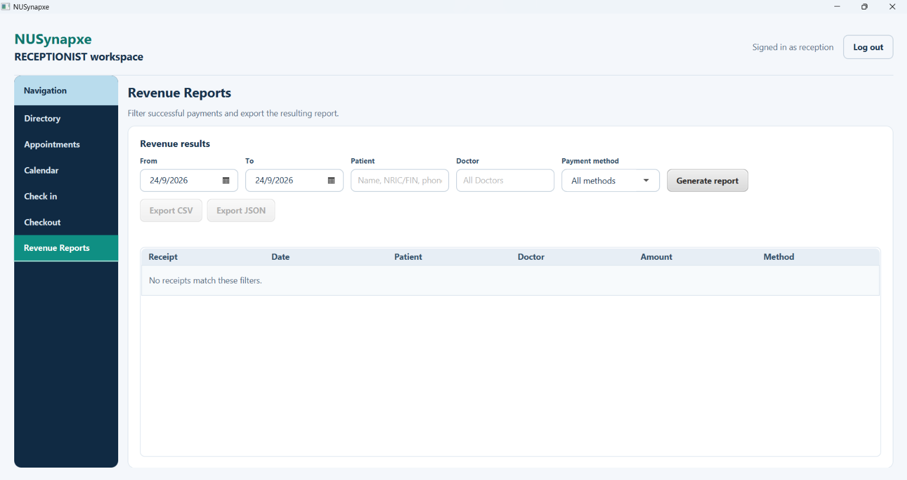
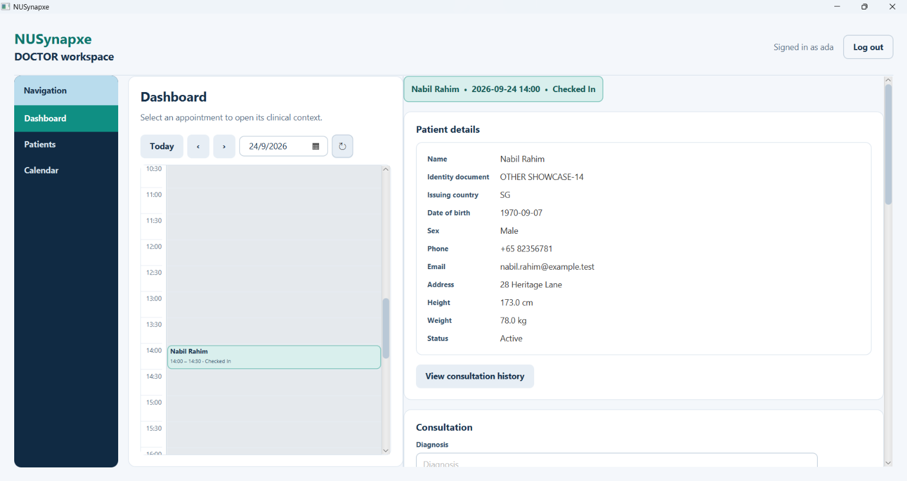
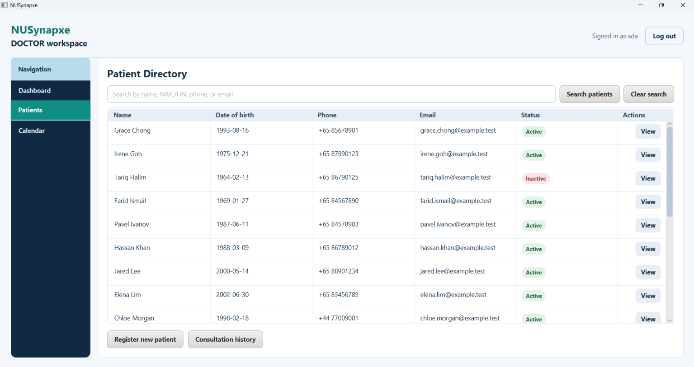
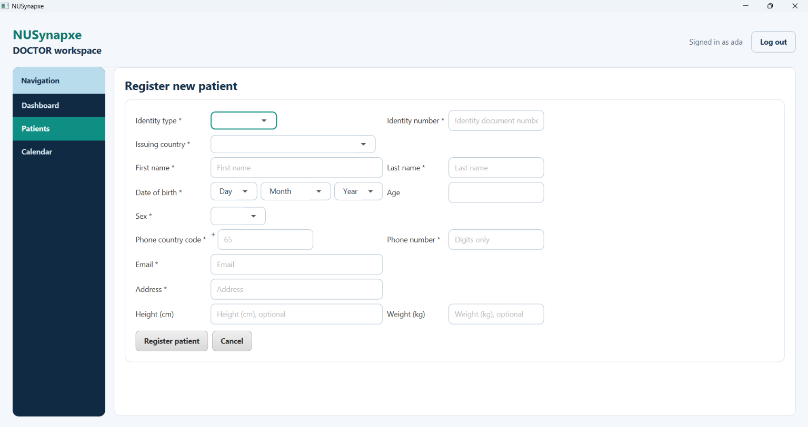
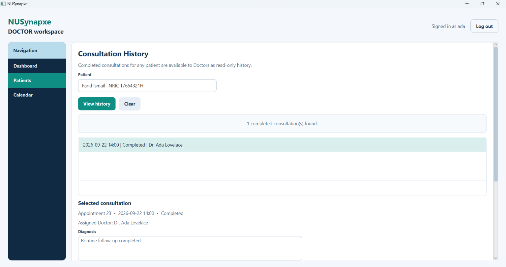
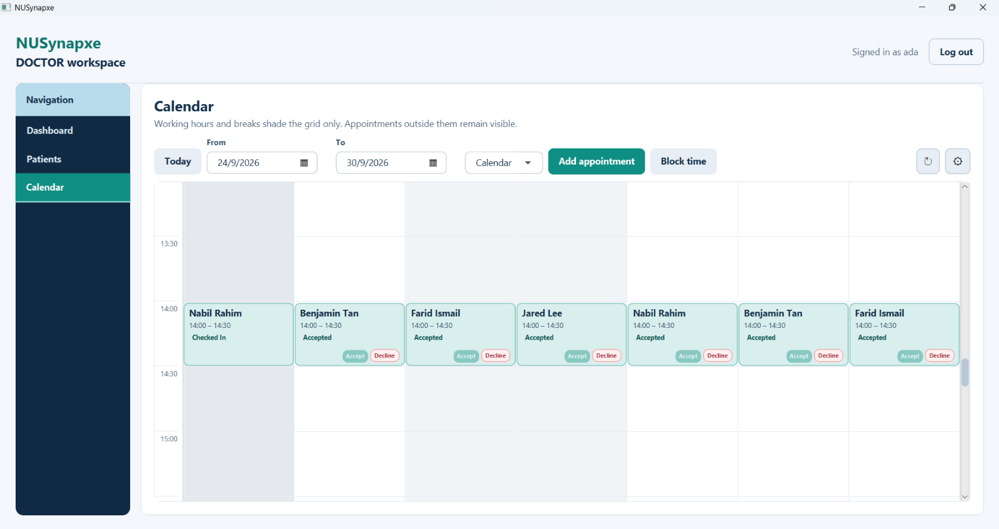
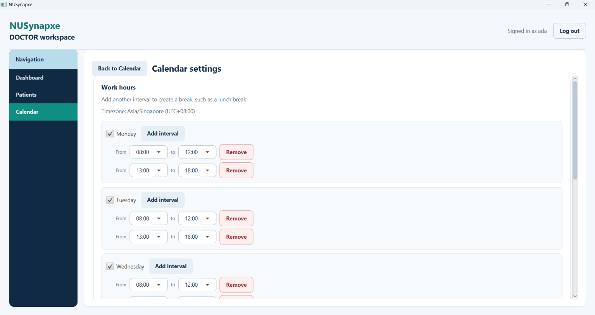

# NUSynapxe Doctor User Guide

The Doctor workspace in NUSynapxe is tailored for clinicians and healthcare providers. Doctors manage their daily schedules, conduct patient consultations, record clinical examination findings and diagnoses, issue prescriptions, and maintain working hours:

```text
accept -> examine & diagnose -> prescribe -> mark completed
```

> [!NOTE]
> Only the assigned Doctor can create, modify, or view in-progress clinical consultation notes and prescriptions for an active appointment. For completed and checked-out consultations, any authenticated Doctor can view consultation notes and prescriptions through the cross-doctor clinical history browser to support continuity of care. Receptionists and Administrators cannot access clinical medical records.
>
> 📖 For general application setup, installation, or user account information, refer back to the [**Main User Guide**](UserGuide.md).

---

## Navigation & Workspace Layout


*Figure 1: Doctor daily dashboard with compact day calendar and contextual appointment detail pane.*

The Doctor workspace features a dark left-hand navigation rail with three primary destinations:
- **Dashboard**: Master-detail daily schedule, appointment acceptance/declining, consultation records, and prescription builder.
- **Patients**: Administrative directory access and cross-doctor historical consultation browser.
- **Calendar**: Visual multi-day schedule, infinite-scrolling agenda view, personal time-off blocking, and working hours / lunch break configuration.

---

## 1. Clinical Dashboard (Master-Detail Schedule)

1. Log in with a Doctor account. **Dashboard** is the default destination upon login.
2. **Left Pane (Daily Schedule)**:
   - Displays a compact, scrollable calendar for the current Singapore-local day (`Asia/Singapore`).
   - Navigate with **Today**, previous day (`<`), next day (`>`), the date picker, or the refresh icon.
   - Displays a live ticking clock showing Singapore Standard Time.
   - Date fields throughout the workspace use a compact, minimal control design.
3. **Right Pane (Contextual Detail & Actions)**:
   - Select an appointment block to reveal its consultation context and actions.
   - The detail header displays patient name, scheduled time, and status color badge alongside written status text.
   - The patient card is read-only. Until a visit is selected, the detail pane explains what to do.
   - Changing to a day without that appointment clears selection; refreshing retains a selection if it remains visible.
4. **Contextual Appointment Actions**:
   - `PENDING`: Buttons for **Accept**, **Decline**, and **Reschedule**.
   - `ACCEPTED`: Buttons for **Decline**, **Reschedule**, and **Check in** (when start time has arrived).
   - `CHECKED_IN`: Consultation form (Diagnosis, Consultation notes, Follow-up notes), **Save consultation**, Prescription form (Medication, Dosage, Frequency, Duration, Instructions), **Add prescription**, Prescriptions table, and **Mark consultation completed**.
   - `COMPLETED` / `CHECKED_OUT`: Displays saved clinical consultation notes and prescriptions in read-only format.
   - `DECLINED` / `CANCELLED`: Displays a non-actionable status notice.
   - Selecting **Reschedule** opens the same Calendar-style appointment editor used elsewhere.

---

## 2. Conducting Consultations & Prescriptions


*Figure 2: Doctor consultation form with clinical notes, diagnosis, and prescription builder.*

1. When a patient arrives and is checked in (status: `CHECKED_IN`), select the appointment on the Dashboard.
2. **Recording Clinical Notes**:
   - **Diagnosis**: Enter clinical diagnosis or primary complaint (required).
   - **Consultation Notes**: Enter clinical examination findings and clinical notes (required).
   - **Follow-up Notes**: Recommended follow-up instructions or referrals (optional).
   - Click **Save consultation**.
3. **Issuing Prescriptions**:
   - In the prescription card below, complete all five fields:
     - **Medication**: Name of medication (e.g. `Amoxicillin 500mg`).
     - **Dosage**: Dosage amount (e.g. `1 tablet`).
     - **Frequency**: Administration schedule (e.g. `3 times daily after meals`).
     - **Duration**: Course duration (e.g. `7 days`).
     - **Instructions**: Specific guidance (e.g. `Complete full course; avoid alcohol`).
   - Click **Add prescription**. The medication is added to the consultation's prescription list.
   - Repeat to add multiple medications as needed.
4. **Completing the Consultation**:
   - Click **Mark consultation completed**.
   - The visit transitions to `COMPLETED` and transfers immediately to the Receptionist **Checkout** queue for payment settlement.
5. **Doctor Ownership Rule**: Only the assigned Doctor can create or modify the clinical record and prescriptions for an appointment, including an in-progress consultation.

---

## 3. Patients Directory & Cross-Doctor Consultation History

Doctors access patient records and clinical histories via **Patients** in the left navigation.

The Patients workspace serves two crucial clinical purposes:
1. **Administrative Patient Directory**: Full demographic search, patient registration, contact detail updates, status toggles, and safe deletion.
2. **Cross-Doctor Consultation History**: A comprehensive, chronologically ordered record of all historical consultations and prescriptions across all clinic physicians.

---

### 3.1 Patient Directory Table & Search

Every patient receives an immutable internal Patient ID for relational database integrity. Routine directory and detail views display patient contact and demographic information rather than raw database keys. Historical appointments, clinical notes, and billing records remain permanently linked to the internal ID when basic contact details are updated.


*Figure 3: Patient directory showing multi-field search and registered patient table.*

#### 3.1.1 Patient Directory Table
The **Directory** tab displays patient search controls at the top and a full-width table containing:
- **Columns**: `Name`, `Date of birth`, `Phone`, `Email`, `Status`, and `Actions`.
- **Actions Column**: Fixed at the far right, containing a dedicated **View** button for each row.
- **Deterministic Ordering**: Patient rows are deterministically sorted by name, then by internal ID.
- **Dynamic Layout**: The results card fills the page and its table expands vertically to utilize available monitor space.

#### 3.1.2 Searching Patients
- Enter search terms into the search bar and press <kbd>Enter</kbd> or click **Search**.
- Supports case-insensitive partial text matching across **Full Name**, **NRIC/FIN/Passport/Other Document Number**, **Phone Number**, **Email Address**, or exact **Patient ID** (e.g. `42` or `P000042`).
- Safe search: Wildcard characters (`%` and `_`) are escaped and treated literally.
- Click **Clear search** to restore the full directory.
- Queries yielding no matches cleanly display an empty list rather than an error.

---

### 3.2 Registering a New Patient

Click **Register new patient** at the bottom of the directory to switch to the registration form:


*Figure 4: Patient registration form with document type selection and Singapore phone autofill.*

1. **Identity Type**: Select `NRIC`, `FIN`, `PASSPORT`, or `OTHER`.
2. **Issuing Country**:
   - The dropdown lists Singapore (`SG`) first, followed by all ISO countries alphabetically.
   - Choosing `NRIC` or `FIN` **automatically selects and locks** Singapore (`SG`). The service strictly rejects any non-Singapore issuing country for NRIC/FIN.
   - The application stores the standardized two-letter ISO country code.
3. **Identity Document Number**:
   - Trimmed and converted to uppercase automatically.
   - **NRIC**: Must begin with `S` or `T`, followed by seven digits, and end with an uppercase letter (e.g. `S1234567A`).
   - **FIN**: Must begin with `F`, `G`, or `M`, followed by seven digits, and end with an uppercase letter (e.g. `G1234567X`).
   - **PASSPORT**: Accepts 5 to 20 alphanumeric characters.
   - *Format vs. Checksum Note*: Syntactic pattern checks are validated by the system. Government checksum algorithms are not queried, so staff must inspect the physical document.
   - *Duplicate Prevention*: The combination of `(identity_type, issuing_country, identity_number)` must be unique. Entering an existing document is rejected with `A patient with this identity document already exists.` To protect confidentiality, application logs and feedback messages do not repeat the full document number.
4. **First Name & Last Name**: Enter the patient's given/first name and family/last name into their respective required fields (both are mandatory and must not be blank).
5. **Date of Birth**:
   - Select using the Day, Month, and Year dropdowns.
   - Note that changing month or year retains the selected day value; you must adjust the day manually if the selected day does not exist in the new month (e.g. adjust day 31 manually if switching to February). Invalid calendar combinations will clear the computed age and be rejected upon submission with Date of birth must be valid.
   - The read-only **Age** field updates automatically based on the current date in Singapore once a valid calendar date is selected.
6. **Sex**: Select `Male` or `Female`.
7. **Contact Phone**:
   - The phone country code is automatically suggested based on the issuing country (e.g. `65` for Singapore) but can be edited.
   - Both the country code and local phone number accept digits only.
   - The fixed `+` symbol is non-editable.
   - Numbers are displayed conventionally with `+<country_code> <number>`.
8. **Email Address**: Enter a valid email address containing `@` with non-empty local and domain parts.
9. **Residential Address**: Enter the patient's home street address.
10. **Height and Weight (Optional)**:
    - All fields marked with `*` are mandatory. Height and weight are the only optional fields.
    - **Height**: Positive whole number in centimetres (e.g. `171`).
    - **Weight**: Positive number in kilograms with at most one decimal place (e.g. `70.4`).
    - *Note*: There is no billing information field on patient records; checkout billing is handled separately during visit settlement.
11. Click **Register patient**. On success, the form clears, the search resets, selectors refresh, and the view returns to the Directory. If validation fails, the form stays open with error feedback so entries can be corrected. Select **Cancel** to discard an unfinished registration.

---

### 3.3 Viewing, Editing & Status Management

#### 3.3.1 Viewing and Editing Patient Basic Details
- In the directory table, click a row's **View** button to open a read-only page containing all administrative details (including the formatted Patient ID `P000042`).
- Actions available: **Edit**, **Deactivate patient** (or **Activate patient**), **Delete patient**, and **Back to patients**.
- Click **Edit** to open the editable basic-data form. Select **Save** to persist changes or **Discard changes** to revert to the read-only view. Failed validation or duplicate documents keep the edit page open with feedback.
- Migrated patients from older databases remain searchable, but their identity-document fields must be completed before their next basic-data save.

#### 3.3.2 Activating and Deactivating Patients
- In the patient detail view, select **Deactivate patient** to mark the status as `INACTIVE`.
- Deactivated patients remain in the system and retain all historical appointments, clinical notes, and billing records.
- **Guardrail**: Deactivated patients cannot be selected for new appointment bookings.
- To re-enable booking, click **Activate patient** at any time.

#### 3.3.3 Safe Patient Deletion
- Deleting is strictly reserved for accidental or unused patient records with zero related data.
- Click **Delete patient**, review the permanent-action warning, and select **Delete permanently**.
- **Preflight Blockers Check**: If the patient has any linked appointments, clinical records, prescriptions, payments, or receipts, deletion is **refused**. A popup lists each blocking category and count (e.g. *Appointments: 3, Payments: 1*), preserving all data. Close the popup and use **Deactivate patient** instead.

---

### 3.4 Cross-Doctor Consultation History

Doctors have exclusive clinical access to browse comprehensive medical history for any patient across all clinic physicians.


*Figure 5: Clinical history browser displaying historical consultations across all clinic physicians.*

1. In **Patients**, locate the patient and click **Consultation history** in the top action area.
2. Choose a patient from the list.
3. The view loads all past **completed** or **checked-out** consultations for that patient across **all Doctors** in the clinic, ordered newest first:
   - Date and time of visit.
   - Treating Physician name.
   - Diagnosis.
   - Examination consultation notes.
   - Follow-up instructions.
   - Full list of prescribed medications and dosages.
4. The history view is read-only and explicitly reports loading, empty, and unavailable states.
5. **Confidentiality Guardrail**: In-progress consultations conducted by other Doctors are strictly excluded from history until formally completed. A Doctor cannot alter another Doctor's schedule, consultation notes, or time-off.

---

## 4. Doctor Calendar, Agenda & Working Hours

Opening **Calendar** in the doctor rail provides complete schedule oversight.


*Figure 6: Doctor multi-day calendar grid showing working hours, appointments, and blocked time.*

### 4.1 Calendar Mode vs. Agenda Mode
Use the compact toggle in the toolbar to switch views:
- **Calendar Mode**: Visual multi-day time grid.
  - Configurable date range (**From** and **To** date pickers, **Today**, **Refresh**).
  - Greys dates and periods that have elapsed, disabled days, and time outside configured working intervals.
  - A red current-time line appears on the current date when within the displayed range.
  - Appointments outside working hours remain visible.
  - Purple **Blocked time** cards show unavailable intervals at their actual start, end, and proportional duration.
- **Agenda Mode**: Chronological, infinite-scrolling list of appointments:
  - Starts at its selected inclusive Singapore clinic date and loads future appointments in chronological pages as you scroll.
  - Groups rows by date and shows time range, patient name, and written status badge.
  - Cancelled rows remain visible but are muted; a **Past** cue identifies elapsed appointments.
  - The compact date picker sits between the previous/next arrows (`<` and `>`), moving one day at a time, while **Today** and refresh return to the anchor date.
  - Empty schedules, the end of the stream, and retryable loading failures display clear notices.
  - Agenda rows are read-only and never show clinical notes or invented all-day events.
  - At narrow window widths, **Add appointment** and **Block time** wrap cleanly onto a second toolbar row.

### 4.2 Blocking Personal Time-Off
1. In Calendar view, click **Block time**.
2. Select the Date and half-hour start and end times.
3. Click **Save blocked time**. Overlapping bookings are prevented.
4. The blocked interval appears as a purple card on both the Doctor's and Receptionists' calendars.
5. To release a block, click your **Blocked time** card, select **Remove blocked time**, and confirm.

### 4.3 Configuring Working Hours and Breaks
Click the **Settings** (gear) icon in the Calendar toolbar:


*Figure 7: Doctor working hours configuration with split intervals for lunch breaks.*

- Displays the fixed Singapore timezone (`Asia/Singapore`). There is no week-start or work-location setting because Calendar ranges and Agenda start dates are selected directly.
- **Toggle Weekdays**: Disable a day to make it entirely non-working.
- **Split Intervals (Breaks)**: Use **Add interval** to split a day around a break such as lunch:
  - Interval 1: `09:00` – `12:30` (Morning clinic)
  - Interval 2: `13:30` – `17:30` (Afternoon clinic)
  - The gap from `12:30` to `13:30` is shaded as non-working lunch break.
- Click **Save settings** to update calendar shading.
- *Behavior Note*: Working hours affect visual shading only; they do not block manual or emergency appointment bookings.

---

## Related Documentation
- [**General User Guide**](UserGuide.md): Installation, first-run wizard, and system administrator workflows.
- [**Receptionist User Guide**](ReceptionistGuide.md): Patient directory, appointment bookings, check-in queue, checkout billing, and revenue reports.
- [**Appointment Lifecycle Reference**](UserGuide.md#6-appointment-lifecycle-reference): Detailed state transition diagrams and booking rules.
