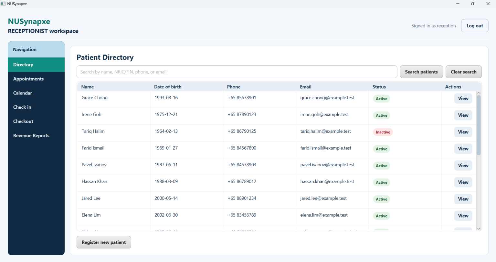
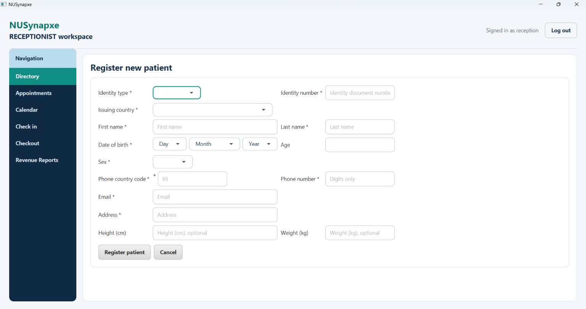
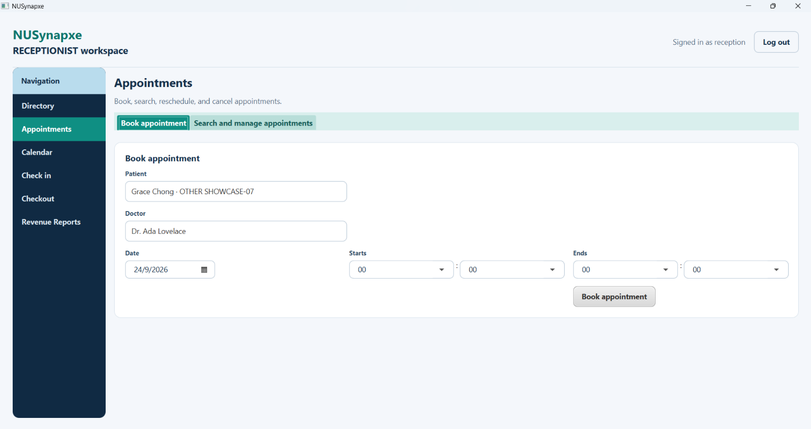
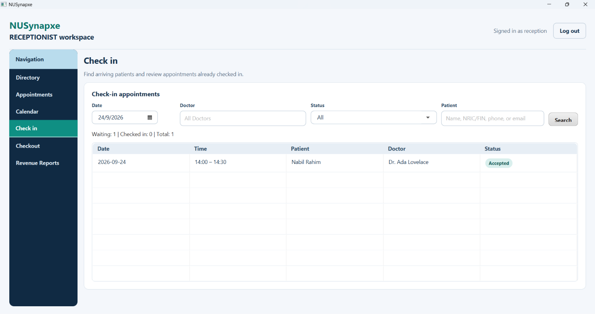
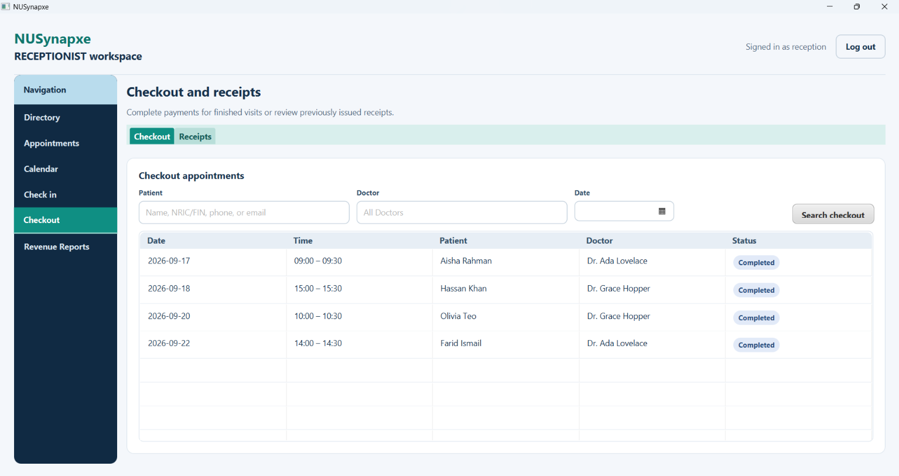

# NUSynapxe Receptionist User Guide

The Receptionist workspace in NUSynapxe coordinates all administrative, scheduling, front-desk arrival, and billing operations across the entire clinic. Receptionists operate across one shared visit workflow while maintaining strict separation between administrative data and clinical records:

```text
book -> accept -> check in -> consult (doctor) -> complete (doctor) -> checkout
```

> [!NOTE]
> Receptionists manage patient identity, demographics, contact details, appointment scheduling, front-desk arrivals, payment collection, and revenue reporting. Clinical notes, physician examination findings, and medication prescriptions are strictly restricted to Doctors.
>
> 📖 For general application setup, installation, or user account information, refer back to the [**Main User Guide**](UserGuide.md).

---

## Navigation & Workspace Layout


*Figure 1: Receptionist workspace layout and navigation rail.*

The Receptionist workspace features a dark left-hand navigation rail allowing immediate access to clinic modules:
- **Directory**: Patient search, registration, profile updates, and activation/deactivation.
- **Appointments**: Search and manage appointments across the clinic, or book new visits.
- **Calendar**: Multi-day clinic scheduling grid across doctors.
- **Check in**: Patient arrival queue for confirmed appointments.
- **Checkout**: Settlement, payment recording, and receipt generation for completed consultations.
- **Revenue Reports**: Financial summaries, method breakdowns, and CSV/JSON data export.

---

## 1. Patient Directory and Basic Data Management

Every patient receives an immutable internal Patient ID for relational database integrity. Routine directory and detail views display patient contact and demographic information rather than raw database keys. Historical appointments, clinical notes, and billing records remain permanently linked to the internal ID when basic contact details are updated.


*Figure 2: Patient directory showing multi-field search and registered patient table.*

### 1.1 Patient Directory Table
The **Directory** tab displays patient search controls at the top and a full-width table containing:
- **Columns**: `Name`, `Date of birth`, `Phone`, `Email`, `Status`, and `Actions`.
- **Actions Column**: Fixed at the far right, containing a dedicated **View** button for each row.
- **Deterministic Ordering**: Patient rows are deterministically sorted by name, then by internal ID.

### 1.2 Searching Patients
- Enter search terms into the search bar and press <kbd>Enter</kbd> or click **Search**.
- Supports case-insensitive partial text matching across **Full Name**, **NRIC/FIN/Passport/Other Document Number**, **Phone Number**, **Email Address**, or exact **Patient ID** (e.g. `42` or `P000042`).
- Safe search: Wildcard characters (`%` and `_`) are escaped and treated literally.
- Click **Clear search** to restore the full directory.
- Queries yielding no matches cleanly display an empty list rather than an error.

### 1.3 Registering a New Patient
Click **Register new patient** at the bottom of the directory to switch to the registration form:


*Figure 3: Patient registration form with document type selection and Singapore phone autofill.*

1. **Identity Type**: Select `NRIC`, `FIN`, `PASSPORT`, or `OTHER`.
2. **Issuing Country**:
   - The dropdown lists Singapore (`SG`) first, followed by all ISO countries alphabetically.
   - Choosing `NRIC` or `FIN` **automatically selects and locks** Singapore (`SG`). The service strictly rejects any non-Singapore issuing country for NRIC/FIN.
   - The application stores the standardized two-letter ISO country code.
3. **Identity Document Number**:
   - Trimmed and converted to uppercase automatically.
   - **NRIC**: Must begin with `S` or `T`, followed by seven digits, and end with an uppercase letter (e.g. `S1234567A`).
   - **FIN**: Must begin with `F`, `G`, or `M`, followed by seven digits, and end with an uppercase letter (e.g. `G1234567X`).
   - **PASSPORT**: Accepts 5 to 20 alphanumeric characters.
   - *Format vs. Checksum Note*: Syntactic pattern checks are validated by the system. Government checksum algorithms are not queried, so staff must inspect the physical document.
   - *Duplicate Prevention*: The combination of `(identity_type, issuing_country, identity_number)` must be unique. Entering an existing document is rejected with `A patient with this identity document already exists.` To protect confidentiality, application logs and feedback messages do not repeat the full document number.
4. **Full Name**: Enter the patient's full legal name.
5. **Date of Birth**:
   - Select using the interactive calendar picker, or jump directly with the adjacent month and year dropdowns.
   - Changing month or year preserves the selected day where possible, or automatically clamps to that month's final day (e.g. switching to February clamps day 31 to 28/29).
   - The read-only **Age** field updates automatically based on the current date in Singapore.
6. **Sex**: Select `Male` or `Female`.
7. **Contact Phone**:
   - The phone country code is automatically suggested based on the issuing country (e.g. `65` for Singapore) but can be edited.
   - Both the country code and local phone number accept digits only.
   - The fixed `+` symbol is non-editable.
   - Numbers are displayed conventionally with `+<country_code> <number>`.
8. **Email Address**: Enter a valid email address containing `@` with non-empty local and domain parts.
9. **Residential Address**: Enter the patient's home street address.
10. **Height and Weight (Optional)**:
    - All fields marked with `*` are mandatory. Height and weight are the only optional fields.
    - **Height**: Positive whole number in centimetres (e.g. `171`).
    - **Weight**: Positive number in kilograms with at most one decimal place (e.g. `70.4`).
    - *Note*: There is no billing information field on patient records; checkout billing is handled separately during visit settlement.
11. Click **Register patient**. On success, the form clears, the search resets, selectors refresh, and the view returns to the Directory. If validation fails, the form stays open with error feedback so entries can be corrected. Select **Cancel** to discard an unfinished registration.

### 1.4 Viewing and Editing Patient Basic Details
- In the directory table, click a row's **View** button to open a read-only page containing all administrative details (including the formatted Patient ID `P000042`).
- Actions available: **Edit**, **Deactivate patient** (or **Activate patient**), **Delete patient**, and **Back to patients**.
- Click **Edit** to open the editable basic-data form. Select **Save** to persist changes or **Discard changes** to revert to the read-only view. Failed validation or duplicate documents keep the edit page open with feedback.
- Migrated patients from older databases remain searchable, but their identity-document fields must be completed before their next basic-data save.

### 1.5 Activating and Deactivating Patients
- In the patient detail view, select **Deactivate patient** to mark the status as `INACTIVE`.
- Deactivated patients remain in the system and retain all historical appointments, clinical notes, and billing records.
- **Guardrail**: Deactivated patients cannot be selected for new appointment bookings.
- To re-enable booking, click **Activate patient** at any time.

### 1.6 Safe Patient Deletion
- Deleting is strictly reserved for accidental or unused patient records with zero related data.
- Click **Delete patient**, review the permanent-action warning, and select **Delete permanently**.
- **Preflight Blockers Check**: If the patient has any linked appointments, clinical records, prescriptions, payments, or receipts, deletion is **refused**. A popup lists each blocking category and count (e.g. *Appointments: 3, Payments: 1*), preserving all data. Close the popup and use **Deactivate patient** instead.

### 1.7 Receptionist Confidentiality Boundary
Receptionists can view and maintain only basic identity, demographic, measurement, contact, and address data. The directory **never returns** diagnoses, consultation notes, follow-up notes, or prescriptions, and administrative edits never alter clinical records.

---

## 2. Booking and Managing Appointments

Appointments are coordinated through two dedicated interfaces: the **Appointments** tab and the **Calendar** tab.


*Figure 4: Appointment booking view with searchable patient and doctor suggestion fields.*

### 2.1 Booking a New Appointment
1. Open **Appointments** and select the **Book appointment** sub-tab.
2. **Patient Selector**: Search bar supporting partial name, NRIC/FIN, phone, or email. Suggestions appear below; select via mouse click or keyboard (<kbd>&uarr;</kbd> / <kbd>&darr;</kbd> and <kbd>Enter</kbd>). Only active patients are offered.
3. **Doctor Selector**: Search bar supporting doctor name or username.
4. **Date and Time**: Date picker, start time, and end time are aligned on a single row. Start and end times use separate hour (`00`–`23`) and minute (`00` or `30`) dropdowns.
5. Click **Book appointment**.
6. **Conflict & Overlap Rules**:
   - The end time must be strictly after the start time.
   - The scheduler covers every Doctor. Overlapping appointments for that Doctor are rejected.
   - Appointments overlapping with a Doctor's explicitly blocked time-off are rejected.
   - Adjacent half-hour appointments (e.g. 09:00–09:30 and 09:30–10:00) are permitted.
7. Upon successful booking, the appointment starts in `PENDING` status awaiting the assigned Doctor's acceptance.

### 2.2 Managing and Filtering Appointments
Under the **Search and manage appointments** sub-tab:
- **Filters**: Date, Doctor, Patient, and Status (`All statuses`, `Pending`, `Accepted`, `Checked in`, `Completed`, `Checked out`, `Declined`, `Cancelled`). Selecting **All statuses** clears previous status filtering.
- **Summary Counters**: Live counters display counts for Pending, Accepted, Checked in, and Completed visits.
- **Table Columns**: `Date`, `Time`, `Patient`, `Doctor`, and `Status` (color-coded badge).
- **Reschedule / Cancel**: Select an appointment row and click **Reschedule selected**. A popup shows patient details and offers new date, start time, end time, **Reschedule appointment**, and **Cancel appointment** actions.

### 2.3 Receptionist Multi-Day Calendar View
1. Open **Calendar** in the left rail.
2. Search for a Doctor and select an inclusive date range (**From** and **To**, up to 31 days). Every date appears without a week-number column.
3. The multi-day time grid renders 30-minute rows:
   - **Click an empty slot**: Opens a scrollable booking popup with Doctor, Date, Start Time, and a 30-minute duration pre-filled.
   - **Click an existing appointment**: Opens its edit and rescheduling popup.
   - **Doctor Blocked Time**: Purple cards labeled *Blocked time* show unavailable doctor intervals. Receptionists can view these blocks but cannot remove them.

---

## 3. Check-in Queue (Front Desk Arrivals)

The **Check-in Queue** is the receptionist's arrival processing view.


*Figure 5: Check-in queue showing arriving patients and arrival confirmation action.*

1. Open **Check in**. It defaults to today's date in Singapore (`Asia/Singapore`).
2. The table shows accepted appointments awaiting arrival alongside already checked-in patients.
3. Use Doctor, Patient, Date, or Queue Status filters to narrow the list.
4. Select the patient's appointment to open the administrative details popup.
5. **Scheduled Start Time Rule**: The **Check in patient** button activates **only when the appointment's scheduled start time has arrived** (current time &ge; start time).
6. Click **Check in patient**. The appointment status transitions to `CHECKED_IN`, notifying the Doctor on their clinical dashboard. The queue refreshes automatically. Clinical notes and prescriptions are never shown.

---

## 4. Checkout Billing & Receipts

When the Doctor finishes consultation and marks it completed, the patient proceeds to checkout.


*Figure 6: Checkout dialog with payment amount entry and method selection.*

1. Open **Checkout** in the left navigation.
2. Use Patient, Doctor, or Date filters to locate the `COMPLETED` appointment.
3. Select the appointment to open the checkout window.
4. In the checkout modal:
   - **Amount**: Enter a positive charge in major currency units (e.g. `45.00` or `120.50`). Zero, negative, malformed, or missing amounts are rejected.
   - **Payment Method**: Choose `Cash`, `Card`, `Transfer`, or `Other`.
5. Click **Complete checkout**.
6. The system atomically records the payment, transitions the appointment to `CHECKED_OUT`, and generates a formal receipt.
7. The receipt preview displays the unique daily receipt number and Singapore timestamp.
8. Switch to the **Receipts** sub-tab to browse the persisted receipt table and inspect transaction details.

---

## 5. Revenue Reports & Data Export

The **Revenue Reports** tab provides financial auditing and summary reporting.


*Figure 7: Financial summary with payment method breakdowns, doctor breakdowns, and export actions.*

1. Open **Revenue Reports**.
2. Equally sized **From**, **To**, **Patient**, **Doctor**, and **Payment Method** filters appear on a single row. Choose **All methods** to clear a previous method selection.
3. Click **Generate report**.
4. The generated report displays:
   - **Summary Totals**: Total gross revenue in SGD and successful payment transaction count.
   - **Breakdown by Payment Method**: Amount and count for Cash, Card, Transfer, and Other.
   - **Breakdown by Doctor**: Attributed revenue and visit count per clinician.
   - **Itemized Receipts Table**: Chronological list of matching receipts (date/time, receipt number, patient name, doctor name, payment method, amount).
   - *Note*: Cancelled visits and unsuccessful payments do not contribute to revenue totals.
5. Click **Export CSV** to save an itemized spreadsheet for Excel/Sheets, or click **Export JSON** to export structured accounting data.

---

## Related Documentation
- [**General User Guide**](UserGuide.md): Installation, first-run wizard, and system administrator workflows.
- [**Doctor User Guide**](DoctorGuide.md): Clinical dashboard, consultations, prescriptions, and schedule management.
- [**Appointment Lifecycle Reference**](UserGuide.md#6-appointment-lifecycle-reference): Detailed state transition diagrams and booking rules.
