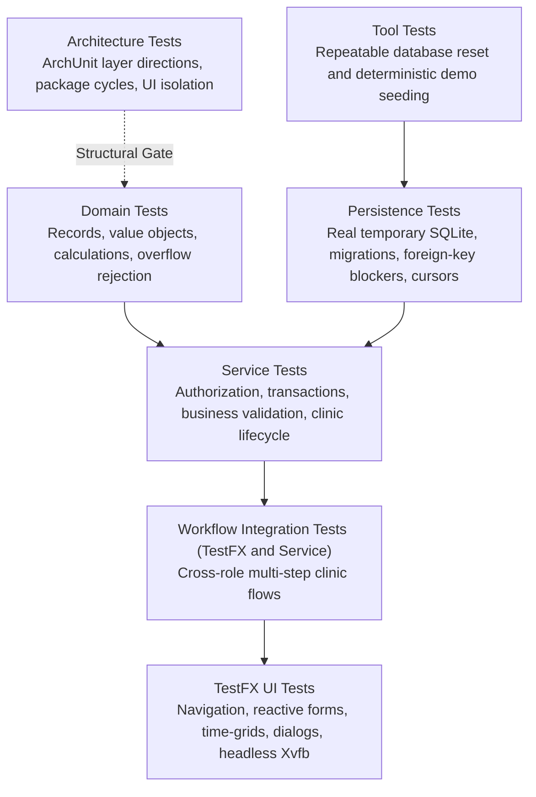

# Testing Strategy

This document details the multi-level testing architecture, risk priorities, automated test inventory, and manual peer-testing walkthrough scenarios for NUSynapxe.

For architectural decisions, see [Architecture & System Design](ArchitectureAndDesign.md). For use cases and business rules, see [Product Specifications & Use Cases](ProductSpecifications.md).

---

## 1. Test Levels & Pyramid



- **Isolated Temporary Databases**: All repository and service tests execute against isolated temporary SQLite databases initialized under JUnit 5 `@TempDir`. Tests never mutate or connect to the developer's default clinic database.
- **Fixed System Clocks**: Time-sensitive appointment, check-in, and agenda tests inject fixed `Clock` instances set to Singapore local time (`Asia/Singapore`).
- **Headless TestFX**: TestFX UI tests run headlessly in CI environments using `xvfb-run --auto-servernum`.

---

## 2. Automated Test Inventory

The test suite provides layered automated verification across all application tiers:

| Test Package / Area | Target Scope & Key Test Classes | Primary Verified Capabilities |
| --- | --- | --- |
| **Application Root** | Presentation Shell (`DatabasePathsTest`, `NUSynapxeAppTest`) | Default database directory creation, stage lifecycle, and path normalization. |
| **Architecture** | Architectural Rules (`ArchitectureTest`) | Package layering, slice cycles, persistence isolation, and UI boundaries enforced by ArchUnit. |
| **Domain** | Domain Models & Types (`PaymentTest`, `TimeRangeTest`, `CursorTest`) | Monetary minor-unit arithmetic, calendar math, and cursor pagination values. |
| **Persistence** | SQLite Data Access (`SchemaMigrationTest`, `SqliteDatabaseTest`, `PatientRepositoryTest`) | SQLite schema initialization, transactional schema migrations, wildcard escapes, and deletion blockers. |
| **Service** | Application Business Rules (`AuthenticationServiceTest`, `AppointmentServiceTest`, `BillingServiceTest`) | Authentication, authorization, patient validation, appointment conflict checking, billing checkout, and clinical ownership. |
| **Tools** | Development Tooling (`DemoDataSeederTest`) | Protected database reset and deterministic demo data seeding. |
| **UI (TestFX)** | Presentation & Interaction (`PatientDirectoryViewTest`, `DoctorCalendarViewTest`, `RevenueReportViewTest`) | Navigation rails, search suggestion fields, table rendering, calendar time-grids, consultation forms, checkout modals, and receipt exports. |

---

## 3. Risk-Based Coverage Priorities

| System Risk | Automated Mitigation & Evidence |
| --- | --- |
| **Unauthorized Access to Clinical Data** | Service role guards, assigned-doctor checks, projection-specific repositories (`AuthorizationTest`, `ClinicalServiceTest`, `ClinicWorkflowIntegrationTest`). |
| **Partial Transaction Writes** | SQLite atomic transactions with rollback tests covering multi-statement appointment booking, checkout, and deletion. |
| **Appointment Scheduling Conflicts** | Boundary tests for overlapping/adjacent intervals, released declined slots, and check-in timing constraints (`AppointmentServiceTest`). |
| **Monetary & Overflow Errors** | 64-bit integer minor unit storage, `BigDecimal.longValueExact()` parsing, `BillingServiceTest`, and `RevenueReportTest` (including `Long.MAX_VALUE`). |
| **Database Migration Data Loss** | `SchemaMigrationTest` covers incremental step-by-step upgrades from v1 through v5 with rollback validation. |
| **SQL Wildcard Injection / Leakage** | Repository tests verify that user input containing `%` or `_` is escaped and treated as literal characters. |
| **Agenda Skipping / Duplication** | Keyspacing cursor pagination tests verify stable continuous scrolling with `(startsAt, appointmentId)`. |
| **CSV / JSON Export Malformation** | Receptionist export tests verify proper quoting and escaping of commas, quotes, line breaks, and control characters. |

---

## 4. Local Verification Commands

From the repository root:

```powershell
# Windows PowerShell
.\gradlew.bat spotlessApply
.\gradlew.bat test --no-daemon --console=plain
.\gradlew.bat check javadoc --no-daemon --console=plain
git diff --check
```

```bash
# macOS / Linux
./gradlew spotlessApply
./gradlew test --no-daemon --console=plain
xvfb-run --auto-servernum ./gradlew check javadoc --no-daemon --console=plain
git diff --check
```

---

## 5. Quality Tasks and Reports

| Task or Tool | Purpose | Output or Failure Policy |
| --- | --- | --- |
| `spotlessApply` / `spotlessCheck` | Apply or verify Google Java Format. | Formatting differences fail `spotlessCheck`. |
| `checkstyleMain`, `checkstyleTest` | Enforce Java style rules. | Reports under `build/reports/checkstyle/`; violations fail. |
| `pmdMain`, `pmdTest` | Run production and test PMD rulesets. | Reports under `build/reports/pmd/`; violations fail. |
| `spotbugsMain` with FindSecBugs | Analyze production bytecode at maximum effort. | Reports under `build/reports/spotbugs/`; medium-confidence findings fail. |
| `test` | Run unit, ArchUnit, repository, service, and TestFX suites. | JUnit XML and HTML reports generated under `build/`. |
| `jacocoTestReport` | Generate instruction and branch coverage evidence. | HTML/XML reports generated under `build/reports/jacoco/`. |
| `javadoc` | Verify and compile public API documentation. | Output under `build/docs/javadoc/`; warnings fail where configured. |
| `npm ci && npm run build` in `website/` | Build the documentation website. | Broken site links fail the production build. |
| `git diff --check` | Detect trailing whitespace and carriage-return errors. | Must produce zero warnings before commit. |

---

## 6. Manual Testing Walkthrough Scenarios

Testers can manually execute these comprehensive end-to-end verification scenarios to validate the latest release of NUSynapxe:

### Scenario 1: First-Run Setup & Administrator Provisioning
1. Launch NUSynapxe with a clean database (`-Dnusynapxe.database="build/peer-test.db"`).
2. Verify that the **Create the first System Admin account** form is displayed.
3. Attempt to submit with password `short` (under 8 characters). Verify error banner appears.
4. Enter username `admin`, password `Admin1234!`, matching confirmation, and submit.
5. Verify application routes to Login screen and setup form cannot be accessed again.

### Scenario 2: Staff Account Management
1. Log in as `admin` / `Admin1234!`.
2. Create Doctor account: username `dr.john`, display name `Dr. John Doe`, password `Doctor123!`.
3. Create Receptionist account: username `mary`, display name `Mary Reception`, password `Recept123!`.
4. Verify both accounts appear in the Current Staff Accounts table with status `ACTIVE`.
5. Log out.

### Scenario 3: Patient Registration & NRIC Validation
1. Log in as `mary` / `Recept123!`.
2. Open Patient Directory and select **Register new patient**.
3. Choose Identity Type `NRIC`. Verify Issuing Country is automatically locked to Singapore (`SG`).
4. Enter an invalid NRIC (e.g. `S123456`). Verify validation error is displayed.
5. Enter valid NRIC `S1234567A`, Name `Tan Ah Teck`, DOB `1990-05-15`, Sex `Male`, Phone `91234567`, Email `tan@example.com`, Address `123 Orchard Road`.
6. Verify derived age is displayed automatically.
7. Click **Register patient**. Verify patient appears in Directory.

### Scenario 4: Patient Deduplication
1. In Patient Directory, attempt to register another patient with the identical NRIC `S1234567A`.
2. Submit the form.
3. Verify registration is rejected with `A patient with this identity document already exists`.

### Scenario 5: Appointment Booking & Conflict Detection
1. Open **Appointments** > **Book appointment**.
2. Select patient `Tan Ah Teck` and doctor `Dr. John Doe`.
3. Select tomorrow's date, start time `10:00`, end time `10:30`, and book appointment.
4. Verify appointment appears in dashboard with status `PENDING`.
5. Attempt to book a second appointment for `Dr. John Doe` at the overlapping time `10:15`–`10:45`.
6. Verify booking is rejected with a scheduling conflict notice.

### Scenario 6: Doctor Schedule Acceptance & Personal Time-Off
1. Log in as `dr.john` / `Doctor123!`.
2. On Dashboard, locate the pending appointment for `Tan Ah Teck`.
3. Click **Accept**. Verify status badge updates to `ACCEPTED`.
4. Switch to **Calendar**, click **Block time**, and block tomorrow `14:00`–`16:00`.
5. Verify purple blocked time card renders on the calendar.
6. Log out. Log in as `mary` and verify receptionist cannot book `Dr. John Doe` during `14:00`–`16:00`.

### Scenario 7: Arrival Check-in Gate
1. Log in as `mary`. Open **Check in** queue.
2. Select an accepted appointment whose scheduled time has not yet arrived.
3. Verify that **Check in patient** button is disabled with explanatory text.
4. Select an accepted appointment whose start time is in the past or present.
5. Click **Check in patient**. Verify status transitions to `CHECKED_IN`.

### Scenario 8: Clinical Consultation & Multi-Drug Prescriptions
1. Log in as `dr.john`.
2. Select the checked-in visit on the Dashboard.
3. Enter Diagnosis `Acute Upper Respiratory Tract Infection`, Examination Notes `Pharynx injected, chest clear`, and Follow-up `Rest for 3 days`. Click **Save consultation**.
4. Add Prescription 1: `Paracetamol 500mg`, Dosage `2 tablets`, Frequency `Every 6 hours PRN`, Duration `3 days`, Instructions `Take after meals`. Click **Add prescription**.
5. Add Prescription 2: `Amoxicillin 250mg`, Dosage `1 capsule`, Frequency `Three times daily`, Duration `5 days`, Instructions `Complete full course`. Click **Add prescription**.
6. Click **Mark consultation completed**. Verify status badge updates to `COMPLETED`.

### Scenario 9: Cross-Doctor Historical Medical Records
1. Switch to **Patients** tab and locate `Tan Ah Teck`.
2. Click **Consultation history**.
3. Verify that the completed consultation, attending physician name (`Dr. John Doe`), notes, and both prescribed medications are clearly readable.

### Scenario 10: Checkout Billing, Receipts & Revenue Export
1. Log in as `mary`. Open **Checkout** tab.
2. Select the completed appointment for `Tan Ah Teck`.
3. Enter amount `65.50` and select payment method `CARD`.
4. Click **Complete checkout**.
5. Verify receipt preview displays sequence number `RCP-YYYYMMDD-0001` and appointment transitions to `CHECKED_OUT`.
6. Navigate to **Revenue Reports**, select today's date range, and click **Generate report**.
7. Verify total revenue shows `$65.50` under CARD method.
8. Click **Export CSV** and **Export JSON** to verify exported file integrity.
