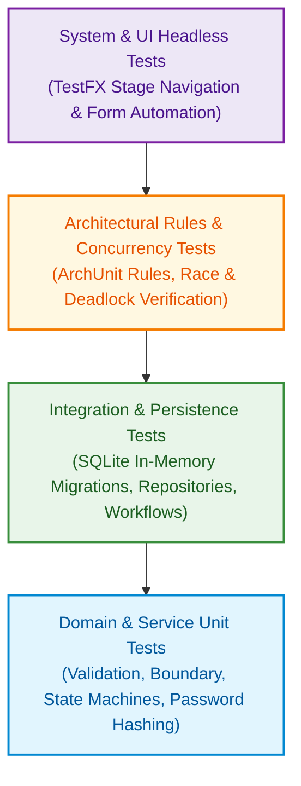
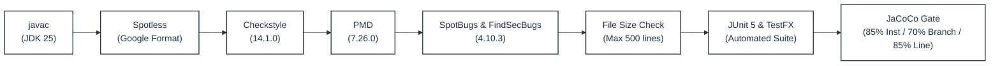

# Testing Strategy

NUSynapxe employs a comprehensive, multi-layered quality assurance methodology to guarantee correctness, security, architectural integrity, and usability across desktop environments.

---

## 1. Test Pyramid & Verification Layers

Testing is distributed across four distinct tiers of automated verification:

---

## 2. Automated Test Inventory

The automated test suite exercises all layers of the application without requiring a physical display:

| Layer / Test Suite | Primary Target Scope | Verified Invariants & Scenarios |
| --- | --- | --- |
| **Domain & Value Types** | `nusynapxe.domain` | Record value equality, immutability, date formatting, and revenue calculations. |
| **Persistence & Transactions** | `nusynapxe.persistence` | Atomic schema migrations (v1–v7), constraint rollback, parameterized queries, and sequential receipt numbers. |
| **Business Services** | `nusynapxe.service` | Authentication, PBKDF2 hashing, appointment state transitions, temporal collision checks, preflight blocker cascades, and calendar intervals. |
| **UI Components (Headless TestFX)** | `nusynapxe.ui` | JavaFX stage routing, minimal date picker sizing, reactive appointment dialog validation, and doctor navigation. |
| **Architectural Rules (ArchUnit)** | `nusynapxe.architecture` | Cyclic dependency prevention, package encapsulation, layer separation, and immutability invariants. |

---

## 3. High-Risk Coverage Matrix

| Risk Domain | Potential Failure Mode | Mitigation & Test Verification |
| --- | --- | --- |
| **Double Booking / Collisions** | Two appointments or doctor time-off booked on overlapping half-hour intervals. | Evaluated via `AppointmentTransitionsTest` and `AppointmentRepositoryScheduleTest` using boundary conditions (`starts_at < other_ends && ends_at > other_starts`). |
| **Accidental Medical Record Deletion** | Deleting a patient who has active visits, clinical notes, or receipts. | Preflight blocker inspection (`PatientServiceMaintenanceTest`) asserts that deletion is refused if any dependent records exist across related categories. |
| **Credential & Session Tampering** | Password exposure or session privilege escalation. | PBKDF2 with 210,000 iterations and per-user cryptographic salt (`PasswordHasherTest`); volatile memory sessions (`SessionManagerTest`). |
| **Financial Reporting Inaccuracies** | Receipt gaps, duplicate daily numbers, or rounding discrepancies. | Atomic SQLite transactions (`ReceiptRepositoryTest`, `BillingServiceTest`) enforce daily monotonically increasing sequence numbers. |
| **Timezone & Local Clock Drift** | Visits scheduled or checked in against inconsistent system clocks. | All temporal boundaries normalized to `Asia/Singapore` via `ClinicClock` (`ClinicClockTest`). |

---

## 4. Quality Verification Gates

NUSynapxe enforces automated quality gates configured in `build.gradle`:

1. **Spotless Code Formatting**: Enforces Google Java Format across all source and test files.
2. **Checkstyle Syntax Linting**: Enforces strict javadoc, naming conventions, import ordering, and whitespace rules.
3. **PMD Static Analysis**: Guards against empty blocks, unused variables, complex cyclomatic structures, and antipatterns.
4. **SpotBugs & FindSecBugs**: Max-effort bytecode inspection detecting potential null dereferences, resource leaks, and security risks.
5. **File Size Enforcement**: `sourceFileSizeCheck` task fails the build if any Java source or test file exceeds 500 lines of code.
6. **JaCoCo Coverage Thresholds**: Requires 85% instruction coverage, 70% branch coverage, and 85% line coverage repo-wide across all compiled classes.

---

## 5. Local Quality Gate Execution Commands

Before opening a pull request, run the following verification commands:

| Command | Purpose | Acceptance Threshold |
| --- | --- | --- |
| `.\gradlew.bat spotlessApply` | Auto-format source code to Google Java Format standard. | Zero diff after formatting. |
| `.\gradlew.bat check` | Run all unit tests, TestFX tests, Checkstyle, PMD, SpotBugs, and JaCoCo verification. | Build Successful, 0 errors, 0 warnings. |
| `.\gradlew.bat javadoc` | Verify Javadoc documentation compilation. | Zero broken tags or missing parameters. |
| `cd website && npm run build` | Validate Docusaurus documentation, MDX syntax, and Mermaid diagrams. | Zero broken links, zero diagram syntax errors. |
| `git diff --check` | Detect trailing whitespace and carriage-return errors. | Must produce zero warnings before commit. |

---

## 6. Manual Testing Walkthrough Scenarios

Testers can manually execute these comprehensive end-to-end verification scenarios to validate the latest release of NUSynapxe:

### Scenario 1: First-Run Setup & Administrator Provisioning
1. Launch NUSynapxe with a clean database (e.g. `.\gradlew.bat run -PdemoDatabasePath="build/peer-test.db"` or `java -Dnusynapxe.database="build/peer-test.db" -jar ...`).
2. Verify that the **Create the first System Admin account** form is displayed.
3. Attempt to submit with password `short` (under 8 characters). Verify error banner appears.
4. Enter username `admin`, password `Admin1234!`, matching confirmation, and submit.
5. Verify application routes to Login screen and setup form cannot be accessed again.

### Scenario 2: Staff Account Management
1. Log in as `admin` / `Admin1234!`.
2. Create Doctor account: username `dr.john`, display name `Dr. John Doe`, password `Doctor123!`.
3. Create Receptionist account: username `mary`, display name `Mary Reception`, password `Recept123!`.
4. Verify both accounts appear in the Current Staff Accounts table with status `ACTIVE`.
5. Log out.

### Scenario 3: Patient Registration & NRIC Validation
1. Log in as `mary` / `Recept123!`.
2. Open Patient Directory and select **Register new patient**`.
3. Choose Identity Type `NRIC`. Verify Issuing Country is automatically locked to Singapore (`SG`).
4. Enter an invalid NRIC (e.g. `S123456`). Verify validation error is displayed.
5. Enter valid NRIC `S1234567A`, Name `Tan Ah Teck`, DOB `1990-05-15`, Sex `Male`, Phone `91234567`, Email `tan@example.com`, Address `123 Orchard Road`.
6. Verify derived age is displayed automatically.
7. Click **Register patient**. Verify patient appears in Directory.

### Scenario 4: Patient Deduplication
1. In Patient Directory, attempt to register another patient with the identical NRIC `S1234567A`.
2. Submit the form.
3. Verify registration is rejected with `A patient with this identity document already exists`.

### Scenario 5: Appointment Booking & Conflict Detection
1. Open **Appointments** > **Book appointment**.
2. Select patient `Tan Ah Teck` and doctor `Dr. John Doe`.
3. Select tomorrow's date, start time `10:00`, end time `10:30`, and book appointment.
4. Verify appointment appears in dashboard with status `PENDING`.
5. Attempt to book a second appointment for `Dr. John Doe` at an overlapping time (e.g. `10:00`–`11:00`).
6. Verify booking is rejected with a scheduling conflict notice.

### Scenario 6: Doctor Schedule Acceptance & Personal Time-Off
1. Log in as `dr.john` / `Doctor123!``.
2. On Dashboard, locate the pending appointment for `Tan Ah Teck`.
3. Click **Accept**. Verify status badge updates to `ACCEPTED`.
4. Switch to **Calendar**, click **Block time**, and block tomorrow `14:00`–`16:00`.
5. Verify purple blocked time card renders on the calendar.
6. Log out. Log in as `mary` and verify receptionist cannot book `Dr. John Doe` during `14:00`–`16:00`.

### Scenario 7: Arrival Check-in Gate
1. Log in as `mary`. Open **Check in** queue.
2. Select an accepted appointment whose scheduled time has not yet arrived.
3. Verify that **Check in patient** button is disabled in the dialog (as current time is before the scheduled start time).
4. Select an accepted appointment whose start time is in the past or present.
5. Click **Check in patient**. Verify status transitions to `CHECKED_IN`.

### Scenario 8: Clinical Consultation & Multi-Drug Prescriptions
1. Log in as `dr.john`.
2. Select the checked-in visit on the Dashboard.
3. Enter Diagnosis `Acute Upper Respiratory Tract Infection`, Examination Notes `Pharynx injected, chest clear`, and Follow-up `Rest for 3 days`. Click **Save consultation**.
4. Add Prescription 1: `Paracetamol 500mg`, Dosage `2 tablets`, Frequency `Every 6 hours PRN`, Duration `3 days`, Instructions `Take after meals`. Click **Add prescription**.
5. Add Prescription 2: `Amoxicillin 250mg`, Dosage `1 capsule`, Frequency `Three times daily`, Duration `5 days`, Instructions `Complete full course`. Click **Add prescription**.
6. Click **Mark consultation completed**. Verify status badge updates to `COMPLETED`.

### Scenario 9: Cross-Doctor Historical Medical Records
1. Switch to **Patients** tab and locate `Tan Ah Teck`.
2. Click **Consultation history**.
3. Verify that the completed consultation, attending physician name (`Dr. John Doe`), notes, and both prescribed medications are clearly readable.

### Scenario 10: Checkout Billing, Receipts & Revenue Export
1. Log in as `mary`. Open **Checkout** tab.
2. Select the completed appointment for `Tan Ah Teck`.
3. Enter amount `65.50` and select payment method `CARD`.
4. Click **Complete checkout**.
5. Verify receipt preview displays receipt sequence formatted as `Receipt YYYY-MM-DD-0001` (e.g. `Receipt 2026-10-15-0001`) and appointment transitions to `CHECKED_OUT`.
6. Navigate to **Revenue Reports**, select today's date range, and click **Generate report**.
7. Verify total revenue shows `$65.50` under CARD method.
8. Click **Export CSV** and **Export JSON** to verify exported file integrity.
