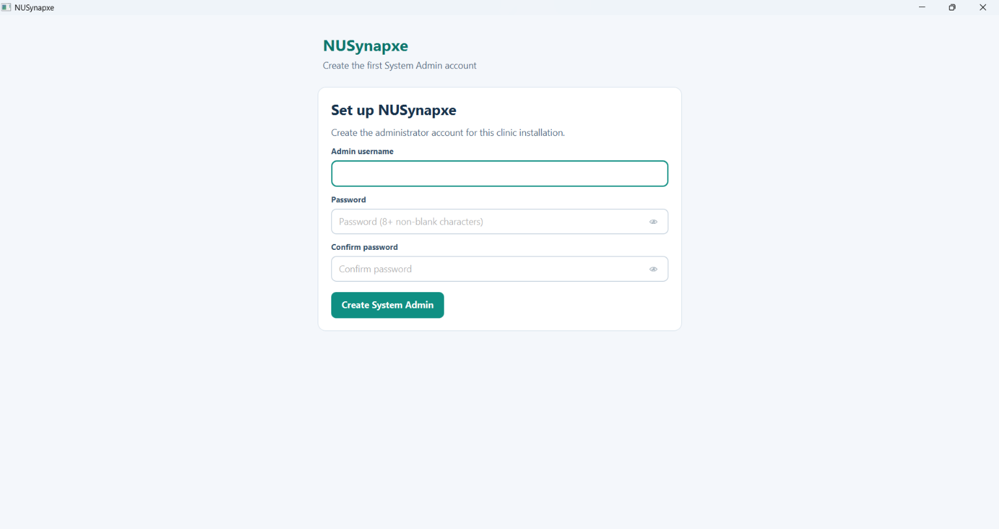
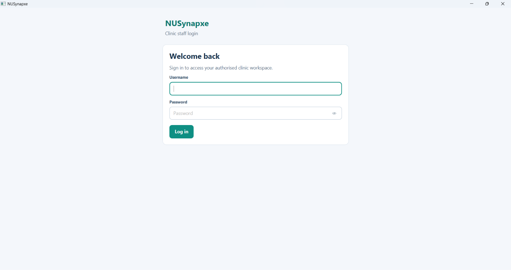
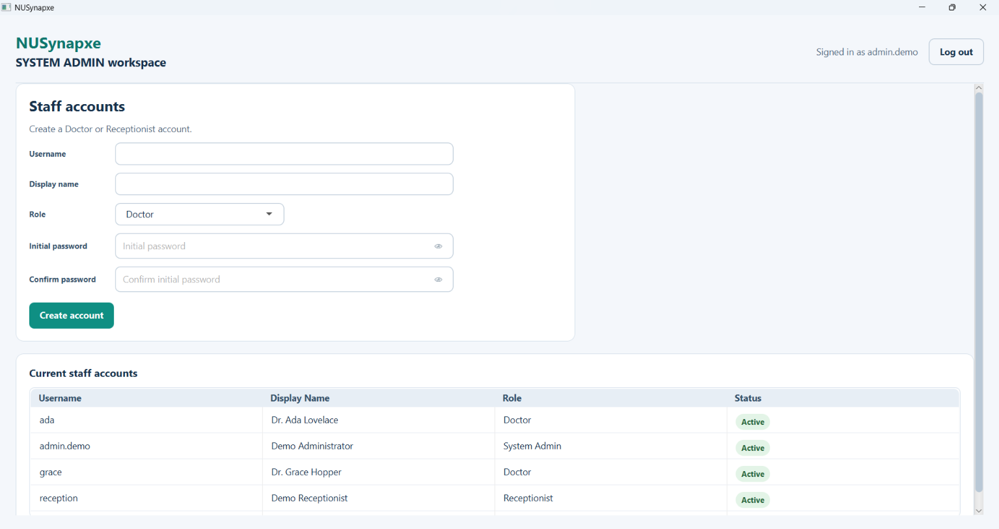
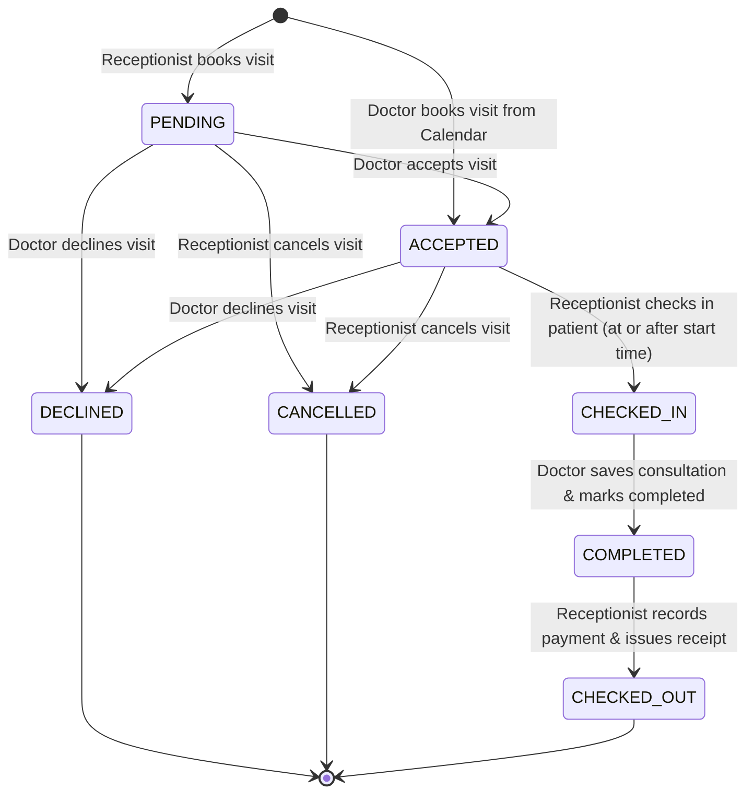

# NUSynapxe User Guide

NUSynapxe is a modern desktop clinical appointment and electronic medical records application designed for outpatient clinics and healthcare practices. NUSynapxe coordinates clinic operations across staff through one shared visit workflow while maintaining strict separation between administrative and clinical information:

```text
book -> accept -> check in -> consult -> complete -> checkout
```

Receptionists coordinate the administrative and scheduling steps across the entire clinic. Doctors manage their own schedules, conduct consultations, issue prescriptions, and record clinical notes for their assigned appointments. System Administrators create and manage staff accounts.

---

## 1. Getting Started

### 1.1 Installation

All official release packages of NUSynapxe are hosted on GitHub.

👉 **Download the latest version**: Visit the [**NUSynapxe GitHub Releases page**](https://github.com/CS3227-2610-MP2-NUSynapxe/CS3227-2610-MP2/releases/latest) and scroll down to the **Assets** section to find the installation file for your computer. Always download the **latest release** (highest version number).

#### Which File Should I Download?

NUSynapxe is distributed in two formats:
1. **Native Installers (Recommended)**: Best for non-technical users. They bundle a dedicated Java 25 runtime, so **no Java installation or terminal configuration is required**.
2. **Portable Executable JARs**: Best for advanced users and developers who already have Java 25 installed on their computer.

Match your computer and operating system in the table below:

| Your Computer / Operating System | Recommended Native Installer (No Java Needed) | Portable JAR Option (Java 25 Required) | Important Note |
| --- | --- | --- | --- |
| **Windows PC / Laptop** (Intel / AMD 64-bit) | `NUSynapxe-<version>-windows-x64.msi` | `NUSynapxe-<version>.jar` *(Universal)* **or**<br />`NUSynapxe-<version>-windows-x64.jar` | Supported by Universal JAR or dedicated Windows x64 JAR. |
| **Windows on ARM** (e.g. Surface Pro X / 9 / 11, Snapdragon) | `NUSynapxe-<version>-windows-arm64-compat.msi` | `NUSynapxe-<version>-windows-arm64-compat.jar` | **Universal JAR unsupported**. Must use platform-specific JAR (runs via Windows 11 ARM Java x64 emulation). |
| **Apple Mac — Apple Silicon** (M1 / M2 / M3 / M4) | `NUSynapxe-<version>-macos-arm64.dmg` | `NUSynapxe-<version>.jar` *(Universal)* **or**<br />`NUSynapxe-<version>-macos-arm64.jar` | Supported by Universal JAR or dedicated Mac ARM64 JAR. |
| **Apple Mac — Intel** (Older pre-2020 MacBooks / iMacs) | `NUSynapxe-<version>-macos-x64.dmg` | `NUSynapxe-<version>-macos-x64.jar` | **Universal JAR unsupported**. Must use platform-specific Intel Mac JAR. |
| **Linux 64-bit** (Ubuntu, Debian, Linux Mint x64) | `NUSynapxe-<version>-linux-x64.deb` | `NUSynapxe-<version>.jar` *(Universal)* **or**<br />`NUSynapxe-<version>-linux-x64.jar` | Supported by Universal JAR or dedicated Linux x64 JAR. |
| **Linux ARM64** (Raspberry Pi 4/5, ARM Linux) | `NUSynapxe-<version>-linux-arm64.deb` | `NUSynapxe-<version>-linux-arm64.jar` | **Universal JAR unsupported**. Must use platform-specific Linux ARM64 JAR. |

---

#### Detailed Installation Instructions

##### Option A: Native Platform Installers (Recommended)
Native installers bundle a dedicated Java 25 runtime, so no prior Java installation or technical configuration is required on your computer:
- **Windows**: Download `NUSynapxe-<version>-windows-x64.msi` (or `NUSynapxe-<version>-windows-arm64-compat.msi` for ARM devices), double-click the installer, and follow the standard Windows setup wizard. An application shortcut is added to your Start Menu.
- **macOS**: Download `NUSynapxe-<version>-macos-arm64.dmg` (for Apple Silicon) or `NUSynapxe-<version>-macos-x64.dmg` (for Intel Macs). Double-click to open the disk image, and drag `NUSynapxe` into your `Applications` folder. You can launch it directly from Launchpad or Finder.
- **Linux**: Download `NUSynapxe-<version>-linux-x64.deb` (or `NUSynapxe-<version>-linux-arm64.deb` for ARM64) and install via terminal or software center:
  ```bash
  sudo apt install ./NUSynapxe-<version>-linux-x64.deb
  ```

> [!NOTE]
> Open-source binary packages are currently unsigned. Operating system security dialogs (such as Windows SmartScreen or macOS Gatekeeper) may present a one-time trust prompt. Verify that you downloaded the package from the official [GitHub Releases page](https://github.com/CS3227-2610-MP2-NUSynapxe/CS3227-2610-MP2/releases/latest), then select **Run anyway** (Windows) or open via **System Settings > Privacy & Security** (macOS).

##### Option B: Portable Executable JARs (Java 25 Required)

If you prefer a portable executable without running an installer, you can run NUSynapxe directly with Java 25.

###### Understanding Universal vs. Platform-Specific JARs
JavaFX requires native graphical windowing libraries (`.dll` on Windows, `.dylib` on macOS, `.so` on Linux) matching the host operating system and CPU architecture. For this reason, the release publishes two categories of JAR files:

1. **Universal JAR (`NUSynapxe-<version>.jar`)**:
   - Bundles native JavaFX libraries for the **three most common desktop targets**: **Windows x64**, **Linux x64**, and **macOS Apple Silicon (ARM64)**.
   - Convenient single JAR that can be shared across these three architectures.
   - **Important Limitation**: Because it only embeds native code for those three targets, **it will fail to launch on other architectures** (such as macOS Intel, Windows ARM64, and Linux ARM64).

2. **Platform-Specific Fat JARs (`NUSynapxe-<version>-<platform>.jar`)**:
   - Each platform-specific JAR bundles only the exact native libraries compiled for that specific OS and processor combination.
   - **Required** for platforms not covered by the Universal JAR (specifically **macOS Intel**, **Windows ARM64**, and **Linux ARM64**).

###### Complete JAR Architecture & Compatibility Matrix

| Target Platform & Architecture | Supported JAR File(s) | Universal JAR Supported? | Launch Command & Notes |
| --- | --- | :---: | --- |
| **Windows x64** (Intel / AMD) | `NUSynapxe-<version>.jar`<br />`NUSynapxe-<version>-windows-x64.jar` | **Yes** | `java -jar NUSynapxe-<version>.jar`<br />*(Works with either Universal or Windows x64 JAR)* |
| **Windows ARM64** (Surface Pro, Snapdragon) | `NUSynapxe-<version>-windows-arm64-compat.jar` | **No** (Must use platform JAR) | `java -jar NUSynapxe-<version>-windows-arm64-compat.jar`<br />*(Runs via Windows 11 ARM64 Java x64 emulation)* |
| **macOS Apple Silicon** (M1 / M2 / M3 / M4) | `NUSynapxe-<version>.jar`<br />`NUSynapxe-<version>-macos-arm64.jar` | **Yes** | `java -jar NUSynapxe-<version>.jar`<br />*(Works with either Universal or Mac ARM64 JAR)* |
| **macOS Intel (x64)** (Pre-2020 Macs) | `NUSynapxe-<version>-macos-x64.jar` | **No** (Must use platform JAR) | `java -jar NUSynapxe-<version>-macos-x64.jar`<br />*(⚠️ Universal JAR will fail with unsatisfied link errors)* |
| **Linux x64** (Ubuntu, Debian, Fedora) | `NUSynapxe-<version>.jar`<br />`NUSynapxe-<version>-linux-x64.jar` | **Yes** | `java -jar NUSynapxe-<version>.jar`<br />*(Works with either Universal or Linux x64 JAR)* |
| **Linux ARM64 / AArch64** (Raspberry Pi, etc.) | `NUSynapxe-<version>-linux-arm64.jar` | **No** (Must use platform JAR) | `java -jar NUSynapxe-<version>-linux-arm64.jar`<br />*(⚠️ Universal JAR will fail on Linux ARM)* |

> [!WARNING]
> **Intel Mac & Windows ARM Users**: Do not use `NUSynapxe-<version>.jar` (Universal). You must download your dedicated platform JAR (`NUSynapxe-<version>-macos-x64.jar` or `NUSynapxe-<version>-windows-arm64-compat.jar`), or simply use the recommended native installer (`.dmg` / `.msi`) which bundles Java and works out-of-the-box.

---

### 1.2 Updating the Application

When a new version of NUSynapxe is released, upgrading to the latest release preserves all your existing clinic records:

#### Preserving Your Data
Your local SQLite database is stored in your personal user profile directory:
- **Windows**: `%USERPROFILE%\.nusynapxe\nusynapxe.db`
- **macOS / Linux**: `~/.nusynapxe/nusynapxe.db`

Because this database resides separately from the application binary installation directory, **updating NUSynapxe will never overwrite, delete, or reset your data**. All patient records, staff accounts, appointment histories, clinical consultations, and billing receipts are preserved. Any required database schema upgrades (e.g. migrations from older versions) are applied automatically and transactionally when the updated application is first launched.

#### Upgrade Instructions by Platform
1. **Windows (.msi)**:
   - Download the new `NUSynapxe-<version>-windows-x64.msi` (or `NUSynapxe-<version>-windows-arm64-compat.msi`) from the [latest GitHub release](https://github.com/CS3227-2610-MP2-NUSynapxe/CS3227-2610-MP2/releases/latest).
   - Close any running instance of NUSynapxe.
   - Run the installer. The Windows installer will automatically upgrade the existing installation in-place.
2. **macOS (.dmg)**:
   - Download the new `NUSynapxe-<version>-macos-arm64.dmg` (or `NUSynapxe-<version>-macos-x64.dmg`) from the [latest GitHub release](https://github.com/CS3227-2610-MP2-NUSynapxe/CS3227-2610-MP2/releases/latest).
   - Close any running instance of NUSynapxe.
   - Open the disk image and drag `NUSynapxe.app` into `Applications`. When prompted by macOS, select **Replace** to overwrite the previous application bundle.
3. **Linux (.deb)**:
   - Download the new `NUSynapxe-<version>-linux-x64.deb` (or `NUSynapxe-<version>-linux-arm64.deb`) from the [latest GitHub release](https://github.com/CS3227-2610-MP2-NUSynapxe/CS3227-2610-MP2/releases/latest).
   - Close any running instance of NUSynapxe.
   - In terminal, execute:
     ```bash
     sudo apt install ./NUSynapxe-<version>-linux-x64.deb
     ```
     The package manager will update the package in-place.
4. **Portable Executable JARs**:
   - Download the new version of your JAR file (either `NUSynapxe-<version>.jar` for supported Universal platforms, or your dedicated platform JAR such as `NUSynapxe-<version>-macos-x64.jar` for Intel Macs / Windows ARM) from the [latest GitHub release](https://github.com/CS3227-2610-MP2-NUSynapxe/CS3227-2610-MP2/releases/latest).
   - Replace the previous `.jar` file with the newly downloaded file.

---

### 1.3 Uninstalling the Application

If you need to uninstall NUSynapxe from your computer, follow the instructions below:

#### Removing the Application Program
- **Windows**:
  1. Open Windows **Settings** > **Apps** > **Installed apps** (or **Apps & features**).
  2. Search for **NUSynapxe** in the list.
  3. Click the three dots icon next to NUSynapxe and select **Uninstall**.
  4. Follow the uninstallation wizard prompts to complete the process.
- **macOS**:
  1. Open **Finder** and navigate to your **Applications** folder.
  2. Locate `NUSynapxe.app`.
  3. Drag `NUSynapxe.app` to the **Trash** (or right-click and choose **Move to Trash**).
  4. Empty your Trash to finalize removal.
- **Linux**:
  1. Open a terminal.
  2. Run the following command:
     ```bash
     sudo apt remove nusynapxe
     ```
- **Portable Executable JARs**:
  - Simply delete the downloaded `.jar` file from your computer.

#### Cleaning Up Application Data (Optional)
By default, standard uninstallation removes the application binaries but leaves your patient database and clinic data intact in your user directory to prevent accidental data loss.

If you wish to **completely wipe all stored clinic data** (including user accounts, patients, and visit records):
- **Windows**: Delete the folder `%USERPROFILE%\.nusynapxe` (e.g. `C:\Users\<username>\.nusynapxe`).
- **macOS / Linux**: Delete the directory `~/.nusynapxe`.

> [!CAUTION]
> Deleting the `.nusynapxe` folder permanently destroys all patient records, medical notes, appointment histories, and receipts. This action cannot be undone unless you have a separate backup of `nusynapxe.db`.

---

### 1.4 First Launch and Administrator Setup
When NUSynapxe is launched with an uninitialized or fresh database, it immediately displays the one-time **Create the first System Admin account** setup form.


*Figure 1: Initial first-run setup wizard for creating the root System Administrator account.*

1. **Username**: Enter a unique, non-blank administrator username (e.g. `admin`).
2. **Password**: Enter a password containing at least **eight non-blank characters**.
3. **Confirm Password**: Re-enter the identical password.
4. **Password Visibility Toggle**: Password fields include a faded eye icon inside the right edge of the input. Click the eye to temporarily reveal or mask the entered password.
5. Click **Create System Admin**.

A successful setup routes immediately to the **Login** screen. Once an account exists, this setup form cannot be accessed again.

---

### 1.5 Login and Logout


*Figure 2: Unified login window with credential authentication and role-based workspace redirection.*

1. On the **Login** screen, enter your assigned **Username** and **Password**.
2. Click **Log in** (or press <kbd>Enter</kbd>).
3. The application authenticates your credentials and automatically opens the appropriate role workspace:
   - System Administrators &rarr; **System Admin Workspace**
   - Receptionists &rarr; **Receptionist Workspace** (defaulting to **Directory**)
   - Doctors &rarr; **Doctor Workspace** (defaulting to **Dashboard**)
4. **Security Notice**: Invalid, unknown, or disabled accounts all display the identical generic message: `Invalid username or password`. This prevents malicious account enumeration.
5. **Session Management**: Sessions are held strictly in volatile system memory and are never written to disk. Click **Log out** in any workspace header to clear the session and return to Login immediately. Closing and reopening the application also terminates the session and requires a fresh login.

---

## 2. Interface Overview and Visual Conventions

### 2.1 Clinical Visual Language
All screens in NUSynapxe use a calm, clinical visual language:
- **Workspace Palette**: Light workspace background (`#f4f7f9`), crisp white content cards, clear section headings in dark navy (`#17324d`), and teal primary actions (`#0f8f83`).
- **Window Sizing & Responsiveness**: The desktop application window opens **maximized** by default so it utilizes the available monitor workspace while retaining standard operating system window controls. When restored, it adopts a compact default size of `1200 x 760` pixels and can be resized down to the supported minimum of `980 x 640` pixels. Longer forms, patient tables, and result lists scroll smoothly within their dedicated content areas.
- **Top Header Bar**: All authenticated screens display the NUSynapxe brand name, current user role badge, signed-in username (`Signed in as <username>`), and a prominent **Log out** button in a shared top header.
- **Left Navigation Rail**:
  - **Receptionist Rail**: Dark left-hand navigation rail with horizontal labels to switch between **Directory**, **Appointments**, **Calendar**, **Check in**, **Checkout**, and **Revenue Reports**. The separate **Navigation** section heading is a section label, not a selectable destination.
  - **Doctor Rail**: Follows the same dark rail pattern for **Dashboard**, **Patients**, and **Calendar**. The currently active destination is highlighted. The **Patients** tab also houses a dedicated consultation-history state.
  - **No Manual Refresh Needed**: In the Receptionist workspace, there is no manual refresh button. Searches and successful data updates refresh affected views automatically, and switching between feature tabs reloads any data that another user or workflow may have updated.
- **Transient Operation Notices**: Status and confirmation notices appear directly below the workspace header and dismiss automatically after six seconds. Critical validation or error notifications appear centered at the top in a distinct red banner and fade away after six seconds.

### 2.2 Status Color Conventions
Appointment and visit statuses follow consistent semantic color-coding throughout the system (in tables, calendar blocks, queue lists, and detail headers):
- **Amber**: `PENDING` (newly booked appointment awaiting doctor acceptance)
- **Teal**: `ACCEPTED` (confirmed by doctor) and `CHECKED_IN` (patient arrived at clinic)
- **Blue**: `COMPLETED` (doctor concluded consultation) and `CHECKED_OUT` (visit paid and receipted)
- **Orange**: `DECLINED` (declined by doctor; time slot released)
- **Red**: `CANCELLED` (cancelled by receptionist; time slot released)

---

## 3. System Administrator Workflow

System Administrators manage user accounts and staff provisioning for the clinic.


*Figure 3: System Administrator workspace showing staff creation form and active staff accounts table.*

### 3.1 Creating Staff Accounts
1. Log in with the administrator account created during initial setup.
2. In the **SYSTEM ADMIN workspace**, locate the **Create staff account** card on the left.
3. Fill in the required fields:
   - **Username**: Desired unique login username (trimmed).
   - **Display Name**: Clinician or staff full title (e.g. `Dr. Ada Lovelace` or `Reception Staff`).
   - **Role**: Select `Doctor` or `Receptionist` from the dropdown.
   - **Initial Password**: Password containing at least 8 characters.
   - **Confirm Password**: Matching confirmation password.
4. Click **Create account**.
5. Upon creation, the account appears immediately in the **Current staff accounts** table on the right with its Username, Display Name, Role, and Status (`ACTIVE`), and can log in right away.

### 3.2 Access Boundaries
System Administrator is strictly an account-administration role. Administrators **cannot** view, search, or modify patient medical records, directories, appointments, or billing receipts.

---

## 4. Receptionist Workflow

The Receptionist workspace coordinates all administrative, scheduling, front-desk arrival, and billing operations across the entire clinic. Receptionists coordinate care through the shared visit lifecycle:

```text
book -> accept -> check in -> consult (doctor) -> complete (doctor) -> checkout
```

### 4.1 Key Responsibilities & Capabilities
- **Patient Directory**: Search patients across multiple criteria (name, identity document, phone, email, patient ID), register new patients with standardized identity documents (NRIC, FIN, Passport), update contact details, activate/deactivate patient records, and safely delete unlinked records.
- **Appointment Management & Multi-Day Calendar**: Book appointments with conflict detection, reschedule or cancel visits, and view 30-minute clinic calendar grids across doctors.
- **Check-in Queue**: Process arriving patients once their scheduled appointment start time arrives, transitioning them to `CHECKED_IN` to alert clinicians.
- **Checkout Billing & Receipts**: Record payment amounts across multiple methods (Cash, Card, Transfer, Other) for completed visits and generate itemized daily receipts.
- **Revenue Reports & Data Export**: Audit gross revenue, breakdown payments by method and attending clinician, and export itemized financial data as CSV or JSON.
- **Confidentiality Boundary**: Receptionists manage only administrative and demographic data; clinical consultation notes, examination findings, and prescriptions remain strictly hidden.

👉 **Complete Step-by-Step Instructions**: For detailed form field validations, conflict rules, queue workflows, and visual walkthroughs, refer to the standalone [**Receptionist User Guide**](ReceptionistGuide.md).

---

## 5. Doctor Workflow

The Doctor workspace is dedicated to clinicians and healthcare providers for conducting visits, managing patient schedules, and recording clinical observations:

```text
accept -> examine & diagnose -> prescribe -> mark completed
```

### 5.1 Key Responsibilities & Capabilities
- **Clinical Dashboard (Master-Detail Schedule)**: Compact scrollable daily schedule with live Singapore clock, status filters, and contextual visit actions (`Accept`, `Decline`, `Reschedule`, `Check in`).
- **Conducting Consultations & Prescriptions**: Record clinical diagnoses, examination findings, and follow-up instructions. Issue itemized multi-drug prescriptions with dosages, frequencies, and instructions.
- **Completing Consultations**: Mark consultations completed, atomically locking clinical notes and transferring the visit to Receptionist Checkout for billing.
- **Patients Directory & Cross-Doctor Consultation History**: Access administrative patient records and review comprehensive historical consultations across all clinic physicians for continuity of care.
- **Schedule Oversight & Time-Off Management**: Switch between interactive multi-day visual calendar grid and infinite-scrolling agenda stream, block personal time-off, and configure recurring working intervals with lunch breaks.
- **Ownership & Confidentiality Rule**: Only the assigned doctor can author or modify consultation records for their visit. In-progress visits by other doctors remain strictly confidential.

👉 **Complete Step-by-Step Instructions**: For detailed consultation recording, prescription builders, calendar and agenda operations, and working hour configurations, refer to the standalone [**Doctor User Guide**](DoctorGuide.md).

---

## 6. Appointment Lifecycle Reference

Every appointment in NUSynapxe progresses through a deterministic finite-state machine:



### Lifecycle Rules Summary
- **Initial Status**: Appointments booked by a Receptionist begin in `PENDING` awaiting Doctor confirmation. Appointments booked directly by an attending Doctor via the Calendar **Add appointment** action are created directly in `ACCEPTED`.
- **Cancellation**: Available before completion from `PENDING` or `ACCEPTED`.
- **Declining**: Available to the Doctor from `PENDING` or `ACCEPTED`.
- **Time Slot Reservation**: `PENDING`, `ACCEPTED`, `CHECKED_IN`, `COMPLETED`, and `CHECKED_OUT` visits reserve their intervals.
- **Slot Release**: `DECLINED` and `CANCELLED` visits remain in historical logs but **release their time slots**. Booking, rescheduling, and blocking time may reuse those intervals unless another active visit occupies them.
- **Invalid Transitions**: Rejected by the service layer without altering stored data.

---

## 7. Local Data and Privacy Cautions

By default, the SQLite database is stored locally per user:
- **Windows**: `%USERPROFILE%\.nusynapxe\nusynapxe.db`
- **macOS / Linux**: `~/.nusynapxe/nusynapxe.db`

The database resides locally on your computer and contains identity document numbers, patient contact details, and clinical records.
- **Privacy Rules**: Do not commit the database to version control, paste it into issue trackers, or attach it to bug reports. Screenshots and bug logs must not expose real patient identity numbers.
- **File Management**: Close the NUSynapxe application before copying, backing up, or deleting the database file.
- **Isolated Testing**: For isolated development or testing, pass the `-PdemoDatabasePath=<path>` project property when running via Gradle (`.\gradlew.bat run -PdemoDatabasePath="build/test.db"`), or the `-Dnusynapxe.database=<path>` JVM property when launching the standalone JAR directly.

---

## 8. Troubleshooting & FAQ

### Login always reports invalid credentials
- Usernames and passwords are case-sensitive. Verify spelling and letter casing.
- Disabled accounts receive the same generic security error as unknown accounts to prevent username enumeration.
- If testing on a clean database, verify that the initial System Administrator was created via the first-run wizard.

### A patient or Doctor does not appear in a booking search
- Type at least one character in the search bar to trigger suggestion results; typed text alone without selecting a suggestion does not select the record.
- Deactivated patients are excluded from appointment booking suggestions to avoid scheduling care for inactive records.
- Only accounts with the `Doctor` role appear in the Doctor selector; receptionist or administrator accounts are excluded.

### Booking or blocked time is rejected
- The end time must be strictly after the start time.
- NUSynapxe rejects bookings that overlap with any existing non-cancelled appointment for that physician, or that overlap with the doctor's explicitly blocked time-off.
- Start and end times must use valid half-hour increments (`00` or `30`).

### Check-in or checkout is unavailable
- Check-in requires an `ACCEPTED` appointment whose scheduled start time has arrived in Singapore local time.
- Checkout requires the assigned Doctor to mark the consultation `COMPLETED` first.
- Switch or reload the tab if another user just updated the status.

### A report or search shows no rows
- Choose **All statuses**, **All Doctors**, or **All methods** to clear previous filters, verify the inclusive date range, and search again. Empty results do not delete or modify stored records.

### The installer shows a trust warning
- Current open-source installers are unsigned. Continue only when the package was downloaded directly from the official GitHub Releases page. Do not install copies received from untrusted third-party sources.
