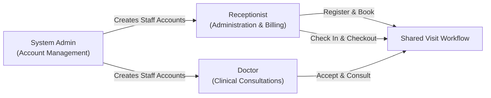

# NUSynapxe Clinic Appointment & Records System

Welcome to the documentation for **NUSynapxe**, an enterprise-grade desktop clinic management system designed for outpatient healthcare practices. NUSynapxe coordinates patient administration, doctor scheduling, consultation records, prescription management, checkout billing, and financial reporting, enforcing strict role-based confidentiality between clinical and administrative operations.



---

## Key Highlights

- **Role-Based Access Control & Clinical Confidentiality**: System Admin, Receptionist, and Doctor roles with cryptographic password verification (PBKDF2-HMAC-SHA256) and strict service-layer isolation. Administrative personnel never access clinical notes or prescriptions.
- **Unified Visit Lifecycle**: Deterministic state machine governing appointments:
  ```text
  PENDING -> ACCEPTED -> CHECKED_IN -> COMPLETED -> CHECKED_OUT
  ```
- **Doctor Workspace & Interactive Calendar**: Daily master-detail clinical dashboard, multi-day calendar time grid, working hours and breaks customization, blocked time management, and an infinite-scrolling chronological Agenda view.
- **Administrative Front Desk & Billing**: Instant patient search, Singapore NRIC/FIN and international passport validation, duplicate document prevention, appointment booking with instant conflict detection, arrival check-in queue, daily sequenced checkout receipts, and revenue reporting with CSV/JSON exports.
- **Local-First Reliability**: Zero external cloud dependency. Fast, transactional local SQLite storage with automated schema migrations and foreign-key integrity enforcement.
- **Production-Grade Delivery**: Native installers (`.msi`, `.dmg`, `.deb`) with bundled Java 25 runtime and universal executable JARs.

---

## Role Responsibilities at a Glance

| Role | Key Responsibilities | Access Boundary |
| :--- | :--- | :--- |
| **System Admin** | System bootstrap, creating and viewing Doctor and Receptionist staff accounts. | Strictly administrative; cannot access patient directories, appointments, or medical records. |
| **Receptionist** | Patient registration and directory maintenance, booking appointments, check-in queue, checkout billing, receipt viewing, and revenue analytics. | Administrative patient information and appointment scheduling; strictly prohibited from reading or modifying medical notes, diagnoses, or prescriptions. |
| **Doctor** | Managing daily schedule and working hours, accepting/declining appointments, blocking time off, recording clinical diagnoses/notes, issuing prescriptions, completing visits, and reviewing past patient consultation histories. | Full clinical and administrative access for assigned appointments; read-only access to historical completed/checked-out clinical records clinic-wide. |

---

## Documentation Navigation

This documentation portal provides resources for users and software developers:

### [User Guide](/docs/UserGuide)
Comprehensive end-user manual tailored for clinic staff and peer evaluators. Includes setup instructions, first-run wizard details, role workflows, UI layout visual references, edge cases, and an end-to-end testing walkthrough script.

### [Developer Guide](/docs/DeveloperGuide)
In-depth architectural specifications, sequence diagrams, state machines, entity-relationship models, persistence schema migrations, quality gates, automated test inventory, and release packaging instructions.

---

## Quick Start

### 1. Launching from Binary or Native Installer
1. Download the platform-specific installer (`.msi`, `.dmg`, `.deb`) or the portable convenience JAR (`NUSynapxe-<version>.jar`) from the project's **Releases** page.
2. If running the JAR, ensure Java 25 is installed, then launch:
   ```bash
   java -jar NUSynapxe-<version>.jar
   ```

### 2. Running from Source
From the repository root:
```powershell
# Windows PowerShell
.\gradlew.bat run

# macOS / Linux
./gradlew run
```

### 3. First-Run Setup
On first startup with an uninitialized database, NUSynapxe automatically launches the **Create the first System Admin account** dialog:
1. Provide a username and a strong password (minimum 8 characters).
2. Click **Create System Admin**.
3. Log in with the newly created administrator account to provision Doctor and Receptionist accounts.

For a detailed step-by-step guide, please consult the [User Guide](/docs/UserGuide).
